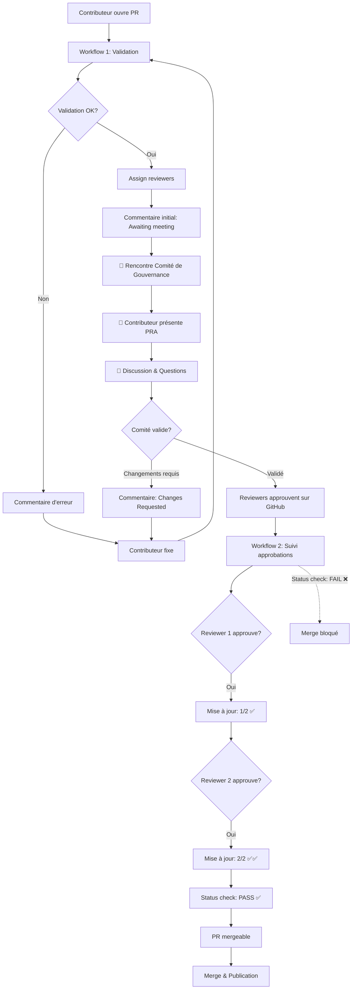

# Plan: Workflows de Validation et Approbation des PRAs Candidate

## 🎯 Objectif

Créer **2 workflows GitHub** complémentaires pour un processus d'approbation transparent des **PRAs Candidate** :

1. **Workflow 1: `validate-pra-candidate-submission.yml`** - Validation automatique initiale
   - Détecte nouveaux PRAs dans `content/pras-*/bank-wide/candidate/` ou `content/pras-*/domain-wide/*/candidate/`
   - **Bloque modifications hors `content/`** (sauf membres de `pra-development-team`)
   - Valide métadonnées, structure, documentation, 1+ proven-in-use
   - Assigne reviewers du bon comité
   - Poste commentaire initial avec étapes claires

2. **Workflow 2: `review-pra-candidate-for-approval.yml`** - Suivi des approbations après comité
   - Suit les approbations en temps réel (0/2, 1/2, 2/2)
   - Met à jour le statut visible pour le contributeur
   - Bloque le merge tant que 2 approbations non atteintes
   - Gère les changements demandés

**Objectifs Principaux**:
- Le contributeur sait **exactement où il en est** à chaque étape
- **Protection du framework** : Seul `content/` modifiable par contributeurs
- **Focus sur PRAs Candidate** : Les transitions (candidate→approved) seront implémentées en Phase 2

**Date**: 2025-12-03
**Repository**: https://github.com/KiyaliHQ/proven-reusable-architecture
**Architecture Cible**: Nouvelle structure post-migration (`content/pras-fr/`, `content/pras-en/`)

---

## 🔒 Protection du Framework

### Règle Fondamentale

**Seul le dossier `content/` peut être modifié par les contributeurs externes.**

Tous les autres dossiers (framework) sont protégés et ne peuvent être modifiés que par les membres de `@KiyaliHQ/pra-development-team`.

### Dossiers Protégés (Framework)
- **`site/`** - Application Next.js avec Fumadocs
- **`.github/`** - Workflows GitHub et templates
- **`docs/`** - Documentation racine (CONTRIBUTING.md, GOVERNANCE.md, etc.)
- **`scripts/`** - Scripts utilitaires (migration, validation)
- **`templates/`** - Templates de PRA et ADR
- **Configuration racine** - package.json, pnpm-workspace.yaml, CLAUDE.md, README.md, CHANGELOG.md

### Dossiers Modifiables (Content)
- **`content/pras-fr/`** - PRAs français (bank-wide, domain-wide)
- **`content/pras-en/`** - PRAs anglais (structure miroir)
- **`content/guides/`** - Guides du registre (fr/, en/)

### Mécanisme de Protection

Le **Workflow 1** (`validate-pra-candidate-submission.yml`) inclut un **Job 1: `check-framework-protection`** qui:

1. **Détecte** tous les fichiers modifiés dans la PR
2. **Sépare** les fichiers `content/` vs hors `content/`
3. **Vérifie** si l'auteur est membre de `@KiyaliHQ/pra-development-team`
4. **Bloque** la PR si:
   - Fichiers hors `content/` modifiés **ET**
   - Auteur n'est PAS membre de `pra-development-team`
5. **Poste un commentaire d'erreur** explicatif avec liste des fichiers bloqués

### Exceptions

Seuls les membres de `@KiyaliHQ/pra-development-team` peuvent:
- Modifier le site Fumadocs (`site/`)
- Créer/modifier des workflows (`.github/workflows/`)
- Mettre à jour les docs racine (`docs/`)
- Modifier les scripts (`scripts/`)
- Changer les templates (`templates/`)

---

## 📋 Contexte: Parcours Utilisateur

### Scénario: Alice soumet un nouveau PRA "API Gateway"

**Étape 1: Préparation**
```bash
git clone https://github.com/KiyaliHQ/proven-reusable-architecture.git
cd proven-reusable-architecture
git checkout -b feature/pra-api-gateway
```

**Étape 2: Création du PRA** (Bank-Wide Tech Candidate)
```bash
# Créer fichiers FR et EN
content/pras-fr/bank-wide/candidate/tech/api-gateway.md
content/pras-en/bank-wide/candidate/tech/api-gateway.md
```

Contenu avec métadonnées:
```yaml
---
title: API Gateway Pattern
description: Centralized API gateway for microservices
pra:
  name: API Gateway Pattern
  category: tech
  status: candidate
  tags: [api, gateway, microservices]
  created_at: "2025-12-03"
  updated_at: "2025-12-03"
  proven_in_use:
    - project: Mobile Banking App
      team: Retail Digital Team
      date: "2025-11-15"
      feedback: "Reduced API latency by 40%"
---

## Overview
[Documentation...]
```

**Étape 3: Pull Request**
```bash
git add content/pras-*
git commit -m "feat: add API Gateway PRA (Bank-Wide Tech Candidate)"
git push origin feature/pra-api-gateway
# Ouvrir PR sur GitHub
```

**Étape 4: Workflow Automatique** ⬅️ **CE QU'ON CRÉE**
1. ✅ Détection: nouveau PRA dans `content/pras-fr/bank-wide/candidate/tech/`
2. ✅ Validation automatique:
   - Métadonnées complètes
   - Emplacement correct
   - Documentation présente
   - 1+ proven-in-use
   - Bilingue (FR + EN)
3. ✅ Routing automatique:
   - Détecte scope: Bank-Wide
   - Assigne reviewers: `@KiyaliHQ/comite-architectes-experts`
4. ✅ Commentaire détaillé:
   - Checklist visuelle
   - Timeline (2-4 semaines)
   - Prochaines étapes claires

**Étape 5: Présentation au Comité de Gouvernance** ⬅️ **L'ÉTAPE MANQUANTE**
- 📅 **Rencontre organisée** : Alice présente son PRA au comité
- 🎤 **Présentation** : Alice explique le contexte, l'architecture, les bénéfices
- 💬 **Discussion** : Le comité pose des questions, discute des trade-offs
- ✅ **Validation en comité** : Le comité valide ou demande des changements

**Étape 6: Review GitHub (Après la Rencontre)**
- 📝 Suite à la rencontre, les reviewers mettent à jour la PR
- 🔔 **Workflow 2 se déclenche automatiquement** à chaque review
- ⏳ Alice reçoit une mise à jour automatique : "0/2 approvals - Awaiting committee feedback"
- ✅ Premier architecte approuve (après rencontre) → Alice voit : "1/2 approvals ✅"
- ✅ Deuxième architecte approuve → Alice voit : "2/2 approvals ✅✅"
- ❌ Si changements demandés (suite à la rencontre) → Alice voit : "Changes Requested" avec feedback détaillé
- 🚫 **PR bloquée** tant que 2/2 approvals non atteints (status check failed)

**Étape 6: Merge & Publication**
- ✅ PR mergée (manuellement ou automatiquement si 2/2 approvals)
- 🚀 PRA publié sur le site avec status `candidate`

---

## 🔧 Architecture des Workflows

### ⚠️ IMPORTANT: Deux Workflows Nécessaires

Le système complet nécessite **2 workflows distincts** :

1. **`submit-new-pra-candidate.yml`** : Validation initiale + assignment reviewers
2. **`track-pra-approval.yml`** : Suivi des approbations + blocage merge + notification statut

---

## Workflow 1: validate-pra-candidate-submission.yml

### Nom du Fichier
`.github/workflows/validate-pra-candidate-submission.yml`

### Trigger
```yaml
on:
  pull_request:
    types: [opened, synchronize]
    paths:
      - '**/*'  # Surveille TOUS les fichiers pour détecter modifications hors content/
```

### Jobs

#### Job 1: `check-framework-protection`
**Objectif**: Bloquer modifications hors `content/` sauf si membre de `pra-development-team`

**Steps**:
1. **Checkout code**
2. **Get modified files**
   - Liste tous les fichiers modifiés dans la PR
   - Sépare: `content/` vs hors `content/` (site/, .github/, docs/, scripts/, templates/, etc.)
3. **Check if non-content files modified**
   - Si aucun fichier hors `content/` → Skip ce job (succès)
   - Si fichiers hors `content/` modifiés → Continue
4. **Check PR author membership**
   - Utilise GitHub API pour vérifier si auteur est membre de `@KiyaliHQ/pra-development-team`
   - Si OUI → Job réussit (membre autorisé)
   - Si NON → Job échoue avec message d'erreur clair
5. **Post blocking comment** (si échec)
   - Commentaire expliquant que seuls membres de `pra-development-team` peuvent modifier le framework
   - Liste des fichiers problématiques
   - Instructions pour contacter l'équipe si modification nécessaire

**Output**:
- `framework_protection_passed`: true/false
- `non_content_files`: liste des fichiers hors content/

#### Job 2: `detect-and-validate-pra`
**Condition**: `needs.check-framework-protection.outputs.framework_protection_passed == 'true'`
**Objectif**: Détecter nouveaux PRAs candidate et valider automatiquement

**Steps**:
1. **Checkout code**
2. **Detect new PRA candidate files**
   - Compare avec base branch
   - Filtre uniquement fichiers dans `content/pras-*/*/candidate/**/*.md`
   - Liste fichiers qui n'existaient pas avant
   - Output: `new_pra_candidates` (JSON array)
3. **Parse metadata** (pour chaque nouveau PRA)
   - Extraire YAML frontmatter avec `gray-matter`
   - Parser métadonnées `pra.*`
   - Extraire scope/status/category depuis le chemin du fichier
   - Output: `scope`, `category`, `status`, `proven_in_use`
4. **Validate proven-in-use requirement**
   - **Pour candidate**: Vérifier 1+ proven-in-use (basé sur emplacement dans `/candidate/`)
   - Si < 1 → Validation échoue
5. **Validate structure**
   - Vérifier métadonnées complètes (name, category, status, tags, created_at, updated_at)
   - Vérifier sections requises (Overview, Context, Architecture, ADRs, Examples)
6. **Check bilingual**
   - Vérifier paire FR/EN existe
   - Ex: `pras-fr/bank-wide/candidate/tech/api-gateway.md` ↔ `pras-en/bank-wide/candidate/tech/api-gateway.md`
7. **Set outputs**
   - `validation_passed`: true/false
   - `scope`: bank-wide | domain-wide
   - `domain`: particuliers | entreprises | gestion-patrimoine (si domain-wide)
   - `category`: tech | integration | security | business
   - `proven_count`: nombre de proven-in-use
   - `status`: candidate (toujours candidate dans ce workflow)

#### Job 3: `assign-reviewers`
**Condition**: `needs.detect-and-validate-pra.outputs.validation_passed == 'true'`
**Objectif**: Router vers le bon comité de gouvernance

**Logique de Routing**:
```
IF scope == "bank-wide":
  → Assign: @KiyaliHQ/comite-architectes-experts

ELSE IF scope == "domain-wide":
  → IF domain == "particuliers":
      → Assign: @KiyaliHQ/comite-gov-particuliers
  → ELSE IF domain == "entreprises":
      → Assign: @KiyaliHQ/comite-gov-entreprises
  → ELSE IF domain == "gestion-patrimoine":
      → Assign: @KiyaliHQ/comite-gov-patrimoine
```

**Action**: GitHub API call to add reviewers

#### Job 4: `post-comment`
**Condition**: Always (success or failure)
**Objectif**: Poster commentaire détaillé pour contributeur

**Si framework protection échouée** (`framework_protection_passed == false`):
```markdown
## 🚫 Framework Modification Blocked

Your PR contains modifications to files outside the `content/` directory. Only members of the **@KiyaliHQ/pra-development-team** can modify framework files.

### ❌ Blocked Files
{list of non-content files}

### 📂 Allowed Modifications
Contributors can only modify files in:
- `content/pras-fr/` - French PRAs
- `content/pras-en/` - English PRAs
- `content/guides/` - Registry guides

### 🔧 Framework Files (Restricted)
The following directories are restricted to the PRA Development Team:
- `site/` - Next.js application
- `.github/workflows/` - GitHub workflows
- `docs/` - Root documentation
- `scripts/` - Utility scripts
- `templates/` - PRA templates

### 💡 Need to Modify Framework?
If you have a legitimate reason to modify framework files:
1. Contact **@KiyaliHQ/pra-development-team** on Teams (#pra-registry)
2. Explain your use case
3. They will either make the change or grant temporary access

### ✅ Next Steps
1. Remove modifications to framework files from this PR
2. Keep only changes to files in `content/`
3. Push your changes - the validation will re-run automatically
```

**Si validation PRA réussie** (`validation_passed == true`):
```markdown
## 🎉 New PRA Candidate Submission

Your PRA has been successfully submitted for approval!

### 📋 Details Detected
- **Scope**: Bank-Wide
- **Category**: Tech
- **Status**: Candidate
- **Title**: API Gateway Pattern
- **Proven-in-use**: 1 implementation documented

### ✅ Automatic Validation
- [x] Complete metadata (YAML frontmatter)
- [x] All required sections present (Overview, Context, Architecture, ADRs, Examples)
- [x] 1+ proven-in-use documented
- [x] Bilingual (FR + EN files found)

### 👥 Governance Review Process
Your PRA will be reviewed by the **Expert Architects Committee**.
- **Reviewers assigned**: @KiyaliHQ/comite-architectes-experts
- **Approvals required**: 2 members
- **Timeline**: 2-4 weeks

### 📊 Current Status
- [ ] Awaiting committee meeting (0/2) ⏳

### 📚 Next Steps
1. **Committee Meeting** 📅 - You will be invited to present your PRA to the governance committee
2. **Presentation** 🎤 - Present the context, architecture, benefits, and trade-offs
3. **Discussion** 💬 - Committee members will ask questions and provide feedback
4. **Validation** ✅ - Committee validates or requests changes
5. **GitHub Reviews** - After the meeting, reviewers will approve on GitHub (2 approvals needed)
6. **Merge** - Once 2 approvals received, your PR will be merged
7. **Publication** - Your PRA will be published with **Candidate** status

### 🔔 What to Expect
- You will receive a calendar invite for the committee meeting
- Prepare a short presentation (10-15 minutes) covering:
  - Problem statement and context
  - Proposed architecture
  - Proven implementations (proven-in-use)
  - Trade-offs and alternatives considered
- The committee will provide constructive feedback
- After the meeting, reviewers will update this PR with their decision

### 🔗 Resources
- [Contributing Guide](../content/guides/en/06-contributing.md)
- [Quality Standards](../content/guides/en/05-standards.md)
- [Lifecycle](../content/guides/en/04-lifecycle.md)

Thank you for your contribution! 🚀
```

**Si validation échouée** (`validation_passed == false`):
```markdown
## ❌ PRA Validation Failed

Your PRA submission has some issues that need to be fixed.

### 🔍 Validation Errors
- [ ] Missing metadata: `pra.proven_in_use` is empty
- [ ] Missing section: "ADRs" section not found
- [ ] Bilingual requirement: French version missing (`content/pras-fr/bank-wide/candidate/tech/api-gateway.md`)

### 🛠️ How to Fix
1. Add at least 1 proven-in-use implementation in the `pra.proven_in_use` array
2. Add an "ADRs" section documenting architectural decisions
3. Create the French version of your PRA

### 📚 Resources
- [PRA Template](../../templates/pra-template.md)
- [Contributing Guide](../content/guides/en/06-contributing.md)

Once fixed, push your changes and the validation will re-run automatically.
```

---

## Workflow 2: review-pra-candidate-for-approval.yml

### Nom du Fichier
`.github/workflows/review-pra-candidate-for-approval.yml`

### Objectif
**Suivre les approbations en temps réel** (après la rencontre au comité) et informer le contributeur du statut exact de sa demande.

### Contexte Important
Ce workflow se déclenche **APRÈS** que le contributeur ait présenté son PRA au comité de gouvernance. Suite à cette présentation :
1. Le comité valide ou demande des changements
2. Les reviewers mettent à jour la PR GitHub avec leur décision
3. Ce workflow suit ces approbations et met à jour le contributeur

### Trigger
```yaml
on:
  pull_request_review:
    types: [submitted, dismissed]
  pull_request:
    types: [review_requested, review_request_removed]
```

**Quand ça se déclenche** :
- Un membre du comité soumet une review (approved, changes requested, commented)
- Une review est dismissed (retirée)
- Un reviewer est ajouté ou retiré

### Jobs

#### Job 1: `count-approvals`
**Objectif**: Compter les approbations des membres du bon comité

**Steps**:
1. **Checkout code**
2. **Detect PRA scope** (bank-wide vs domain-wide)
   - Parse metadata du PRA pour identifier scope
   - Détermine quel comité doit approuver
3. **Get required team**
   - Bank-Wide → `@KiyaliHQ/comite-architectes-experts`
   - Domain-Wide → `@KiyaliHQ/comite-gov-{domain}`
4. **Count approvals from team members**
   - Récupère liste des reviews via GitHub API
   - Filtre uniquement les "APPROVED" reviews
   - Vérifie que le reviewer fait partie du bon team
   - Output: `approval_count`, `required_count` (2)
5. **Check for changes requested**
   - Vérifie si des reviews "CHANGES_REQUESTED" existent
   - Output: `changes_requested` (true/false)

#### Job 2: `update-status-comment`
**Condition**: Always
**Objectif**: Mettre à jour le commentaire de statut avec le nombre d'approbations

**Steps**:
1. **Find original status comment**
   - Recherche le commentaire posté par `submit-new-pra-candidate.yml`
   - Contient: "## 🎉 New PRA Candidate Submission"
2. **Update comment with current status**

**Si `changes_requested == true`** :
```markdown
## 🔄 Changes Requested

The governance committee has requested changes to your PRA submission.

### 📊 Current Status
- ❌ **Changes Requested** - Please address the feedback below

### 💬 Reviewer Feedback
[Liste des commentaires des reviewers]

### 🛠️ Next Steps
1. Review the feedback from the governance committee
2. Make the requested changes to your PRA
3. Push your changes to this PR
4. The validation will re-run automatically

Once you address the feedback, the committee will review again.
```

**Si `approval_count < 2`** :
```markdown
## ⏳ Awaiting Approval

Your PRA is currently under review by the governance committee.

### 📊 Current Status
- ⏳ **In Review** - Waiting for GitHub approvals (after committee meeting)

### 👥 Governance Review Progress
- **Reviewers assigned**: @KiyaliHQ/comite-architectes-experts
- **Approvals received**: {approval_count}/2 ✅
- **Still needed**: {2 - approval_count} approval(s)

### 📅 Timeline
- **Submitted**: {submission_date}
- **Expected review time**: 2-4 weeks

### 🔔 Review Process
Your PRA follows this process:
1. ✅ **Automatic Validation** - Completed
2. 📅 **Committee Meeting** - You will present your PRA to the committee
3. 💬 **Discussion** - Committee provides feedback
4. ⏳ **GitHub Reviews** - Reviewers approve on GitHub (currently at {approval_count}/2)
5. ✅ **Merge** - Once 2 approvals received

### What's Happening Now
{if approval_count == 0}
- The committee meeting has been scheduled or will be scheduled soon
- You will receive a calendar invite to present your PRA
- After the meeting, reviewers will approve or request changes on GitHub
{else if approval_count == 1}
- ✅ First reviewer has approved (likely after committee meeting)
- ⏳ Waiting for second reviewer approval
{endif}

You will be notified automatically when:
- A reviewer approves your PRA
- A reviewer requests changes
- Your PRA is ready to merge (2/2 approvals)
```

**Si `approval_count == 2`** :
```markdown
## ✅ PRA Approved!

Congratulations! Your PRA has been approved by the governance committee.

### 📊 Current Status
- ✅ **APPROVED** - Ready to merge!

### 👥 Governance Review Complete
- **Reviewers assigned**: @KiyaliHQ/comite-architectes-experts
- **Approvals received**: 2/2 ✅✅

### 🎉 Next Steps
1. Your PR is now approved and will be merged automatically
2. Once merged, your PRA will be published on the registry
3. It will be available at: `/registre/bank-wide/candidate/tech/your-pra`

Thank you for your contribution to the PRA Registry! 🚀
```

#### Job 3: `block-merge-if-not-approved`
**Condition**: Always
**Objectif**: Bloquer le merge si moins de 2 approbations

**Steps**:
1. **Check approval count**
2. **Set required status check**
   - Si `approval_count < 2` → Status: **failure** ❌
   - Si `approval_count >= 2` → Status: **success** ✅
3. **Post status** via GitHub API

**GitHub Status Check**:
```
PRA Governance Approval: {approval_count}/2 approvals received
```

**Protection Rule** (à configurer sur GitHub):
- Require status check "PRA Governance Approval" to pass
- Require 2 approvals from team `comite-architectes-experts`

---

### Workflow 2: YAML Complet

```yaml
name: Track PRA Approval

on:
  pull_request_review:
    types: [submitted, dismissed]
  pull_request:
    types: [review_requested, review_request_removed]

permissions:
  contents: read
  pull-requests: write
  statuses: write

jobs:
  count-approvals:
    name: Count Governance Approvals
    runs-on: ubuntu-latest
    outputs:
      approval_count: ${{ steps.count.outputs.approval_count }}
      required_count: ${{ steps.count.outputs.required_count }}
      changes_requested: ${{ steps.count.outputs.changes_requested }}
      scope: ${{ steps.detect-scope.outputs.scope }}
      team: ${{ steps.detect-scope.outputs.team }}

    steps:
      - name: Checkout code
        uses: actions/checkout@v4

      - name: Detect PRA scope
        id: detect-scope
        run: |
          # [Script pour détecter scope et déterminer team]
          # Output: scope, team

      - name: Get reviews from correct team
        id: count
        uses: actions/github-script@v7
        with:
          script: |
            const team = '${{ steps.detect-scope.outputs.team }}';
            const reviews = await github.rest.pulls.listReviews({
              owner: context.repo.owner,
              repo: context.repo.repo,
              pull_number: context.issue.number
            });

            // Get team members
            const teamMembers = await github.rest.teams.listMembersInOrg({
              org: 'KiyaliHQ',
              team_slug: team
            });
            const teamMemberLogins = teamMembers.data.map(m => m.login);

            // Count approvals from team members
            let approvalCount = 0;
            let changesRequested = false;

            reviews.data.forEach(review => {
              if (teamMemberLogins.includes(review.user.login)) {
                if (review.state === 'APPROVED') {
                  approvalCount++;
                } else if (review.state === 'CHANGES_REQUESTED') {
                  changesRequested = true;
                }
              }
            });

            core.setOutput('approval_count', approvalCount);
            core.setOutput('required_count', 2);
            core.setOutput('changes_requested', changesRequested);

  update-status-comment:
    name: Update Status Comment
    needs: count-approvals
    if: always()
    runs-on: ubuntu-latest

    steps:
      - name: Find and update status comment
        uses: actions/github-script@v7
        with:
          script: |
            const approvalCount = ${{ needs.count-approvals.outputs.approval_count }};
            const changesRequested = ${{ needs.count-approvals.outputs.changes_requested }};

            // [Script pour trouver et mettre à jour commentaire]
            // Utiliser les templates ci-dessus selon status

  block-merge-if-not-approved:
    name: Block Merge if Not Approved
    needs: count-approvals
    if: always()
    runs-on: ubuntu-latest

    steps:
      - name: Set status check
        uses: actions/github-script@v7
        with:
          script: |
            const approvalCount = ${{ needs.count-approvals.outputs.approval_count }};
            const state = approvalCount >= 2 ? 'success' : 'failure';
            const description = `${approvalCount}/2 approvals received`;

            await github.rest.repos.createCommitStatus({
              owner: context.repo.owner,
              repo: context.repo.repo,
              sha: context.payload.pull_request.head.sha,
              state: state,
              context: 'PRA Governance Approval',
              description: description
            });
```

---

## 🔍 Détection: Nouveau vs Update

### Logique de Détection

**Bash Script**:
```bash
#!/bin/bash
# Detect new PRA files (not existing in base branch)

BASE_BRANCH="${{ github.base_ref }}"
NEW_PRAS=()

# Get all modified .md files in content/pras-*
git diff --name-only origin/$BASE_BRANCH...HEAD | grep "content/pras-.*\.md$" | while read file; do
  # Check if file exists in base branch
  if ! git cat-file -e origin/$BASE_BRANCH:"$file" 2>/dev/null; then
    echo "NEW PRA detected: $file"
    NEW_PRAS+=("$file")
  fi
done

# Output as JSON array
echo "new_pras=$(echo ${NEW_PRAS[@]} | jq -R -s -c 'split(" ")')" >> $GITHUB_OUTPUT
```

**Output Example**:
```json
{
  "new_pras": [
    "content/pras-fr/bank-wide/candidate/tech/api-gateway.md",
    "content/pras-en/bank-wide/candidate/tech/api-gateway.md"
  ]
}
```

---

## 📦 Extraction des Métadonnées

### Méthode: Node.js avec `gray-matter`

**Setup**:
```yaml
- name: Setup Node.js
  uses: actions/setup-node@v4
  with:
    node-version: '18'

- name: Install gray-matter
  run: npm install -g gray-matter
```

**Script d'Extraction**:
```javascript
// extract-metadata.js
const fs = require('fs');
const matter = require('gray-matter');

const filePath = process.argv[2]; // content/pras-fr/bank-wide/candidate/tech/api-gateway.md
const content = fs.readFileSync(filePath, 'utf8');
const { data } = matter(content);

// Extract scope from path
const pathParts = filePath.split('/');
const lang = pathParts[1].split('-')[1]; // fr or en
const scope = pathParts[2]; // bank-wide or domain-wide
const status = pathParts[3]; // candidate, approved, deprecated
const category = pathParts[4]; // tech, integration, security, business

let domain = null;
if (scope === 'domain-wide') {
  domain = pathParts[3]; // particuliers, entreprises, gestion-patrimoine
}

// Output JSON
console.log(JSON.stringify({
  lang,
  scope,
  status,
  category,
  domain,
  metadata: data.pra || {},
  proven_count: (data.pra?.proven_in_use || []).length
}));
```

**Usage**:
```bash
node extract-metadata.js content/pras-fr/bank-wide/candidate/tech/api-gateway.md
```

**Output**:
```json
{
  "lang": "fr",
  "scope": "bank-wide",
  "status": "candidate",
  "category": "tech",
  "domain": null,
  "metadata": {
    "name": "API Gateway Pattern",
    "category": "tech",
    "status": "candidate",
    "tags": ["api", "gateway", "microservices"],
    "created_at": "2025-12-03",
    "updated_at": "2025-12-03",
    "proven_in_use": [...]
  },
  "proven_count": 1
}
```

---

## ✅ Validation des Sections Requises

### Sections Obligatoires

Pour qu'un PRA soit valide, il doit contenir :
1. **Overview** (## Overview)
2. **Context** (## Context)
3. **Architecture** (## Architecture)
4. **ADRs** (## ADRs or ## Architecture Decision Records)
5. **Examples** (## Examples or ## Code Examples)

### Validation Script

**Bash**:
```bash
#!/bin/bash
file=$1

# Check required sections
sections=("Overview" "Context" "Architecture" "ADR" "Example")
missing=()

for section in "${sections[@]}"; do
  if ! grep -q "^##\s*${section}" "$file"; then
    missing+=("$section")
  fi
done

if [ ${#missing[@]} -eq 0 ]; then
  echo "sections_valid=true" >> $GITHUB_OUTPUT
else
  echo "sections_valid=false" >> $GITHUB_OUTPUT
  echo "missing_sections=$(echo ${missing[@]} | jq -R -s -c 'split(" ")')" >> $GITHUB_OUTPUT
fi
```

---

## 🌐 Validation Bilingue

### Règle

Pour chaque PRA français, un équivalent anglais doit exister :
- `content/pras-fr/bank-wide/candidate/tech/api-gateway.md`
- `content/pras-en/bank-wide/candidate/tech/api-gateway.md`

### Validation Script

```bash
#!/bin/bash
# Check bilingual requirement

NEW_PRA_FR=$1 # content/pras-fr/bank-wide/candidate/tech/api-gateway.md

# Convert to EN path
NEW_PRA_EN=$(echo "$NEW_PRA_FR" | sed 's/pras-fr/pras-en/')

if [ -f "$NEW_PRA_EN" ]; then
  echo "bilingual_valid=true" >> $GITHUB_OUTPUT
else
  echo "bilingual_valid=false" >> $GITHUB_OUTPUT
  echo "missing_translation=$NEW_PRA_EN" >> $GITHUB_OUTPUT
fi
```

---

## 👥 Assignment des Reviewers (GitHub API)

### Méthode: GitHub CLI (`gh`)

**Installation**:
```yaml
- name: Setup GitHub CLI
  uses: cli/cli@v2
```

**Script d'Assignment**:
```bash
#!/bin/bash
SCOPE=$1 # bank-wide or domain-wide
DOMAIN=$2 # particuliers, entreprises, gestion-patrimoine (if domain-wide)
PR_NUMBER=${{ github.event.pull_request.number }}

if [ "$SCOPE" == "bank-wide" ]; then
  TEAM="comite-architectes-experts"
elif [ "$SCOPE" == "domain-wide" ]; then
  if [ "$DOMAIN" == "particuliers" ]; then
    TEAM="comite-gov-particuliers"
  elif [ "$DOMAIN" == "entreprises" ]; then
    TEAM="comite-gov-entreprises"
  elif [ "$DOMAIN" == "gestion-patrimoine" ]; then
    TEAM="comite-gov-patrimoine"
  fi
fi

# Assign team as reviewer
gh pr edit $PR_NUMBER --add-reviewer "KiyaliHQ/$TEAM"

echo "✅ Assigned reviewers: @KiyaliHQ/$TEAM"
```

---

## 📝 Workflow YAML Complet

### Fichier: `.github/workflows/submit-new-pra-candidate.yml`

```yaml
name: Submit New PRA Candidate

on:
  pull_request:
    types: [opened, synchronize]
    paths:
      - 'content/pras-fr/**/*.md'
      - 'content/pras-en/**/*.md'

permissions:
  contents: read
  pull-requests: write

jobs:
  detect-and-validate:
    name: Detect & Validate New PRA
    runs-on: ubuntu-latest
    outputs:
      validation_passed: ${{ steps.validate.outputs.validation_passed }}
      scope: ${{ steps.extract-meta.outputs.scope }}
      domain: ${{ steps.extract-meta.outputs.domain }}
      category: ${{ steps.extract-meta.outputs.category }}
      proven_count: ${{ steps.extract-meta.outputs.proven_count }}
      new_pras: ${{ steps.detect.outputs.new_pras }}

    steps:
      - name: Checkout code
        uses: actions/checkout@v4
        with:
          fetch-depth: 0 # Full history for comparison

      - name: Detect new PRA files
        id: detect
        run: |
          # [Bash script from "Détection: Nouveau vs Update" section]
          # Output: new_pras (JSON array)

      - name: Setup Node.js
        uses: actions/setup-node@v4
        with:
          node-version: '18'

      - name: Install dependencies
        run: npm install -g gray-matter js-yaml

      - name: Extract metadata
        id: extract-meta
        run: |
          # [Node.js script from "Extraction des Métadonnées" section]
          # Output: scope, domain, category, proven_count

      - name: Validate structure
        id: validate
        run: |
          # [Validation scripts from sections above]
          # Outputs:
          # - validation_passed: true/false
          # - sections_valid: true/false
          # - bilingual_valid: true/false
          # - missing_sections: array
          # - missing_translation: path

  assign-reviewers:
    name: Assign Governance Reviewers
    needs: detect-and-validate
    if: needs.detect-and-validate.outputs.validation_passed == 'true'
    runs-on: ubuntu-latest

    steps:
      - name: Setup GitHub CLI
        uses: cli/cli@v2

      - name: Assign reviewers
        env:
          GH_TOKEN: ${{ secrets.GITHUB_TOKEN }}
        run: |
          # [Assignment script from "Assignment des Reviewers" section]

  post-comment:
    name: Post Validation Result
    needs: detect-and-validate
    if: always()
    runs-on: ubuntu-latest

    steps:
      - name: Post success comment
        if: needs.detect-and-validate.outputs.validation_passed == 'true'
        uses: actions/github-script@v7
        with:
          script: |
            const comment = `[Success comment from "Architecture du Workflow" section]`;
            github.rest.issues.createComment({
              issue_number: context.issue.number,
              owner: context.repo.owner,
              repo: context.repo.repo,
              body: comment
            });

      - name: Post failure comment
        if: needs.detect-and-validate.outputs.validation_passed == 'false'
        uses: actions/github-script@v7
        with:
          script: |
            const comment = `[Failure comment from "Architecture du Workflow" section]`;
            github.rest.issues.createComment({
              issue_number: context.issue.number,
              owner: context.repo.owner,
              repo: context.repo.repo,
              body: comment
            });
```

---

## 🧪 Test du Workflow

### Scénario de Test 1: Soumission Valide (Bank-Wide Tech)

**Fichiers créés**:
```
content/pras-fr/bank-wide/candidate/tech/test-api-gateway.md
content/pras-en/bank-wide/candidate/tech/test-api-gateway.md
```

**Résultat Attendu**:
- ✅ Validation automatique réussie
- ✅ Reviewers assignés: `@KiyaliHQ/comite-architectes-experts`
- ✅ Commentaire de succès posté
- ✅ Timeline affichée: "2-4 weeks"

### Scénario de Test 2: Soumission Invalide (Métadonnées manquantes)

**Fichiers créés**:
```
content/pras-fr/bank-wide/candidate/tech/test-incomplete.md (sans proven_in_use)
content/pras-en/bank-wide/candidate/tech/test-incomplete.md
```

**Résultat Attendu**:
- ❌ Validation échouée
- ❌ Commentaire d'erreur posté avec détails
- ❌ PR bloquée (check failed)

### Scénario de Test 3: Soumission Sans Traduction

**Fichiers créés**:
```
content/pras-fr/bank-wide/candidate/tech/test-no-translation.md (FR seulement)
```

**Résultat Attendu**:
- ❌ Validation bilingual échouée
- ❌ Commentaire d'erreur indiquant fichier EN manquant
- ❌ PR bloquée

---

## 📂 Fichiers à Créer/Modifier

### Nouveaux Fichiers (2 workflows)
1. **`.github/workflows/validate-pra-candidate-submission.yml`** (Workflow 1: validation automatique + protection framework)
2. **`.github/workflows/review-pra-candidate-for-approval.yml`** (Workflow 2: suivi des approbations après comité)

### Scripts Utilitaires (Optionnel, peut être inline dans workflow)
- `.github/scripts/detect-new-pras.sh`
- `.github/scripts/extract-metadata.js`
- `.github/scripts/validate-sections.sh`
- `.github/scripts/validate-bilingual.sh`
- `.github/scripts/assign-reviewers.sh`
- `.github/scripts/detect-pra-scope.sh` ⬅️ **NOUVEAU (pour workflow 2)**

### Pas de Modification
- Workflow existant `approve-pra-candidate.yml` peut rester (sera déprécié plus tard)
- Structure de contenu déjà correcte (post-migration)

---

## 🚀 Déploiement

### Étapes d'Implémentation

**Phase 1: Créer Workflow 1 (Submit New PRA)**
1. Créer `.github/workflows/submit-new-pra-candidate.yml`
2. Implémenter job `detect-and-validate`
3. Implémenter job `assign-reviewers`
4. Implémenter job `post-comment`

**Phase 2: Créer Workflow 2 (Track Approval)** ⬅️ **NOUVEAU**
1. Créer `.github/workflows/track-pra-approval.yml`
2. Implémenter job `count-approvals`
3. Implémenter job `update-status-comment`
4. Implémenter job `block-merge-if-not-approved`

**Phase 3: Test Workflow 1 (Validation Initiale)**
1. Créer branche `test/workflow-submit-pra`
2. Créer test PRA valide
3. Ouvrir PR de test
4. Vérifier workflow 1 s'exécute correctement
5. Vérifier reviewers assignés
6. Vérifier commentaire initial posté

**Phase 4: Test Workflow 2 (Suivi Approbations)** ⬅️ **NOUVEAU**
1. Sur la même PR de test
2. Faire reviewer 1 approuver → Vérifier commentaire mis à jour "1/2"
3. Faire reviewer 2 approuver → Vérifier commentaire mis à jour "2/2"
4. Vérifier status check passe (vert)
5. **Test changements demandés**:
   - Créer nouvelle PR test
   - Faire reviewer demander changements
   - Vérifier commentaire "Changes Requested"
   - Vérifier status check échoue (rouge)

**Phase 5: Test Scénarios d'Erreur (Workflow 1)**
1. Test sans proven_in_use
2. Test sans traduction
3. Test sections manquantes
4. Vérifier commentaires d'erreur clairs

**Phase 6: Configuration GitHub Branch Protection** ⬅️ **NOUVEAU**
1. Aller dans Settings → Branches → Protection rules
2. Ajouter règle pour `main`
3. **Require status checks to pass**:
   - Cocher: "PRA Governance Approval"
4. **Require approvals**: 2 approvals from `comite-architectes-experts`
5. Sauvegarder

**Phase 7: Déploiement Production**
1. Merger workflows vers `main`
2. Documenter dans `docs/DEVELOPER_GUIDE.md`
3. Mettre à jour `CLAUDE.md` avec nouvelle procédure
4. Créer guide utilisateur pour contributeurs

---

## 📚 Documentation à Mettre à Jour

### Fichiers à Modifier Après Implémentation

**`docs/DEVELOPER_GUIDE.md`**:
- Section "GitHub Workflows"
- Ajouter description de `submit-new-pra-candidate.yml`
- Exemples d'utilisation

**`CLAUDE.md`**:
- Section "Contribution Workflow"
- Mettre à jour processus de soumission

**`docs/CONTRIBUTING.md`** (si existe):
- Mettre à jour avec nouveau workflow automatique
- Ajouter screenshots de commentaires de validation

---

## ✅ Critères de Succès

Le système complet (2 workflows) est considéré réussi si :

### Workflow 1: Submit New PRA
1. **Détection automatique** fonctionne pour nouveaux PRAs
2. **Validation automatique** détecte erreurs correctement
3. **Routing** assigne les bons reviewers selon scope
4. **Commentaires initiaux** sont clairs et aident le contributeur
5. **Bilingue** est enforced (bloque si traduction manquante)

### Workflow 2: Track Approval ⬅️ **NOUVEAU**
6. **Comptage des approbations** est précis (compte uniquement membres du bon comité)
7. **Mise à jour en temps réel** : commentaire se met à jour à chaque review (0/2, 1/2, 2/2)
8. **Status check** bloque merge si < 2 approbations
9. **Détection changements demandés** : affiche feedback clair si reviewer demande changements
10. **Transparence totale** : Alice voit exactement où elle en est à tout moment

### UX Contributeur (Objectif Principal)
11. **Clarté** : Alice sait exactement où elle en est à chaque étape
12. **Feedback immédiat** : Notifications automatiques à chaque changement de statut
13. **Pas de confusion** : Impossible de merger sans 2 approvals
14. **Suivi transparent** : Progression visible (0/2 → 1/2 → 2/2)

---

## 📊 Diagramme de Flux (Vue d'Ensemble)



---

---

## 📊 Résumé du Scope

### ✅ Phase 1: PRAs Candidate (Ce Plan)

**Workflows implémentés**:
1. `validate-pra-candidate-submission.yml` - Validation automatique + protection framework
2. `review-pra-candidate-for-approval.yml` - Suivi approbations après comité

**Fonctionnalités**:
- ✅ Protection framework (`content/` seul modifiable)
- ✅ Détection nouveaux PRAs dans `*/candidate/`
- ✅ Validation 1+ proven-in-use pour candidate
- ✅ Validation bilingue (FR + EN)
- ✅ Routing automatique vers comité correct
- ✅ Commentaires détaillés avec étapes claires
- ✅ Présentation au comité de gouvernance
- ✅ Suivi approbations temps réel (0/2, 1/2, 2/2)
- ✅ Blocage merge si < 2 approvals
- ✅ Gestion changements demandés

**Ce qui N'est PAS inclus** (Phase 2 future):
- ❌ Validation PRAs approved (3+ proven-in-use)
- ❌ Validation PRAs deprecated
- ❌ Transitions candidate→approved (promotion)
- ❌ Transitions approved→deprecated (dépréciation)
- ❌ Mise à jour de PRAs existants

### 🔮 Phase 2: Workflows Additionnels (Futur)

**Workflows à créer plus tard**:
- `validate-pra-approved-submission.yml` - Pour nouveaux PRAs approved (3+ proven-in-use)
- `promote-pra-to-approved.yml` - Transition candidate→approved
- `deprecate-pra.yml` - Transition approved→deprecated
- `update-existing-pra.yml` - Modifications de PRAs existants

---

**Dernière mise à jour**: 2025-12-03
