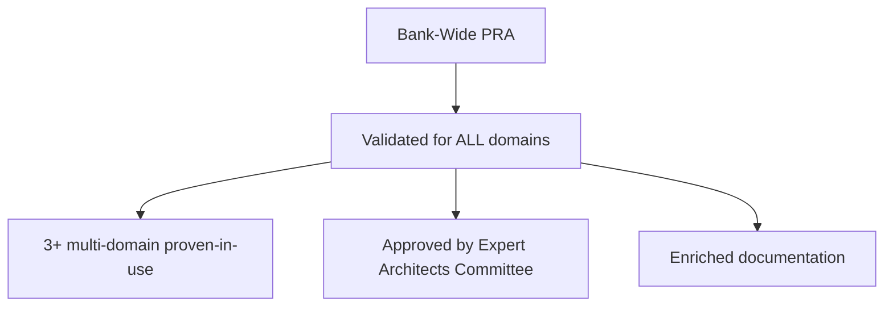
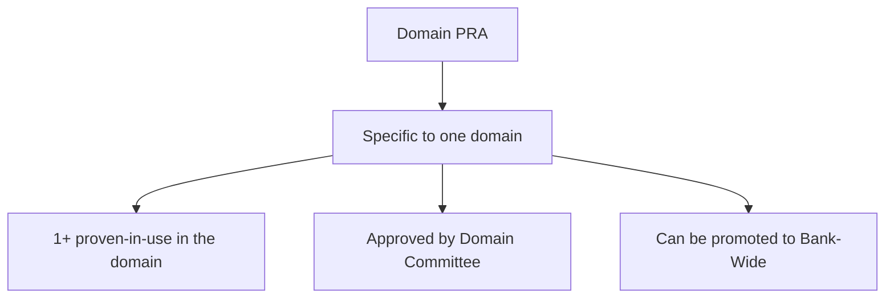
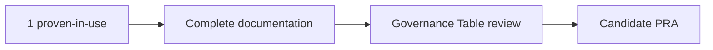
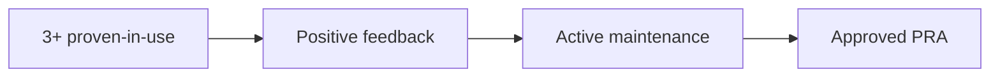
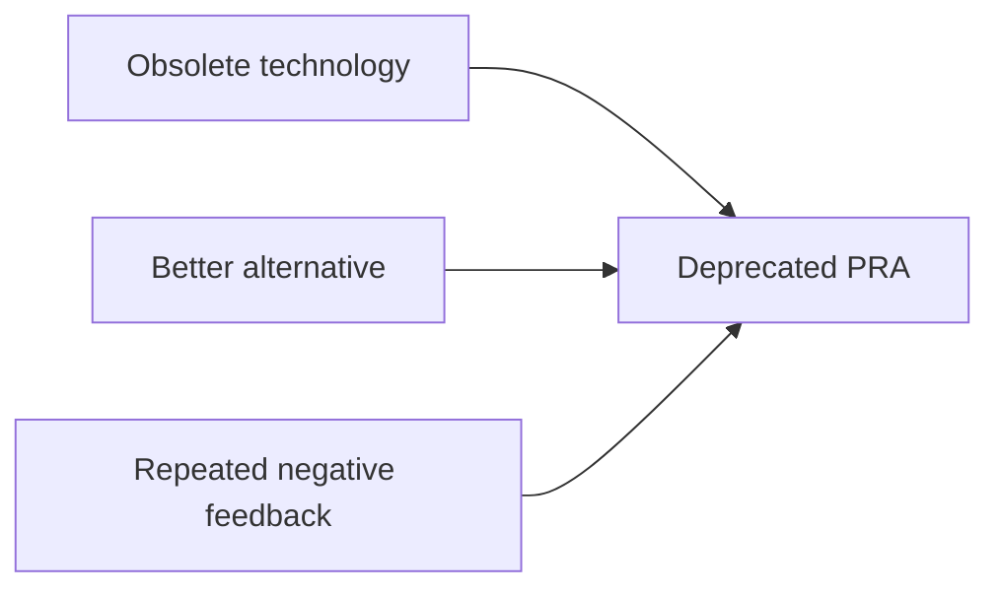
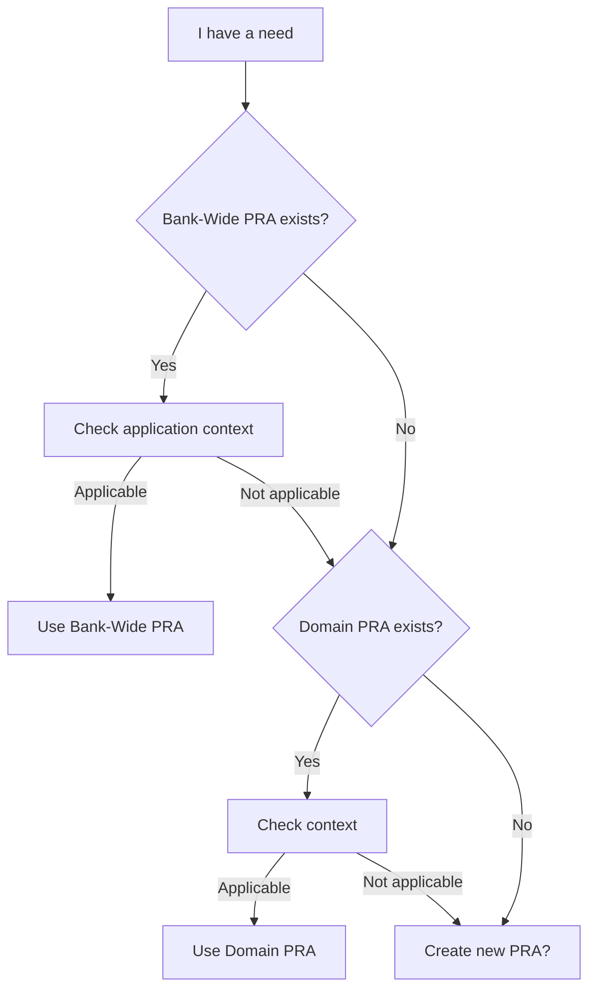

# Understanding PRAs

Now that you know the basics, let's dive into the structure and organization of Proven Reusable Architectures.

## Anatomy of a PRA

Each PRA follows a standardized structure to ensure clarity and reusability.

### Required Structure

```markdown
# PRA-XXX: [Pattern Name]

## Summary
Concise description in 2-3 sentences

## Application Context
### When to use this PRA?
### When NOT to use this PRA?

## Problem Solved
Description of the problem with typical symptoms

## Solution
Architecture, technology stack, diagrams

## Architecture Decision Records (ADR)
Key decisions and justifications

## Prerequisites
Technical and organizational

## Implementation
Step-by-step guide

## Examples
Real code and configurations

## Experience Reports
Documented proven-in-use

## Limitations & Pitfalls
Things to know before implementing

## Maintenance
How to maintain and evolve

## References
Documentation, contacts
```

### Metadata (Frontmatter)

Each PRA contains metadata in YAML format:

```yaml
---
id: pra-XXX
name: "Pattern Name"
category: tech | integration | security | business
tags:
  - tag1
  - tag2
status: candidate | approved | deprecated
version: X.Y.Z
author:
  name: "First Last"
  email: "email@company.com"
maintainer:
  name: "First Last"
  email: "email@company.com"
created: YYYY-MM-DD
updated: YYYY-MM-DD
proven_in_use:
  - project: "Project Name"
    team: "Team Name"
    date: "YYYY-MM-DD"
    feedback: "Concrete results"
dependencies: []
replaces: null
---
```

## The 2 Scopes of a PRA

### 1. Bank-Wide (Transversal)



**Characteristics**:
- Applicable to **all domains**
- Validated by the **Expert Architects Governance Committee**
- At least **3 proven-in-use** from different domains/teams
- **Recommended** for new projects
- Location: `pra/transversal/[category]/`

**Examples**:
- Authentication & Authorization
- Observability (Logs, Metrics, Traces)
- CI/CD Pipelines
- API Design Standards

### 2. Domain



**Characteristics**:
- Applicable to **a specific domain** (Retail, Corporate, Wealth Management)
- Validated by the **Domain Governance Committee**
- At least **1 proven-in-use** in the domain
- **All types of patterns** (functional AND technical)
- Can be promoted to Bank-Wide if reusable outside the domain (**"in promotion"** status)
- Location: `pra/secteurs/[domain]/[category]/`

**Examples**:
- Functional: Digital Onboarding (Retail), SAP ERP Integration (Corporate)
- Technical: Serverless AWS, file transfer, data pipelines (in absence of Bank-Wide pattern)

**Note on promotion**: When a Domain PRA is proposed to become Bank-Wide, it receives the **"in promotion"** status in its metadata. This status is visible to all domains during the review period by the Expert Architects Committee.

## PRA Statuses

### Candidate



**Criteria**:
- **1+ documented proven-in-use** in production
- Complete documentation (all required sections)
- Demonstrated reusability
- Validated technical quality

**Usage**:
- Can be used with **caution**
- **Experience report required**
- Helps reach 3 proven-in-use for promotion

**Badge**: Candidate

### Approved



**Criteria**:
- **3+ documented proven-in-use**
- **Positive** feedback (satisfaction > 7/10)
- **Enriched** documentation with learnings
- **Active** maintainer (< 6 months since update)

**Usage**:
- **Recommended** for all applicable projects
- Guaranteed support
- Regular maintenance

**Badge**: Approved

### Deprecated



**Reasons**:
- Obsolete technologies
- Better alternatives available
- Repeated negative feedback
- No maintenance (12+ months)

**Usage**:
- **Not recommended** for new projects
- Maintenance only for existing ones
- Recommended alternative documented

**Badge**: Deprecated

## How to Choose the Right PRA?

### Selection Workflow



**Note**: PRAs with **"in promotion"** status are visible in Domain PRA metadata and can be consulted to see emerging patterns.

### Questions to Ask Yourself

#### 1. Does the PRA solve my problem?
- Read the **"Problem Solved"** section
- Check **typical symptoms**

#### 2. Is my context compatible?
- Read the **"When to use this PRA?"** section
- Check **"When NOT to use this PRA?"**

#### 3. Do I have the prerequisites?
- Compatible technology stack
- Team skills
- Available infrastructure

#### 4. Is the PRA mature?
- **Approved**: Go ahead
- **Candidate**: Assess risk
- **Deprecated**: Avoid

## PRA Categories

### Tech
Technical patterns and infrastructure
- CI/CD, Deployment, Monitoring, Testing

### Integration
Integrations between systems
- API Design, Event-Driven, Message Queues

### Security
Security and compliance
- Authentication, Authorization, Data Protection

### Business
Business patterns
- Workflows, Business Rules, Domain Models

## Next Steps

You now understand the structure of PRAs. Continue your learning:

**Next**: [Roles and Responsibilities](/guides/03-roles-responsibilities) - Who does what in the PRA ecosystem

---

**Recommended Path**:
1. [Getting Started with PRAs](/guides/01-getting-started)
2. **Understanding PRAs** (you are here)
3. [Roles and Responsibilities](/guides/03-roles-responsibilities)
4. [Lifecycle](/guides/04-lifecycle)
5. [Quality Standards](/guides/05-standards)
6. [Contributing a PRA](/guides/06-contributing)
7. [Promotion Process](/guides/07-promotion-process)
8. [Governance](/guides/08-governance)

---

**Navigation**:
- **Previous**: [Getting Started with PRAs](/guides/01-getting-started)
- **Next**: [Roles and Responsibilities](/guides/03-roles-responsibilities)

---

**Last Updated**: 2025-11-28
