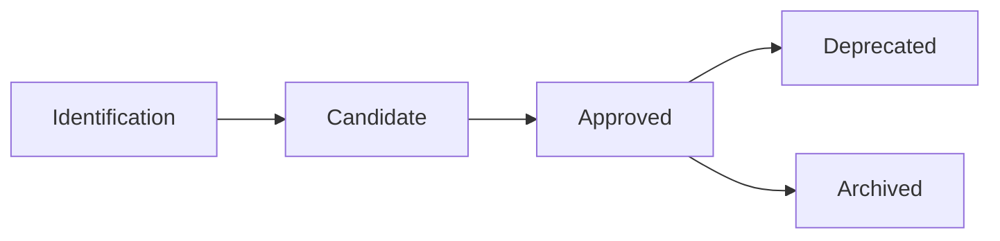

# PRA Lifecycle

This document describes the different stages in the lifecycle of a Proven Reusable Architecture (PRA), from its initial conception to its eventual deprecation.

## Overview

A PRA goes through several statuses during its lifecycle:



## PRA Statuses

### Candidate

**Definition**: PRA under initial validation.

**Criteria by scope**:

**Domain PRA**:
- At least **1 proven implementation** in production within the domain
- Complete documentation (context, architecture, ADRs, examples)
- Demonstrated reusability within the domain
- Technical quality validated by **Domain Governance Committee**

**Bank-Wide PRA**:
- At least **1 proven implementation** in production
- Complete documentation
- Demonstrated multi-domain applicability
- Technical quality validated by **Expert Architects Governance Committee**

**Location**:
- Domain: `pra/secteurs/[domain]/[category]/`
- Bank-Wide: `pra/transversal/[category]/`

**Usage**: May be used with caution and feedback required

### Approved

**Definition**: Validated PRA recommended for use.

**Criteria by scope**:

**Domain PRA Approved**:
- At least **1 proven implementation** within the domain
- Positive feedback from domain teams
- Documentation enriched with learnings
- Validated by **Domain Governance Committee**

**Bank-Wide PRA Approved**:
- At least **3 proven implementations** (different domains/teams)
- Positive multi-domain feedback
- Documentation enriched with multi-context learnings
- Validity confirmed across multiple domains
- Validated by **Expert Architects Governance Committee**

**Location**:
- Domain: `pra/secteurs/[domain]/[category]/`
- Bank-Wide: `pra/transversal/[category]/`

**Usage**:
- Domain: Recommended for domain projects
- Bank-Wide: Recommended for all domains

### Deprecated

**Definition**: Obsolete PRA, not recommended for new implementations.

**Reasons**:
- Obsolete technologies
- Better alternatives available
- Repeated negative feedback
- No maintenance for 12+ months

**Location**: `pra/deprecated/[category]/`

**Usage**: Maintenance only for existing projects

## Status Transitions

### Domain PRA: From Candidate to Approved

**Trigger**: 1+ documented proven implementation within the domain

**Process**:
1. Contributor updates metadata: `status: approved`
2. Automatic validation via GitHub Actions
3. Review by **Domain Governance Committee** (2 approvals required)
4. Merge → PRA becomes Approved (domain level)
5. Announcement to domain (Teams/email)

**Timeline**: 5-10 business days

### Bank-Wide PRA: From Candidate to Approved

**Trigger**: 3+ documented proven implementations (different domains/teams)

**Process**:
1. Contributor updates metadata: `status: approved`
2. Automatic validation via GitHub Actions
3. Review by **Expert Architects Governance Committee** (2 approvals required)
4. Verification of multi-domain applicability
5. Merge → PRA becomes Bank-Wide Approved
6. Automatic publication to Confluence
7. Announcement to all domains (Teams/email)

**Timeline**: 2-4 weeks

### Domain PRA: Promotion to Bank-Wide

**Trigger**: Domain PRA identified as reusable outside the domain

**Process**:
1. **Domain Committee** proposes promotion (with justification)
2. Create promotion dossier with multi-domain evidence
3. Review by **Expert Architects Committee**
4. Validation of Bank-Wide criteria (3+ proven-in-use required)
5. If approved → move to `transversal/`
6. Communication to all domains

**Timeline**: 4-8 weeks

See detailed guide: [Promotion Process](/guides/07-promotion-process)

### From Approved to Deprecated

**Trigger**: Proposal from relevant committee or repeated negative feedback

**Process by scope**:

**Domain PRA**:
1. Proposal from **Domain Committee** (with justification)
2. Discussion with domain users
3. Domain Committee vote (simple majority)
4. Update metadata: `status: deprecated`
5. Communication to domain teams
6. 3-month transition period

**Bank-Wide PRA**:
1. Proposal from **Expert Architects Committee** (with justification)
2. Multi-domain consultation
3. Expert Architects Committee vote (2/3)
4. Update metadata: `status: deprecated`, recommended alternative
5. Communication to all domains
6. 6-month transition period

**Timeline**: 2-4 weeks + transition period

## Ongoing Maintenance

### Domain PRA Approved

**Responsibilities**:
- **Designated maintainer**: Documentation updates, answering questions
- **Domain Governance Committee**: Quality monitoring, update validation

**Cadence**:
- **Quarterly review**: Domain relevance, usage, feedback
- **As-needed updates**: New technology versions, learnings

### Bank-Wide PRA Approved

**Responsibilities**:
- **Designated maintainer**: Documentation updates, multi-domain support
- **Expert Architects Committee**: Quality monitoring, update validation

**Cadence**:
- **Annual review**: Multi-domain relevance, adoption, feedback
- **As-needed updates**: BNC standard evolutions, new learnings

### Candidate PRA

**Responsibilities**:
- **Original contributor**: Initial documentation, early feedback
- **Early adopters**: Active feedback, documenting learnings

**Objective**:
- Domain: Reach 1 proven implementation for local Approved
- Bank-Wide: Reach 3 multi-domain implementations for Approved

## Proven-in-Use Feedback

Each PRA implementation must be documented with:

```yaml
proven_in_use:
  - project: "Project name"
    team: "Team name"
    date: "YYYY-MM-DD"
    feedback: "Concrete results and learnings"
    metrics:
      - "40% reduction in deployment time"
      - "100% change traceability"
```

**Quality criteria**:
- Project in **production** (not dev/staging)
- **Concrete** and **measurable** feedback
- Recent implementation date (< 2 years)

## Success Criteria

### For a Domain PRA Candidate

- [ ] 1+ documented proven-in-use within the domain
- [ ] Complete and clear documentation
- [ ] Positive feedback from pilot team
- [ ] No major technical blockers
- [ ] Validated by Domain Committee

### For a Domain PRA Approved

- [ ] 1+ documented proven-in-use within the domain
- [ ] Positive feedback from domain teams
- [ ] Documentation enriched with learnings
- [ ] Confirmed reusability within the domain
- [ ] Regular maintenance (< 6 months since last update)

### For a Bank-Wide PRA Candidate

- [ ] 1+ documented proven-in-use
- [ ] Complete documentation with multi-domain vision
- [ ] Demonstrated multi-domain applicability
- [ ] No major technical blockers
- [ ] Validated by Expert Architects Committee

### For a Bank-Wide PRA Approved

- [ ] 3+ documented proven-in-use (different domains/teams)
- [ ] Positive multi-domain feedback
- [ ] Documentation enriched with multi-context learnings
- [ ] Varied use cases (different domains)
- [ ] User satisfaction > 8/10
- [ ] Regular maintenance (< 6 months since last update)

## Support and Questions

For any questions about the PRA lifecycle:

- **Teams Channel**: `#pra-registry`
- **Email**: pra-governance@company.com
- **GitHub Issues**: [Open an issue](https://github.com/org/pra-registry/issues)

---

**Recommended path**:
1. [Getting Started with PRAs](/guides/01-getting-started)
2. [Understanding PRAs](/guides/02-understanding-pra)
3. [Roles and Responsibilities](/guides/03-roles-responsibilities)
4. **Lifecycle** (you are here)
5. [Quality Standards](/guides/05-standards)
6. [Contributing a PRA](/guides/06-contributing)
7. [Promotion Process](/guides/07-promotion-process)
8. [Governance](/guides/08-governance)

---

**Navigation**:
- **Previous**: [Roles and Responsibilities](/guides/03-roles-responsibilities)
- **Next**: [Quality Standards](/guides/05-standards)

---

**Last updated**: 2025-12-02
**Next review**: 2026-06-02
