# PRA Registry Governance

This document defines the two-tier governance structure, roles, and processes of the PRA Registry.

##  Two-Tier Governance Structure

The PRA registry operates with **two governance levels** to reflect the organizational reality at the National Bank:

```mermaid
graph TB
    ARCH["🏗️ ARCHITECTS<br/>in Domains"]
    TRANS["⚡ CROSS-CUTTING TEAMS<br/>(Software Engineering, etc.)"]
    BOOT["🚀 BOOTSTRAP<br/>(Priority Identification)"]

    GOV_DOM["🔵 Domain Governance<br/>Committees"]
    GOV_BW["🟣 Expert Architects<br/>Governance Committee"]

    DOM["🔵 DOMAIN PRAs"]
    BW["🟢 BANK-WIDE PRAs"]

    ARCH -->|"Architectures"| GOV_DOM
    GOV_DOM -->|"Flow 1:<br/>Evaluated reusable"| DOM
    DOM -->|"If reusable<br/>outside domain"| GOV_BW

    TRANS -->|"Flow 2:<br/>New standards"| GOV_BW

    BOOT -.->|"Flow 3:<br/>Existing candidates"| GOV_BW

    GOV_BW -->|"Approved"| BW

    style BW fill:#10b981,stroke:#059669,stroke-width:4px,color:#fff
    style DOM fill:#3b82f6,stroke:#2563eb,stroke-width:4px,color:#fff
    style GOV_BW fill:#8b5cf6,stroke:#7c3aed,stroke-width:3px,color:#fff
    style GOV_DOM fill:#60a5fa,stroke:#2563eb,stroke-width:3px,color:#fff
    style ARCH fill:#fbbf24,stroke:#d97706,stroke-width:3px,color:#000
    style TRANS fill:#f59e0b,stroke:#d97706,stroke-width:3px,color:#000
    style BOOT fill:#ef4444,stroke:#dc2626,stroke-width:3px,color:#fff
```

### Tier 1: Domain Governance Committees

**For** : Validation of PRAs at the domain level (Retail, Corporate, Wealth Management)

#### Composition
- **Number**: 3 to 5 architects from the domain
- **Profiles**: Solution architects from the domain
- **Representation**: Different teams within the domain
- **Term**: Annually renewable

#### Responsibilities
-  **Validate Domain PRAs** (functional AND technical)
-  Verify 1+ proven-in-use within the domain
-  Approve transition to Approved status (domain level)
-  Identify PRA candidates for Bank-Wide promotion
-  Local review < 5 business days

#### Validation Criteria
- **Proven-in-use**: Minimum 1 implementation within the domain
- **Documentation**: Complete and compliant with template
- **Reusability**: Generalizable within the domain
- **Quality**: Technical standards and security respected

### Tier 2: Expert Architects Governance Committee

**For**: Validation of Bank-Wide PRAs (applicable to all domains)

#### Composition
- **Number**: 5 to 7 expert architects
- **Profiles**: Expert architects close to practice
- **Representation**: Cross-domain and cross-team
- **Term**: Annually renewable

#### Responsibilities
-  **Validate Bank-Wide PRAs** (infrastructure, standards, common patterns)
-  Verify 3+ proven-in-use from different domains/teams
-  Approve Domain → Bank-Wide promotions
-  Validate standards from cross-cutting teams
-  Manage Bootstrap (priority identification)
-  Arbitrate cross-domain conflicts
-  Review < 2 weeks

#### Validation Criteria
- **Proven-in-use**: Minimum 3 implementations (different domains/teams)
- **Multi-domain reusability**: Applicable to 3+ domains
- **Standards**: Compliance with BNC target architecture
- **Enriched documentation**: Multi-context learnings

##  Three PRA Creation Flows

### Flow 1: Domain → Bank-Wide (Organic Emergence)

**Source**: Architects in domains

**Process**:
1. Architects define **architectures** (functional AND technical)
2. Some architectures evaluated as **reusable** → become **Domain PRAs**
3. Validation by **Domain Governance Committee** (1+ proven-in-use)
4. Domain PRAs reusable **outside the domain** → Bank-Wide promotion proposal
5. Review by **Expert Architects Governance Committee** (3+ proven-in-use)
6. Approved → becomes **Bank-Wide PRA**

**Examples**:
- File transfer pattern from Wealth Management → Bank-Wide
- Digital onboarding pattern from Retail → Bank-Wide (if repeated elsewhere)

**Applicable Governance**:
- **Local stage**: Domain Governance Committee
- **Bank-Wide stage**: Expert Architects Governance Committee

---

### Flow 2: Cross-Cutting Standards → Bank-Wide (Top-Down)

**Source**: Cross-cutting teams (Software Engineering, Security, Cloud Infra)

**Process**:
1. Cross-cutting teams define **new standards** for the bank
2. Standards translate into **Bank-Wide PRAs**
3. Direct submission to **Expert Architects Governance Committee**
4. Review and validation (Bank-Wide criteria: 3+ proven-in-use expected)
5. Approved → **Bank-Wide PRA** available to all

**Examples**:
- CI/CD GitOps with ArgoCD
- Observability (Prometheus/Grafana/Tempo)
- Zero Trust network security
- Secrets management with Vault

**Applicable Governance**:
- **Direct**: Expert Architects Governance Committee

---

### Flow 3: Bootstrap (Current Situation - Transitional)

**Source**: Proactive priority identification by Expert Architects Committee

**Context**: No existing pattern registry currently → quick-start strategy

**Process**:
1. Expert Architects Committee identifies **priority topics** to cover Bank-Wide
2. Search for **existing architectures** in domains (good candidates)
3. Evaluation and selection of best candidates
4. **Direct Bank-Wide** promotion (bypassing standard Domain process)
5. Communication and enriched documentation

**Examples**:
- File transfer identified as priority → WM pattern evaluated → directly Bank-Wide
- Async APIs identified as need → best domain pattern → Bank-Wide

**Why this flow?**:
- Rapidly populate initial registry
- Avoid existing duplication (same topic in multiple domains)
- Identify and promote best practices already in place

**Status**: **Transitional** - This flow will decrease over time as the registry matures

**Applicable Governance**:
- **Leadership**: Expert Architects Governance Committee
- **Consultation**: Domain Committees (for candidate validation)

##  Submission Process by Scope

### For a Domain PRA (Flow 1 - Local Level)

#### 1. Preparation
Domain architect prepares the PRA according to the [provided template](/templates/pra-template.md).

**Content**: Any type of pattern (functional OR technical)

#### 2. Submission (Pull Request)
- Fork repository
- Create PRA file in `content/registre/secteurs/[domain]/[category]/`
- Pull Request with tags `scope:domain` and `domain:[domain-name]`

#### 3. Automated Validation
GitHub Actions verifies format, mandatory sections, links.

#### 4. Review by Domain Committee
- 2 members of Domain Governance Committee review
- Discussion via PR comments
- Verification: 1+ proven-in-use within domain

#### 5. Decision
- **Approved** → Merge as Domain PRA Approved
- **Revisions** → Iterations
- **Rejected** → Feedback and closure

**Timeline**: 5-10 business days

---

### For a Bank-Wide PRA (Flow 2 - Direct)

#### 1. Preparation
Cross-cutting team prepares the PRA (infrastructure/foundation standard).

#### 2. Submission (Pull Request)
- Create PRA file in `content/registre/transversal/[category]/`
- Pull Request with tag `scope:bank-wide`
- Justification of cross-cutting nature

#### 3. Review by Expert Architects Committee
- 2-3 members review
- Verification of multi-domain applicability
- Requirement: 3+ proven-in-use (or clear adoption plan)

#### 4. Decision
- **Approved** → Merge as Bank-Wide PRA Approved
- **Revisions** → Iterations
- **Rejected** → Can be redirected to Domain level

**Timeline**: 2-4 weeks

---

### For Domain → Bank-Wide Promotion (Flow 1 - Promotion)

See dedicated guide: [Promotion Process](/guides/07-promotion-process)

**Trigger**: Domain PRA identified as reusable outside domain

**Governance**:
1. Proposal by Domain Committee
2. Review by Expert Architects Committee
3. Validation of Bank-Wide criteria (3+ proven-in-use required)

##  Approval Criteria by Level

### Domain PRA (Approved)

 **1+ proven implementation** in production within the domain
 Complete documentation (context, architecture, ADR, examples)
 Reusability within the domain
 Technical quality validated by Domain Committee
 Can be functional OR technical

### Bank-Wide PRA (Approved)

 **3+ proven implementations** in production (different domains/teams)
 Positive feedback from user teams
 Documentation enriched with multi-context learnings
 Reusability demonstrated across the bank
 Validated by Expert Architects Committee

##  Deprecation Process

A PRA may be deprecated if:

-  Obsolete technologies
-  Better alternatives available
-  Repeated negative feedback
-  No maintenance for 12+ months

### Process by Level

**Domain PRA**:
1. Proposal by Domain Committee or maintainer
2. Discussion with domain users
3. Domain Committee vote
4. Migration to `deprecated`

**Bank-Wide PRA**:
1. Proposal by Expert Architects Committee
2. Multi-domain consultation
3. Expert Architects Committee vote
4. Communicated migration plan
5. Transition period (6 months)

##  Governance Meetings

### Domain Governance Committees
- **Frequency**: Monthly
- **Duration**: 1 hour maximum
- **Agenda**:
  - Review new domain submissions
  - Follow-up on candidate PRAs
  - Identification of candidates for Bank-Wide promotion

### Expert Architects Governance Committee
- **Frequency**: Biweekly (every 2 weeks)
- **Duration**: 1.5 hours maximum
- **Agenda**:
  - Review Bank-Wide PRAs (Flow 2)
  - Review Domain → Bank-Wide promotions (Flow 1)
  - Identification of Bootstrap priorities (Flow 3)
  - Standards evolution
  - Cross-domain issues

##  Communication

### Domain Committees
- **Teams Channel**: `#pra-[domain-name]`
- **Email**: pra-[domain]@company.com

### Expert Architects Committee
- **Teams Channel**: `#pra-governance`
- **Email**: pra-governance@company.com
- **GitHub Issues**: For public questions

##  Governance Metrics

### By Domain
- Number of active Domain PRAs
- Promotion rate to Bank-Wide
- Average review time
- Domain contributor satisfaction

### Bank-Wide
- Number of active Bank-Wide PRAs
- Multi-domain adoption (how many domains use)
- Deprecation rate
- Overall user feedback

##  Governance Evolution

This governance document may evolve. Any major modification must:

1. Be proposed via PR
2. Be discussed in Expert Architects Committee meeting
3. Be validated by Domain Committees (consultation)
4. Be approved by 2/3 vote of Expert Architects Committee

##  Summary: Who Validates What?

| PRA Type | Governance | Proven-in-use Criteria | Timeline |
|----------|------------|----------------------|----------|
| **Domain** (functional/technical) | Domain Committee | 1+ within domain | 5-10 days |
| **Bank-Wide** (cross-cutting standard) | Expert Architects Committee | 3+ multi-domain | 2-4 weeks |
| **Promotion** (Domain → Bank-Wide) | Expert Architects Committee | 3+ multi-domain | 4-8 weeks |
| **Bootstrap** (existing candidate) | Expert Architects Committee | Case-by-case evaluation | 2-3 weeks |

---

**Recommended path**:
1. [Getting Started with PRAs](/guides/01-getting-started)
2. [Understanding PRAs](/guides/02-understanding-pra)
3. [Roles and Responsibilities](/guides/03-roles-responsibilities)
4. [Lifecycle](/guides/04-lifecycle)
5. [Quality Standards](/guides/05-standards)
6. [Contributing a PRA](/guides/06-contributing)
7. [Promotion Process](/guides/07-promotion-process)
8.  **Governance** (you are here)

---

**Navigation**:
-  **Previous**: [Promotion Process](/guides/07-promotion-process)
-  **Back to start**: [Getting Started with PRAs](/guides/01-getting-started)

---

**Last updated**: 2025-12-02
**Next review**: 2026-06-02
