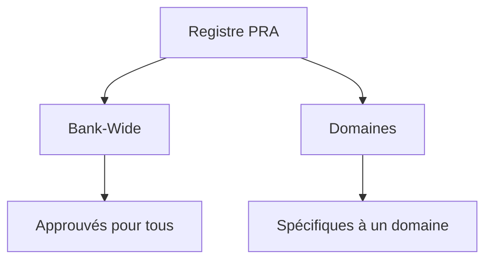
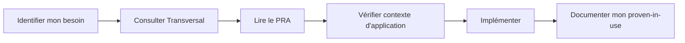

#  Démarrer avec les PRA

Bienvenue dans le **Registre des Proven Reusable Architecture (PRA)** !

Ce guide vous aidera à comprendre rapidement ce qu'est un PRA et comment l'utiliser dans vos projets.

##  Qu'est-ce qu'un PRA ?

Un **Proven Reusable Architecture (PRA)** est une **solution éprouvée** à un problème récurrent d'architecture logicielle.

### En 3 points clés

1. ** Proven-in-use** : Validé en production réelle (pas théorique)
2. ** Réutilisable** : Applicable à plusieurs contextes et projets
3. ** Bien documenté** : Contexte, architecture, exemples, retours d'expérience

### Analogie Simple

Pensez aux PRA comme des **recettes de cuisine éprouvées** :
- La recette (le PRA) a été testée plusieurs fois
- Elle fonctionne dans différentes cuisines (contextes)
- Elle documente les ingrédients (stack tech), les étapes (implémentation) et les pièges à éviter

##  Pourquoi utiliser les PRA ?

### Gain de Temps
-  Éviter de réinventer la roue
-  Solutions prêtes à l'emploi
-  Retours d'expérience documentés

### Qualité
-  Solutions validées en production
-  Best practices intégrées
-  Pièges courants documentés

### Cohérence
-  Alignement architectural entre équipes
-  Vocabulaire commun
-  Standards partagés

##  Comment naviguer dans le registre ?

Le registre PRA est organisé en **2 scopes** :

###  Bank-Wide (Transversal)
- **Pour qui ?** Tous les domaines de l'organisation
- **Maturité** : Validés par le Comité de Gouvernance Architectes Experts (3+ proven-in-use)
- **Exemples** : Authentification, Observabilité, CI/CD, File Transfer

###  Domaines
- **Pour qui ?** Équipes d'un domaine spécifique (Particuliers, Entreprises, Gestion de Patrimoine)
- **Maturité** : Validés par le Comité de Gouvernance du Domaine (1+ proven-in-use)
- **Contenu** : Tous types de patterns (fonctionnels ET techniques)
- **Exemples** : Onboarding digital, Intégration SAP, Serverless AWS, Data pipelines
- **Note** : Les PRAs en cours de promotion vers Bank-Wide ont un statut spécifique visible dans leur métadonnées

##  Vos premiers pas

### 1 Je veux **utiliser** un PRA

**Action** : Parcourez la section [Transversal](/registre/transversal)

### 2 Je veux **contribuer** un PRA

**Action** : Consultez le guide [Contribuer](/guides/06-contributing)

### 3 Je veux **comprendre** la gouvernance

**Action** : Suivez ce parcours dans l'ordre :
1. [Comprendre les PRA](/guides/02-understanding-pra)
2. [Rôles et Responsabilités](/guides/03-roles-responsibilities)
3. [Cycle de Vie](/guides/04-lifecycle)
4. [Gouvernance](/guides/08-governance)

##  Exemple Concret

### Scénario : "Je dois implémenter de l'authentification"

#### Étape 1 : Rechercher
Allez dans **Transversal > Security** et cherchez "Authentication"

#### Étape 2 : Vérifier l'applicabilité
Lisez la section **"Quand utiliser ce PRA ?"**
-  Application web avec utilisateurs
-  Besoin de SSO
-  Application interne sans login

#### Étape 3 : Lire la documentation
- Contexte et problème résolu
- Architecture proposée
- Stack technologique (Auth0, Keycloak, etc.)
- Exemples de code

#### Étape 4 : Implémenter
Suivez le guide d'implémentation pas à pas

#### Étape 5 : Feedback
Documentez votre implémentation dans les **proven-in-use**

##  Questions Fréquentes

### Dois-je obligatoirement utiliser un PRA ?

**Non.** Les PRA sont des **recommandations**, pas des obligations.

**Mais** : Si un PRA applicable existe et que vous ne l'utilisez pas, vous devrez justifier pourquoi (lors des revues d'architecture).

### Puis-je adapter un PRA à mon contexte ?

**Oui, absolument !** Les PRA sont des **patrons**, pas du code figé.

**Important** : Documentez vos adaptations et partagez vos learnings.

### Combien de temps pour qu'un PRA soit approuvé ?

**PRA Domaine** :
- **Candidate** : 5-10 jours (review par Comité Domaine)
- **Approved** : Quand 1+ proven-in-use documenté dans le domaine

**PRA Bank-Wide** :
- **Review initiale** : 2-4 semaines (review par Comité Architectes Experts)
- **Approved** : Quand 3+ proven-in-use documentés (multi-domaines)

### Je ne trouve pas de PRA pour mon besoin

**Options** :
1. Cherchez dans les **domaines** (peut-être existe dans un autre domaine)
2. Vérifiez les PRAs avec statut **"en promotion"** (peut-être en cours de validation Bank-Wide)
3. **Contribuez !** Votre solution peut devenir un nouveau PRA

##  Prochaines Étapes

Maintenant que vous comprenez les bases, continuez votre apprentissage :

 **Suivant** : [Comprendre les PRA](/guides/02-understanding-pra) - Anatomie détaillée d'un PRA

---

**Parcours recommandé** :
1.  **Démarrer avec les PRA** (vous êtes ici)
2. [Comprendre les PRA](/guides/02-understanding-pra)
3. [Rôles et Responsabilités](/guides/03-roles-responsibilities)
4. [Cycle de Vie](/guides/04-lifecycle)
5. [Standards de Qualité](/guides/05-standards)
6. [Contribuer un PRA](/guides/06-contributing)
7. [Processus de Promotion](/guides/07-promotion-process)
8. [Gouvernance](/guides/08-governance)

---

**Besoin d'aide ?**
- **Canal Teams** : `#pra-registry`
- **Email** : pra-support@company.com
- **Documentation** : Ce site

---

**Dernière mise à jour** : 2025-12-02
