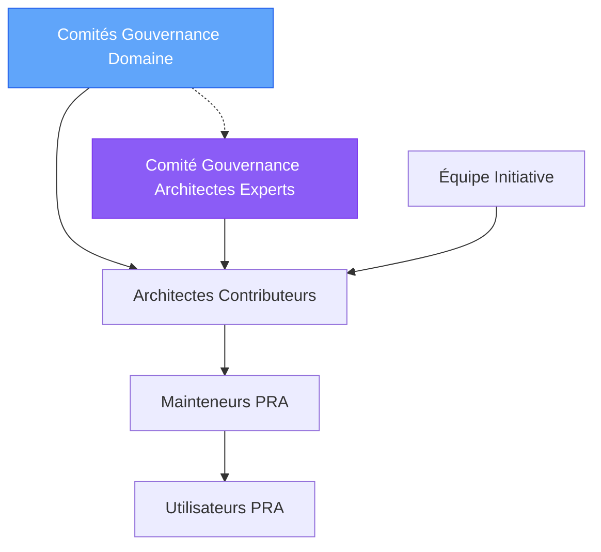

# Rôles et Responsabilités

Ce document définit les rôles clés dans l'écosystème du registre PRA et leurs responsabilités respectives.

##  Vue d'ensemble des Rôles

##  Comités de Gouvernance par Domaine

### Composition

- **Nombre** : 3 à 5 architectes par domaine
- **Profils** : Architectes de solutions du domaine
- **Représentation** : Différentes équipes du domaine (Particuliers, Entreprises, Gestion de Patrimoine)
- **Mandat** : Renouvelable annuellement
- **Décisions** : Par consensus ou vote majoritaire

### Responsabilités

#### 1. Review des PRA Domaine

- Évaluer techniquement et qualitativement les nouveaux PRA du domaine
- Vérifier conformité aux standards
- Valider applicabilité dans le domaine
- **Timeline** : Review initiale sous 5 jours ouvrés

#### 2. Approbation des PRA Domaine

**Pour les PRA Domaine Approved** :
- Valider conformité au template
- Vérifier 1+ proven-in-use dans le domaine
- Approuver passage en statut Approved (échelle domaine)
- **Seuil** : 2 approvals requis dans le comité domaine

#### 3. Identification Candidats Bank-Wide

- Identifier PRA domaine réutilisables hors du domaine
- Proposer promotions Domaine → Bank-Wide
- Fournir justification et preuves de réutilisabilité

#### 4. Maintenance Locale

- Review trimestrielle des PRA domaine
- Identifier PRA obsolètes dans le domaine
- Adapter standards Bank-Wide au contexte domaine

### Réunions

- **Fréquence** : Mensuelle
- **Durée** : 1h maximum
- **Agenda type** :
  - Review nouvelles soumissions domaine (30 min)
  - Suivi PRA candidates domaine (15 min)
  - Identification candidats Bank-Wide (10 min)
  - Questions diverses (5 min)

### Engagement Attendu

- **Temps** : 2-3 heures/mois
- **Disponibilité** : Review PR sous 48h
- **Participation** : 80%+ réunions

##  Comité de Gouvernance Architectes Experts

### Composition

- **Nombre** : 5 à 7 architectes experts
- **Profils** : Architectes experts proches de la pratique
- **Représentation** : Cross-domaines et cross-équipes transversales
- **Mandat** : Renouvelable annuellement
- **Décisions** : Par consensus ou vote 2/3

### Responsabilités

#### 1. Review des PRA Bank-Wide

- Évaluer PRA standards transversaux (Flow 2 : équipes transversales)
- Évaluer promotions Domaine → Bank-Wide (Flow 1)
- Gérer Bootstrap : identifier et valider priorités (Flow 3)
- **Timeline** : Review sous 2 semaines

#### 2. Approbation des PRA Bank-Wide

**Pour les PRA Bank-Wide Approved** :
- Vérifier 3+ proven-in-use (différents domaines/équipes)
- Valider applicabilité multi-domaine
- Vérifier conformité architecture cible BNC
- Approuver passage en statut Approved Bank-Wide
- **Seuil** : 2 approvals requis dans le comité

#### 3. Gouvernance Stratégique

- Approuver promotions Domaine → Bank-Wide
- Approuver dépréciations Bank-Wide (avec consultation multi-domaine)
- Valider nouveaux standards des équipes transversales
- Arbitrer conflits inter-domaines

#### 4. Bootstrap et Priorisation

- Identifier sujets prioritaires Bank-Wide
- Rechercher candidats existants dans domaines
- Valider promotion directe (bypass Domaine standard)
- **Note** : Flux transitoire, diminuera avec maturité registre

### Réunions

- **Fréquence** : Bimensuelle (toutes les 2 semaines)
- **Durée** : 1h30 maximum
- **Agenda type** :
  - Review PRAs Bank-Wide (Flow 2) (30 min)
  - Review promotions Domaine → Bank-Wide (Flow 1) (30 min)
  - Bootstrap et priorités (Flow 3) (20 min)
  - Points stratégiques (10 min)

### Engagement Attendu

- **Temps** : 3-5 heures/mois
- **Disponibilité** : Review PR sous 72h
- **Participation** : 80%+ réunions

##  Équipe Initiative PRA

### Composition

- **Nombre** : 2-3 personnes dédiées
- **Profils** :
  - 1 Architecte Senior (lead)
  - 1 DevOps/Platform Engineer
  - 1 Developer Experience (DX) Specialist (optionnel)

### Responsabilités

#### 1. Infrastructure & Outillage

- Maintenir repository Git et structure
- Gérer site Fumadocs et Orama search
- Maintenir workflows GitHub Actions
- Gérer sync Confluence
- Monitoring et alertes

#### 2. Support Communauté

- Répondre questions sur `#pra-registry`
- Aider contributeurs avec templates et processus
- Organiser sessions de formation
- Créer documentation et guides

#### 3. Évolution Continue

- Proposer améliorations processus
- Implémenter nouvelles fonctionnalités
- Collecter et analyser feedback
- Roadmap et priorisation

#### 4. Communication

- Newsletter mensuelle
- Annonces nouveaux PRA
- Promotions secteur  transversal
- Stats et métriques d'adoption

### Engagement Attendu

- **Temps** : 20-40% temps de travail
- **Disponibilité** : Support actif communauté
- **Proactivité** : Amélioration continue

##  Architectes Contributeurs

### Qui sont-ils ?

**Tous les architectes** de l'organisation peuvent contribuer :
- Architectes d'entreprise
- Architectes de solution
- Architectes techniques
- Architectes de secteur

### Responsabilités

#### 1. Identifier des Patrons Réutilisables

- Observer patterns récurrents dans projets
- Identifier solutions éprouvées en production
- Évaluer réutilisabilité et généralisation

#### 2. Documenter des PRA

- Utiliser template officiel
- Fournir contexte et ADR complets
- Inclure exemples et proven-in-use
- Respecter standards de qualité

#### 3. Maintenir leurs PRA

- Répondre aux questions utilisateurs
- Intégrer feedback et learnings
- Mettre à jour documentation
- Proposer évolutions

#### 4. Reviewer des PRA

- Participer aux reviews de PRs
- Fournir feedback constructif
- Valider applicabilité dans leur contexte
- Partager expérience similaire

### Droits

-  **Libre choix** : Pas d'obligation d'utiliser un PRA
-  **Accès complet** : Tous les PRA approved et candidates
-  **Support** : Assistance équipe Initiative
-  **Visibilité** : Reconnaissance contributions

### Devoirs

-  **Justification** : Expliquer si on n'utilise pas un PRA applicable
-  **Feedback** : Partager retours sur PRA utilisés
-  **Documentation** : Documenter proven-in-use
-  **Respect** : Suivre processus et standards

##  Mainteneurs PRA

### Qui sont-ils ?

Architectes désignés comme responsables d'un ou plusieurs PRA spécifiques.

### Responsabilités

#### 1. Ownership du PRA

- Garantir qualité et actualité
- Décider évolutions et modifications
- Valider PRs de contributions externes

#### 2. Documentation

- Maintenir documentation à jour
- Enrichir avec nouveaux learnings
- Clarifier points ambigus
- Ajouter exemples

#### 3. Support Utilisateurs

- Répondre questions sur le PRA
- Aider adoption dans nouveaux projets
- Débloquer problèmes d'implémentation
- Collecter feedback

#### 4. Évolution

- Proposer améliorations basées sur feedback
- Adapter aux nouvelles versions technologiques
- Identifier besoins de dépréciation
- Créer versions successeurs si nécessaire

### Durée Engagement

- **Minimum** : 1 an
- **Transfert** : Possible avec validation Table Gouvernance
- **Rotation** : Encouragée tous les 2-3 ans

##  Utilisateurs PRA

### Qui sont-ils ?

- **Développeurs** : Implémentent les PRA dans le code
- **Architectes** : Utilisent les PRA dans conceptions
- **Product Owners** : Référencent les PRA dans specs
- **Tech Leads** : Recommandent les PRA à leurs équipes

### Responsabilités

#### 1. Utilisation Appropriée

- Comprendre contexte d'application du PRA
- Respecter guidelines et best practices
- Adapter aux spécificités projet (avec justification)

#### 2. Feedback

- Documenter implémentation (proven-in-use)
- Signaler problèmes ou limitations
- Proposer améliorations
- Partager learnings

#### 3. Contribution

- Enrichir exemples et cas d'usage
- Corriger erreurs documentation
- Proposer clarifications
- Aider autres utilisateurs

### Droits

-  **Accès libre** : Tous les PRA sans restriction
-  **Support** : Aide mainteneurs et communauté
-  **Adaptation** : Flexibilité dans implémentation (justifiée)
-  **Contribution** : Proposer modifications via PR

##  Matrice RACI

| Activité | Comités Domaine | Comité Experts | Équipe Init. | Contributeurs | Mainteneurs | Utilisateurs |
|----------|-----------------|----------------|--------------|---------------|-------------|--------------|
| Soumettre PRA Domaine | C | I | I | **R** | I | I |
| Review PRA Domaine | **R/A** | I | C | C | I | I |
| Approuver PRA Domaine | **A** | I | I | I | C | I |
| Soumettre PRA Bank-Wide | I | C | I | **R** | I | I |
| Review PRA Bank-Wide | I | **R/A** | C | C | I | I |
| Approuver PRA Bank-Wide | I | **A** | I | I | C | I |
| Proposer promotion Domaine→BW | **R** | C | I | C | C | I |
| Approuver promotion Domaine→BW | C | **A** | I | C | C | I |
| Bootstrap (identifier priorités) | C | **R/A** | C | I | I | I |
| Maintenir infrastructure | I | I | **R/A** | I | I | I |
| Maintenir PRA | I | I | C | I | **R/A** | C |
| Utiliser PRA | I | I | I | I | C | **R/A** |
| Déprécier PRA Domaine | **A** | I | C | C | R | C |
| Déprécier PRA Bank-Wide | C | **A** | C | C | R | C |
| Former communauté | I | I | **R/A** | C | C | I |

**Légende** :
- **R** : Responsable (fait le travail)
- **A** : Approbateur (décide)
- **C** : Consulté (donne input)
- **I** : Informé (reçoit notification)

##  Contacts

### Comités de Gouvernance Domaine
- **Particuliers** : `#pra-particuliers` | pra-particuliers@company.com
- **Entreprises** : `#pra-entreprises` | pra-entreprises@company.com
- **Gestion de Patrimoine** : `#pra-gp` | pra-gp@company.com

### Comité de Gouvernance Architectes Experts
- **Canal Teams** : `#pra-governance`
- **Email** : pra-governance@company.com
- **Membres** : Voir [Page Gouvernance](/guides/08-governance)

### Équipe Initiative
- **Canal Teams** : `#pra-initiative`
- **Email** : pra-team@company.com
- **Lead** : [Nom Lead Équipe]

### Support Communauté
- **Canal Teams** : `#pra-registry`
- **Email** : pra-support@company.com
- **GitHub Issues** : [Lien Repository]

---

**Parcours recommandé** :
1. [Démarrer avec les PRA](/guides/01-getting-started)
2. [Comprendre les PRA](/guides/02-understanding-pra)
3.  **Rôles et Responsabilités** (vous êtes ici)
4. [Cycle de Vie](/guides/04-lifecycle)
5. [Standards de Qualité](/guides/05-standards)
6. [Contribuer un PRA](/guides/06-contributing)
7. [Processus de Promotion](/guides/07-promotion-process)
8. [Gouvernance](/guides/08-governance)

---

**Navigation** :
-  **Précédent** : [Comprendre les PRA](/guides/02-understanding-pra)
-  **Suivant** : [Cycle de Vie](/guides/04-lifecycle)

---

**Dernière mise à jour** : 2025-12-02
**Prochaine review** : 2026-06-02
