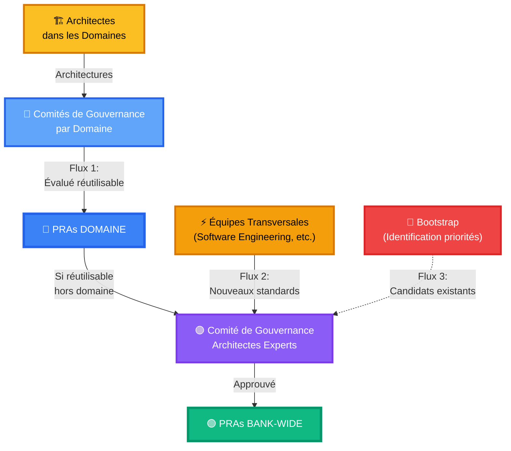

# Gouvernance du Registre PRA

Ce document définit la structure de gouvernance à deux niveaux, les rôles, et les processus du Registre PRA.

##  Structure de Gouvernance à Deux Niveaux

Le registre PRA fonctionne avec **deux niveaux de gouvernance** pour refléter la réalité organisationnelle de la Banque Nationale :

### Niveau 1 : Comités de Gouvernance par Domaine

**Pour qui** : Validation des PRAs à l'échelle d'un domaine spécifique (Particuliers, Entreprises, Gestion de Patrimoine)

#### Composition
- **Nombre** : 3 à 5 architectes du domaine
- **Profils** : Architectes de solutions du domaine
- **Représentation** : Différentes équipes du domaine
- **Mandat** : Renouvelable annuellement

#### Responsabilités
-  **Valider les PRAs Domaine** (fonctionnels ET techniques)
-  Vérifier 1+ proven-in-use dans le domaine
-  Approuver passage en statut Approved (échelle domaine)
-  Identifier PRAs candidats pour promotion Bank-Wide
-  Review locale < 5 jours ouvrés

#### Critères de Validation
- **Proven-in-use** : Minimum 1 implémentation dans le domaine
- **Documentation** : Complète et conforme au template
- **Réutilisabilité** : Généralisable au sein du domaine
- **Qualité** : Standards techniques et sécurité respectés

### Niveau 2 : Comité de Gouvernance Architectes Experts

**Pour qui** : Validation des PRAs Bank-Wide (applicable à tous les domaines)

#### Composition
- **Nombre** : 5 à 7 architectes experts
- **Profils** : Architectes experts proches de la pratique
- **Représentation** : Cross-domaines et cross-équipes
- **Mandat** : Renouvelable annuellement

#### Responsabilités
-  **Valider les PRAs Bank-Wide** (infrastructure, standards, patterns communs)
-  Vérifier 3+ proven-in-use de différents domaines/équipes
-  Approuver promotions Domaine → Bank-Wide
-  Valider standards des équipes transversales
-  Gérer le Bootstrap (identification priorités)
-  Arbitrer conflits inter-domaines
-  Review < 2 semaines

#### Critères de Validation
- **Proven-in-use** : Minimum 3 implémentations (différents domaines/équipes)
- **Réutilisabilité multi-domaine** : Applicable à 3+ domaines
- **Standards** : Conformité avec architecture cible BNC
- **Documentation enrichie** : Learnings multi-contextes

##  Trois Flux de Création de PRAs

### Flux 1 : Domaine → Bank-Wide (Émergence Organique)

**Source** : Architectes dans les domaines

**Processus** :
1. Architectes définissent des **architectures** (fonctionnelles ET techniques)
2. Certaines architectures évaluées **réutilisables** → deviennent **PRAs Domaine**
3. Validation par **Comité de Gouvernance du Domaine** (1+ proven-in-use)
4. PRAs Domaine réutilisables **hors du domaine** → proposition promotion Bank-Wide
5. Review par **Comité Gouvernance Architectes Experts** (3+ proven-in-use)
6. Approuvé → devient **PRA Bank-Wide**

**Exemples** :
- File transfer pattern de Gestion de Patrimoine → Bank-Wide
- Onboarding digital pattern de Particuliers → Bank-Wide (si répété ailleurs)

**Gouvernance applicable** :
- **Étape locale** : Comité de Gouvernance Domaine
- **Étape Bank-Wide** : Comité Gouvernance Architectes Experts

---

### Flux 2 : Standards Transversaux → Bank-Wide (Top-Down)

**Source** : Équipes transversales (Software Engineering, Sécurité, Infra Cloud)

**Processus** :
1. Équipes transversales définissent **nouveaux standards** pour la banque
2. Standards se traduisent en **PRAs Bank-Wide**
3. Soumission directe au **Comité Gouvernance Architectes Experts**
4. Review et validation (critères Bank-Wide : 3+ proven-in-use attendu)
5. Approuvé → **PRA Bank-Wide** disponible pour tous

**Exemples** :
- CI/CD GitOps avec ArgoCD
- Observabilité (Prometheus/Grafana/Tempo)
- Sécurité réseau Zero Trust
- Gestion des secrets avec Vault

**Gouvernance applicable** :
- **Direct** : Comité Gouvernance Architectes Experts

---

### Flux 3 : Bootstrap (Situation Actuelle - Transitoire)

**Source** : Identification proactive de priorités par Comité Architectes Experts

**Contexte** : Pas de registre de patrons existant actuellement → stratégie de démarrage rapide

**Processus** :
1. Comité Architectes Experts identifie **sujets prioritaires** à couvrir Bank-Wide
2. Recherche **architectures existantes** dans les domaines (bons candidats)
3. Évaluation et sélection des meilleurs candidats
4. Promotion **directe Bank-Wide** (bypass du processus Domaine standard)
5. Communication et documentation enrichie

**Exemples** :
- File transfer identifié comme priorité → pattern de GP évalué → directement Bank-Wide
- APIs asynchrones identifiées comme besoin → meilleur pattern domaine → Bank-Wide

**Pourquoi ce flux ?** :
- Permet de peupler rapidement le registre initial
- Évite duplication existante (même sujet dans plusieurs domaines)
- Identifie et promeut les meilleures pratiques déjà en place

**Statut** : **Transitoire** - Ce flux diminuera au fil du temps quand le registre sera mature

**Gouvernance applicable** :
- **Pilotage** : Comité Gouvernance Architectes Experts
- **Consultation** : Comités Domaines (pour validation candidats)

##  Processus de Soumission par Scope

### Pour un PRA Domaine (Flux 1 - Niveau Local)

#### 1. Préparation
L'architecte du domaine prépare le PRA selon le [template fourni](/templates/pra-template.md).

**Contenu** : Tout type de pattern (fonctionnel OU technique)

#### 2. Soumission (Pull Request)
- Fork du repository
- Création du fichier PRA dans `content/registre/secteurs/[domaine]/[categorie]/`
- Pull Request avec tag `scope:domaine` et `domaine:[nom-domaine]`

#### 3. Validation Automatique
GitHub Actions vérifie format, sections obligatoires, liens.

#### 4. Review par Comité Domaine
- 2 membres du Comité de Gouvernance Domaine reviewent
- Échanges via commentaires PR
- Vérification : 1+ proven-in-use dans le domaine

#### 5. Décision
- **Approuvé** → Merge en tant que PRA Domaine Approved
- **Révisions** → Itérations
- **Rejeté** → Feedback et fermeture

**Timeline** : 5-10 jours ouvrés

---

### Pour un PRA Bank-Wide (Flux 2 - Direct)

#### 1. Préparation
Équipe transversale prépare le PRA (standard infrastructure/fondation).

#### 2. Soumission (Pull Request)
- Création du fichier PRA dans `content/registre/transversal/[categorie]/`
- Pull Request avec tag `scope:bank-wide`
- Justification du caractère transversal

#### 3. Review par Comité Architectes Experts
- 2-3 membres reviewent
- Vérification applicabilité multi-domaine
- Exigence : 3+ proven-in-use (ou plan d'adoption clair)

#### 4. Décision
- **Approuvé** → Merge en tant que PRA Bank-Wide Approved
- **Révisions** → Itérations
- **Rejeté** → Peut être redirigé vers niveau Domaine

**Timeline** : 2-4 semaines

---

### Pour Promotion Domaine → Bank-Wide (Flux 1 - Promotion)

Voir le guide dédié : [Processus de Promotion](/guides/07-promotion-process)

**Déclencheur** : PRA Domaine identifié comme réutilisable hors domaine

**Gouvernance** :
1. Proposition par Comité Domaine
2. Review par Comité Architectes Experts
3. Validation critères Bank-Wide (3+ proven-in-use requis)

##  Critères d'Approbation par Niveau

### PRA Domaine (Approved)

 **1+ implémentation prouvée** en production dans le domaine
 Documentation complète (contexte, architecture, ADR, exemples)
 Réutilisabilité au sein du domaine
 Qualité technique validée par Comité Domaine
 Peut être fonctionnel OU technique

### PRA Bank-Wide (Approved)

 **3+ implémentations prouvées** en production (différents domaines/équipes)
 Retours positifs des équipes utilisatrices
 Documentation enrichie avec learnings multi-contextes
 Réutilisabilité démontrée à l'échelle de la banque
 Validé par Comité Architectes Experts

##  Processus de Deprecation

Un PRA peut être déprécié si :

-  Technologies obsolètes
-  Meilleures alternatives disponibles
-  Retours négatifs répétés
-  Non maintenance pendant 12+ mois

### Processus par Niveau

**PRA Domaine** :
1. Proposition par Comité Domaine ou mainteneur
2. Discussion avec utilisateurs domaine
3. Vote Comité Domaine
4. Migration vers `deprecated`

**PRA Bank-Wide** :
1. Proposition par Comité Architectes Experts
2. Consultation multi-domaines
3. Vote Comité Architectes Experts
4. Plan de migration communiqué
5. Période de transition (6 mois)

##  Réunions de Gouvernance

### Comités de Gouvernance Domaine
- **Fréquence** : Mensuelle
- **Durée** : 1h maximum
- **Agenda** :
  - Review nouvelles soumissions domaine
  - Suivi PRAs candidates
  - Identification candidats pour promotion Bank-Wide

### Comité de Gouvernance Architectes Experts
- **Fréquence** : Bimensuelle (toutes les 2 semaines)
- **Durée** : 1h30 maximum
- **Agenda** :
  - Review PRAs Bank-Wide (Flux 2)
  - Review promotions Domaine → Bank-Wide (Flux 1)
  - Identification priorités Bootstrap (Flux 3)
  - Évolutions standards
  - Points inter-domaines

##  Communication

### Comités Domaine
- **Canal Teams** : `#pra-[nom-domaine]`
- **Email** : pra-[domaine]@company.com

### Comité Architectes Experts
- **Canal Teams** : `#pra-governance`
- **Email** : pra-governance@company.com
- **Issues GitHub** : Pour questions publiques

##  Métriques de Gouvernance

### Par Domaine
- Nombre de PRAs Domaine actifs
- Taux de promotion vers Bank-Wide
- Délai moyen de review
- Satisfaction contributeurs domaine

### Bank-Wide
- Nombre de PRAs Bank-Wide actifs
- Adoption multi-domaine (combien de domaines utilisent)
- Taux de dépréciation
- Feedback global utilisateurs

##  Évolution de la Gouvernance

Ce document de gouvernance peut évoluer. Toute modification majeure doit :

1. Être proposée via PR
2. Être discutée en réunion Comité Architectes Experts
3. Être validée par les Comités Domaine (consultation)
4. Être approuvée à 2/3 des voix du Comité Architectes Experts

##  Résumé : Qui Valide Quoi ?

| Type de PRA | Governance | Critère Proven-in-use | Timeline |
|-------------|------------|----------------------|----------|
| **Domaine** (fonctionnel/technique) | Comité Domaine | 1+ dans le domaine | 5-10 jours |
| **Bank-Wide** (standard transversal) | Comité Architectes Experts | 3+ multi-domaines | 2-4 semaines |
| **Promotion** (Domaine → Bank-Wide) | Comité Architectes Experts | 3+ multi-domaines | 4-8 semaines |
| **Bootstrap** (candidat existant) | Comité Architectes Experts | Évaluation cas par cas | 2-3 semaines |

---

**Parcours recommandé** :
1. [Démarrer avec les PRA](/guides/01-getting-started)
2. [Comprendre les PRA](/guides/02-understanding-pra)
3. [Rôles et Responsabilités](/guides/03-roles-responsibilities)
4. [Cycle de Vie](/guides/04-lifecycle)
5. [Standards de Qualité](/guides/05-standards)
6. [Contribuer un PRA](/guides/06-contributing)
7. [Processus de Promotion](/guides/07-promotion-process)
8.  **Gouvernance** (vous êtes ici)

---

**Navigation** :
-  **Précédent** : [Processus de Promotion](/guides/07-promotion-process)
-  **Retour au début** : [Démarrer avec les PRA](/guides/01-getting-started)

---

**Dernière mise à jour** : 2025-12-02
**Prochaine review** : 2026-06-02
