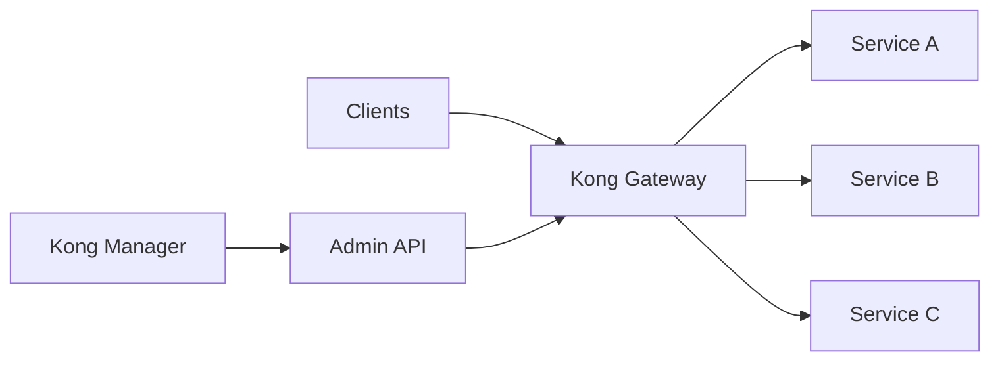
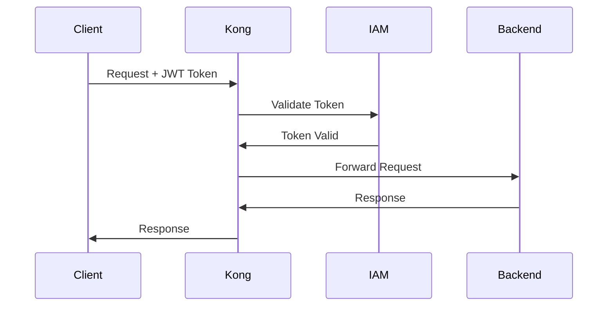

# API Gateway Kong

## Vue d'ensemble

API Gateway centralisée basée sur Kong, gérant actuellement **250+ APIs** en production à la BNC.

## Contexte

**Secteur d'origine** : Architecture Entreprise
**Statut** : Transversal (validé par CAE)
**Proven-in-use** : 24 mois, 250+ APIs
**Traffic** : 50M+ requêtes/jour

## Architecture

### Composants



### Stack Technologique

- **Gateway** : Kong Gateway 3.4+ (Enterprise)
- **Database** : PostgreSQL 14+
- **Cache** : Redis 7+
- **Monitoring** : Prometheus + Grafana
- **APM** : Datadog

## Plugins Activés

### Authentication & Security

- **OAuth 2.0** : Authentification centralisée
- **JWT** : Validation de tokens
- **CORS** : Gestion des origines cross-domain
- **Rate Limiting** : Protection contre abus
- **IP Restriction** : Filtrage par IP

### Traffic Control

- **Request Transformer** : Modification des requêtes
- **Response Transformer** : Modification des réponses
- **Request Size Limiting** : Limite de taille
- **Canary Release** : Déploiements progressifs

### Observability

- **Logging** : Logs centralisés
- **Prometheus** : Métriques
- **Zipkin** : Distributed tracing
- **Datadog** : APM

## Configuration

### Service Configuration

```yaml
# kong.yaml
_format_version: "3.0"

services:
  - name: customer-service
    url: http://customers.bnc.ca:8080
    routes:
      - name: customer-api
        paths:
          - /api/v1/customers
    plugins:
      - name: rate-limiting
        config:
          minute: 100
          policy: local
      - name: jwt
        config:
          secret_is_base64: false
```

### Plugin Configuration

```bash
# Rate Limiting
curl -X POST http://kong-admin:8001/services/customer-service/plugins \
  --data "name=rate-limiting" \
  --data "config.minute=100" \
  --data "config.policy=local"

# JWT Authentication
curl -X POST http://kong-admin:8001/services/customer-service/plugins \
  --data "name=jwt"
```

## Métriques

### Performance

- **Latency p50** : 12ms
- **Latency p95** : 45ms
- **Latency p99** : 120ms
- **Throughput** : 50M+ req/jour
- **Availability** : 99.95%

### Adoption

- **APIs enregistrées** : 250+
- **Services backend** : 80+
- **Consumers** : 500+ applications
- **Équipes** : 25+

## Sécurité

### Authentication Flow



### ACL (Access Control Lists)

```bash
# Créer un consumer
curl -X POST http://kong-admin:8001/consumers \
  --data "username=mobile-app"

# Associer JWT credential
curl -X POST http://kong-admin:8001/consumers/mobile-app/jwt \
  --data "key=mobile-app-key" \
  --data "secret=my-secret-key"

# Configurer ACL
curl -X POST http://kong-admin:8001/consumers/mobile-app/acls \
  --data "group=customers-read"
```

## Monitoring

### Métriques Kong

- **Request Count** : Nombre de requêtes
- **Request Latency** : Latence des requêtes
- **Bandwidth** : Bande passante utilisée
- **Status Codes** : Distribution des codes HTTP

### Alertes

```yaml
# Prometheus Alert Rules
groups:
  - name: kong
    rules:
      - alert: HighErrorRate
        expr: rate(kong_http_status{code="5xx"}[5m]) > 0.05
        for: 5m
        annotations:
          summary: "High error rate detected"

      - alert: HighLatency
        expr: histogram_quantile(0.95, kong_latency_bucket) > 1000
        for: 5m
        annotations:
          summary: "High latency detected (p95 > 1s)"
```

## Conformité

### Audit Trail

- Tous les appels API loggés
- Intégration avec SIEM BNC
- Retention 90 jours minimum

### Politiques de Sécurité

- **TLS 1.2+** obligatoire
- **mTLS** pour APIs critiques
- **API Keys rotation** trimestrielle
- **Rate limiting** par défaut

## Documentation

### Getting Started

#### 1. Enregistrer votre API

```bash
# Créer un service
curl -i -X POST http://kong-admin:8001/services \
  --data "name=my-service" \
  --data "url=http://my-api.bnc.ca:8080"

# Créer une route
curl -i -X POST http://kong-admin:8001/services/my-service/routes \
  --data "paths[]=/api/v1/my-service"
```

#### 2. Activer Authentication

```bash
# Activer JWT plugin
curl -X POST http://kong-admin:8001/services/my-service/plugins \
  --data "name=jwt"
```

#### 3. Tester

```bash
# Sans authentification (devrait échouer)
curl -i http://kong:8000/api/v1/my-service

# Avec JWT token
curl -i http://kong:8000/api/v1/my-service \
  -H "Authorization: Bearer <JWT_TOKEN>"
```

### Support

- **Documentation** : https://docs.bnc.ca/api-gateway
- **Canal Slack** : #api-gateway-support
- **Formation** : Formation mensuelle Kong
- **SLA** : 99.9% uptime

## Roadmap

### Q1 2025

- [ ] Service Mesh integration (Istio)
- [ ] GraphQL support
- [ ] Developer Portal v2

### Q2 2025

- [ ] Multi-region deployment
- [ ] Advanced analytics dashboard
- [ ] Self-service API registration

## Références

- [Kong Gateway Documentation](https://docs.konghq.com/)
- [API Gateway Pattern](https://microservices.io/patterns/apigateway.html)
- [BNC API Standards](https://standards.bnc.ca/api)

## Contacts

- **Product Owner** : Sophie Lapointe (sophie.lapointe@bnc.ca)
- **Tech Lead** : Pierre Gagnon (pierre.gagnon@bnc.ca)
- **Support** : api-gateway-support@bnc.ca
