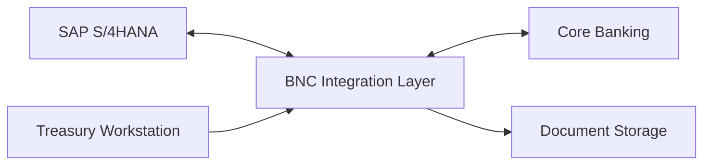
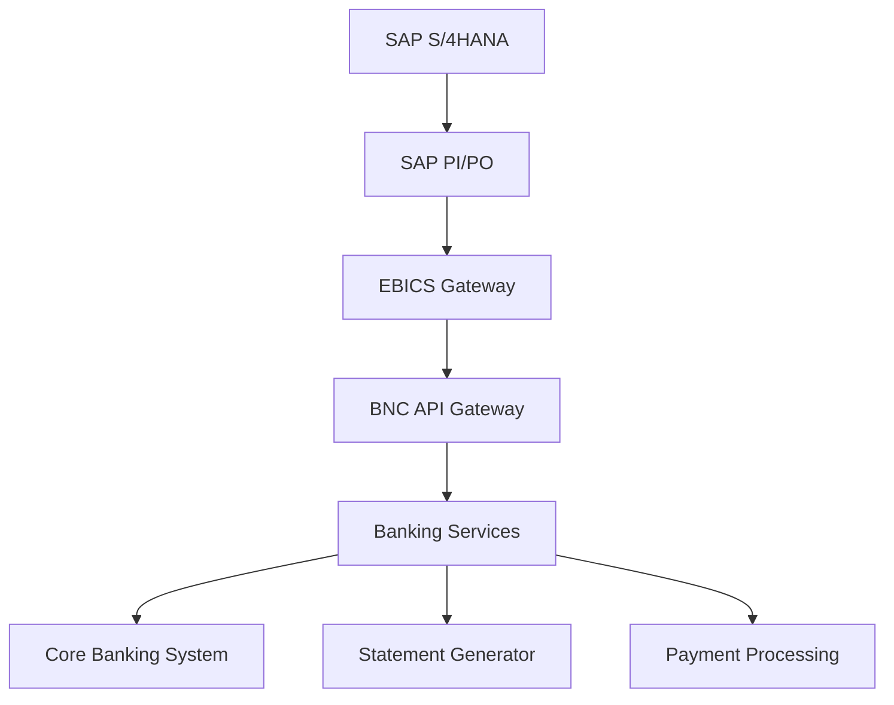
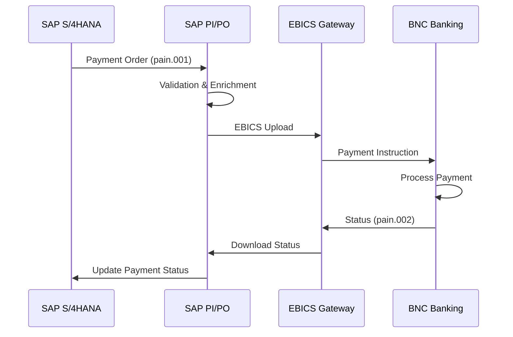
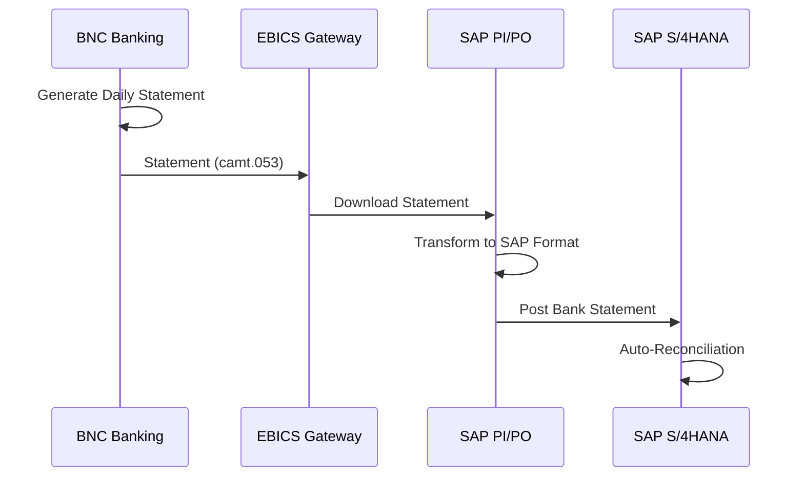
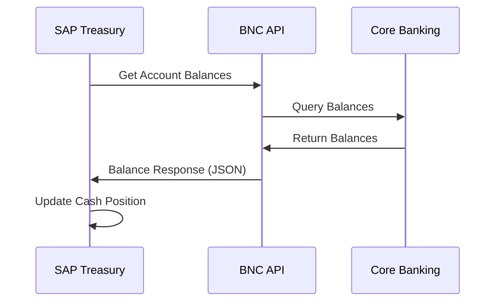

# ERP SAP S/4HANA Integration

## Vue d'ensemble

Solution d'intégration bancaire bidirectionnelle entre la BNC et SAP S/4HANA, permettant la synchronisation automatique des transactions, relevés et positions de trésorerie.

## Contexte

**Secteur** : Entreprises
**Statut** : Production (stable)
**Proven-in-use** : 24 mois
**Clients** : 150+ grandes entreprises
**Transactions** : 500,000+ transactions/mois

## Architecture

### Vue d'ensemble



### Composants



### Stack Technologique

- **SAP Side** : SAP S/4HANA 2021+ with Bank Communication Management (BCM)
- **Integration** : SAP PI/PO (Process Integration/Orchestration)
- **Protocol** : EBICS (Electronic Banking Internet Communication Standard)
- **Format** : ISO 20022 (pain.001, pain.002, camt.053, camt.054)
- **BNC Side** : API Gateway (Kong) + Banking Services (Java Spring Boot)
- **Security** : TLS 1.3, X.509 certificates, Message signing

## Flux de Données

### 1. Paiements (Outbound)



**Messages ISO 20022** :
- **pain.001** : Customer Credit Transfer Initiation
- **pain.002** : Customer Payment Status Report

### 2. Relevés Bancaires (Inbound)



**Messages ISO 20022** :
- **camt.053** : Bank to Customer Statement
- **camt.054** : Bank to Customer Debit/Credit Notification

### 3. Cash Position (Real-time)



## Configuration SAP

### Bank Communication Management (BCM)

```abap
" Configuration BCM in SAP
" Transaction: FBCM_SETUP

DATA: ls_bank TYPE bcm_bank_details.

ls_bank-bank_country = 'CA'.
ls_bank-bank_key = '123456789'. " BNC institution number
ls_bank-bank_account = '1234567890'.
ls_bank-currency = 'CAD'.
ls_bank-comm_method = 'EBICS'.

CALL FUNCTION 'BCM_BANK_SETUP'
  EXPORTING
    is_bank_details = ls_bank.
```

### Payment Format Configuration

```xml
<!-- pain.001.001.03 Configuration -->
<Document xmlns="urn:iso:std:iso:20022:tech:xsd:pain.001.001.03">
  <CstmrCdtTrfInitn>
    <GrpHdr>
      <MsgId>SAP-BNC-20241127-001</MsgId>
      <CreDtTm>2024-11-27T10:30:00</CreDtTm>
      <NbOfTxs>1</NbOfTxs>
      <CtrlSum>1000.00</CtrlSum>
      <InitgPty>
        <Nm>Acme Corporation</Nm>
        <Id>
          <OrgId>
            <Othr>
              <Id>123456789</Id>
            </Othr>
          </OrgId>
        </Id>
      </InitgPty>
    </GrpHdr>
    <!-- Payment Instructions -->
  </CstmrCdtTrfInitn>
</Document>
```

## Configuration BNC

### EBICS Gateway

```yaml
# EBICS Server Configuration
ebics:
  host: ebics.bnc.ca
  port: 443
  protocol: H005
  encryption:
    algorithm: RSA-4096
    signing: SHA-256
  certificates:
    bank_x002: /certs/bnc_x002.pem
    bank_e002: /certs/bnc_e002.pem
  partners:
    - partner_id: ACMECORP
      user_ids:
        - ACME_TREAS01
        - ACME_TREAS02
      permissions:
        upload:
          - CCT  # Credit Transfer
          - CDD  # Direct Debit
        download:
          - STA  # Statements
          - VMK  # Payment Status
```

### API Endpoints

```typescript
// BNC Banking API
@Controller('banking/sap')
export class SapBankingController {
  // Get account balances
  @Get('accounts/:accountId/balance')
  async getBalance(@Param('accountId') accountId: string) {
    return this.bankingService.getAccountBalance(accountId);
  }

  // Submit payment
  @Post('payments')
  async submitPayment(@Body() payment: Pain001) {
    return this.paymentService.processPayment(payment);
  }

  // Get statement
  @Get('accounts/:accountId/statement')
  async getStatement(
    @Param('accountId') accountId: string,
    @Query('from') from: Date,
    @Query('to') to: Date,
  ) {
    return this.statementService.generateCamt053(accountId, from, to);
  }
}
```

## Types de Paiements Supportés

### Virements Domestiques (EFT)

- **Délai** : Same-day / Next-day
- **Limite** : $25M par transaction
- **Format** : pain.001 (ISO 20022)
- **Volume** : 300k transactions/mois

### Virements Internationaux (SWIFT)

- **Délai** : 1-3 jours ouvrables
- **Devise** : CAD, USD, EUR, GBP (+ 40 autres)
- **Format** : MT103 / pain.001
- **Volume** : 50k transactions/mois

### Prélèvements Automatiques

- **Types** : PAD (Pre-Authorized Debit)
- **Fréquence** : Daily, Weekly, Monthly
- **Format** : pain.008 (ISO 20022)
- **Volume** : 150k transactions/mois

## Réconciliation Automatique

### Matching Rules

```typescript
// Auto-reconciliation logic
interface ReconciliationRule {
  field: 'reference' | 'amount' | 'date' | 'account';
  tolerance?: number; // For amount matching
  priority: number;
}

const rules: ReconciliationRule[] = [
  { field: 'reference', priority: 1 },
  { field: 'amount', tolerance: 0.01, priority: 2 },
  { field: 'date', priority: 3 },
];

// Matching algorithm
function autoMatch(sapPayment, bankStatement) {
  let score = 0;

  if (sapPayment.reference === bankStatement.reference) score += 100;
  if (Math.abs(sapPayment.amount - bankStatement.amount) <= 0.01) score += 50;
  if (isSameDay(sapPayment.date, bankStatement.date)) score += 25;

  return score >= 150; // Threshold for auto-match
}
```

### Taux de Réconciliation

- **Auto-matching** : 95%
- **Manual review** : 5%
- **Exceptions** : < 0.5%

## Métriques

### Performance

- **Transaction volume** : 500k+/mois
- **Processing time** : < 2 secondes (p95)
- **Availability** : 99.95%
- **Error rate** : < 0.1%

### Adoption

- **Clients actifs** : 150+ grandes entreprises
- **Comptes intégrés** : 800+
- **Transaction value** : $2B+/mois

### SLA

- **Upload acceptance** : < 30 secondes
- **Statement delivery** : Avant 8h AM (jour ouvrable suivant)
- **Payment execution** : Same-day (si reçu avant 14h)
- **Support** : 24/7 pour clients Tier 1

## Sécurité

### EBICS Security

```

  EBICS 3-Key Security Model             

  Authentication (A006) - RSA 4096       
  Encryption (E002) - RSA 4096           
  Signature (X002) - RSA 4096            

```

### Certificate Management

- **Validity** : 3 ans
- **Renewal** : Automatique (90 jours avant expiration)
- **Revocation** : Support révocation immédiate
- **Storage** : HSM (Hardware Security Module)

### Message Integrity

- **Digital Signature** : Tous les messages signés
- **Timestamp** : RFC 3161 compliant
- **Non-repudiation** : Archive 7 ans

## Monitoring

### Dashboards

```yaml
# Prometheus Metrics
- sap_payments_total{status="success|failed"}
- sap_payment_processing_duration_seconds
- sap_statement_generation_duration_seconds
- ebics_upload_total{client_id}
- ebics_download_total{client_id}
```

### Alertes

```yaml
# Alert Rules
groups:
  - name: sap_integration
    rules:
      - alert: HighPaymentFailureRate
        expr: rate(sap_payments_total{status="failed"}[5m]) > 0.05
        for: 10m
        annotations:
          summary: "High payment failure rate detected"

      - alert: EBICSConnectionFailed
        expr: ebics_connection_errors > 3
        for: 5m
        annotations:
          summary: "EBICS connection failing"
```

## Coûts

### Infrastructure

- **EBICS Gateway** : $5,000/mois (hosting + licences)
- **SAP PI/PO** : Client-owned
- **BNC API** : Included in platform costs
- **Monitoring** : $1,000/mois

### Transaction Fees

- **Setup fee** : $5,000 (one-time)
- **Monthly fee** : $500/compte
- **Transaction fee** : $0.50 (domestic), $15 (international)

**Typical client** : $2,000/mois (4 comptes + ~500 transactions)

## Documentation

### Getting Started

#### 1. Onboarding

```bash
# Step 1: Request EBICS access
# Contact: sap-integration@bnc.ca

# Step 2: Generate certificates
openssl genrsa -out client_a006.key 4096
openssl req -new -x509 -key client_a006.key -out client_a006.crt

# Step 3: Send certificates to BNC
# Via secure channel

# Step 4: Receive BNC certificates
# bank_x002.crt, bank_e002.crt

# Step 5: Configure SAP BCM
# Transaction: FBCM_SETUP
```

#### 2. Testing

```bash
# Test EBICS connection
ebics-cli --host ebics.bnc.ca --partner TESTCORP --user TEST01 HPB

# Upload test payment
ebics-cli --host ebics.bnc.ca --partner TESTCORP --user TEST01 CCT test_payment.xml

# Download test statement
ebics-cli --host ebics.bnc.ca --partner TESTCORP --user TEST01 STA
```

### Support

- **Documentation** : https://docs.bnc.ca/sap-integration
- **Technical Support** : sap-support@bnc.ca
- **Emergency** : 1-800-BNC-SAP1 (24/7)
- **Training** : Monthly SAP integration workshop

## Roadmap

### Q1 2025

- [ ] Support SAP S/4HANA Cloud
- [ ] Real-time payment notifications (webhooks)
- [ ] Enhanced reconciliation AI

### Q2 2025

- [ ] Multi-currency virtual accounts
- [ ] Instant payments (Real-Time Rail)
- [ ] Expanded ISO 20022 message types

## Cas d'Usage Clients

### Manufacturier (Tier 1)

**Profil** :
- 4 comptes CAD/USD
- 500 paiements/semaine (fournisseurs)
- 100 virements internationaux/mois
- Réconciliation quotidienne

**Bénéfices** :
- Automatisation 95% des paiements
- Réduction 80% du temps de réconciliation
- Visibilité temps réel sur cash position

### Distributeur (Tier 2)

**Profil** :
- 2 comptes CAD
- 1,000 prélèvements/mois (clients)
- 200 paiements/mois (fournisseurs)

**Bénéfices** :
- Gestion centralisée des paiements
- Réduction erreurs de saisie
- Amélioration prévisions de trésorerie

## Références

- [EBICS Specification](https://www.ebics.org/)
- [ISO 20022 Standards](https://www.iso20022.org/)
- [SAP Bank Communication Management](https://help.sap.com/docs/SAP_S4HANA_ON-PREMISE/86fcaa1673f34f3e8ef74fea814c85b5/4b5dc59b6b0b4e56a37c8eb98fd6d924.html)

## Contacts

- **Product Owner** : Jean-François Morin (jf.morin@bnc.ca)
- **Integration Lead** : Stéphanie Roy (stephanie.roy@bnc.ca)
- **SAP Architect** : Michel Fortin (michel.fortin@bnc.ca)
- **Support** : sap-integration@bnc.ca
