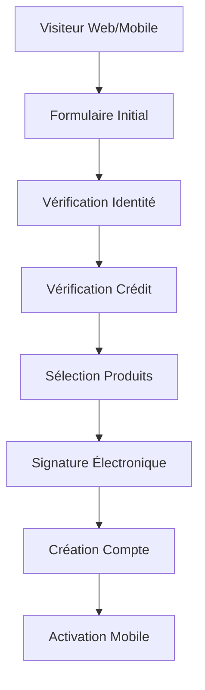
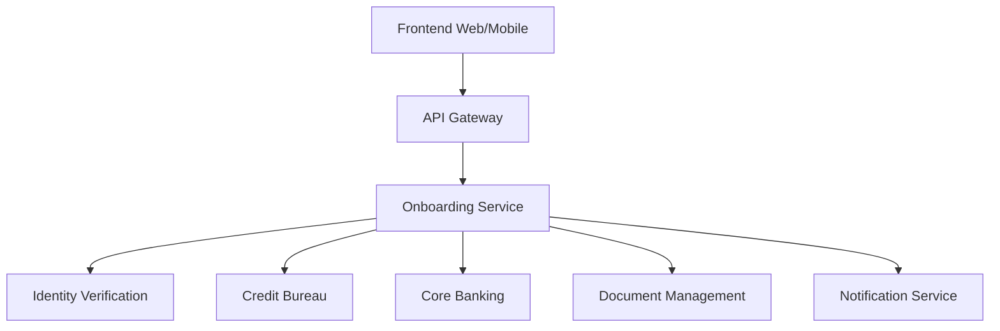

# Onboarding Client Digital

## Vue d'ensemble

Solution d'onboarding 100% digital permettant aux nouveaux clients d'ouvrir un compte bancaire en **moins de 10 minutes**, sans se déplacer en succursale.

## Contexte

**Secteur** : Particuliers
**Statut** :  **EN PROMOTION** vers Transversal
**Proven-in-use** : 12 mois en production
**Adoption** : 75% des nouveaux clients (170k+ clients)

## Architecture

### Workflow



### Composants



### Stack Technologique

- **Frontend** : React SPA + React Native (mobile)
- **Backend** : Node.js (NestJS)
- **Database** : PostgreSQL 14
- **Cache** : Redis
- **Queue** : RabbitMQ
- **Storage** : AWS S3 (documents)

## Étapes du Processus

### 1. Formulaire Initial (2 minutes)

**Informations collectées** :
- Nom, prénom, date de naissance
- Adresse résidentielle
- Contact (email, téléphone)
- Occupation et revenu

**Validation** :
- Format email/téléphone
- Âge minimum (18 ans)
- Adresse au Canada

### 2. Vérification d'Identité (3 minutes)

**Méthodes** :
1. **Scan de documents** : Permis de conduire ou passeport
2. **Selfie vidéo** : Liveness detection
3. **Questions de sécurité** : Basées sur historique de crédit

**Technologies** :
- **OCR** : Tesseract + AWS Textract
- **Liveness Detection** : FaceTec
- **Document Verification** : Jumio

**Taux de succès** : 92%

### 3. Vérification de Crédit (1 minute)

**Bureaux de crédit** :
- Equifax Canada
- TransUnion Canada

**Informations obtenues** :
- Credit Score
- Historique de paiement
- Dettes en cours
- Faillites/jugements

**Décision automatique** :
- Score > 700 : Approbation automatique
- Score 600-700 : Revue manuelle
- Score < 600 : Refus avec option produits alternatifs

### 4. Sélection de Produits (2 minutes)

**Produits disponibles** :
- Compte Chèques (multiple types)
- Compte Épargne
- Carte de débit
- Carte de crédit (si approuvé)
- Découvert autorisé (si approuvé)

**Recommandations personnalisées** :
- Basées sur profil client
- Machine Learning (historique similarités)

### 5. Signature Électronique (1 minute)

**Documents signés** :
- Convention de compte
- Conditions générales
- Autorisation vérification de crédit
- Consentement PIPEDA

**Technologies** :
- **eSignature** : DocuSign
- **Horodatage** : RFC 3161 compliant
- **Archivage** : 7 ans (conformité)

### 6. Création de Compte (< 30 secondes)

**Processus** :
1. Génération numéro de compte
2. Création dans Core Banking
3. Attribution carte de débit (virtuelle immédiate)
4. Setup mobile banking
5. Envoi credentials

**Core Banking Integration** :
- API temps réel
- Rollback automatique en cas d'échec
- Idempotence (retry-safe)

### 7. Activation Mobile (1 minute)

**Steps** :
1. Download app mobile BNC
2. Login avec credentials temporaires
3. Setup Face ID / Touch ID
4. Activation carte de débit virtuelle
5. Premier virement (optionnel)

**First Time User Experience** :
- Tutorial interactif
- Setup notifications push
- Découverte des fonctionnalités

## Métriques

### Adoption

- **Nouveaux clients/mois** : 12,000+
- **Taux de complétion** : 68%
- **Taux d'abandon** : 32% (benchmark industrie: 40%)
- **Temps moyen** : 8.5 minutes
- **Utilisation mobile** : 60%

### Performance

- **Availability** : 99.8%
- **Time to account** : < 10 minutes (95th percentile)
- **API response time** : < 500ms (p95)
- **Identity verification success** : 92%
- **Credit check success** : 98%

### Business Impact

- **Cost per acquisition** : -60% (vs succursale)
- **Customer satisfaction** : 4.5/5
- **First month activation** : 85%
- **Branch traffic reduction** : -35%

## Sécurité

### Protection des Données

- **Encryption at rest** : AES-256
- **Encryption in transit** : TLS 1.3
- **PII tokenization** : Tous les champs sensibles
- **Data masking** : Logs et monitoring

### Fraud Prevention

- **Device fingerprinting** : ThreatMetrix
- **Behavioral analysis** : Pattern detection
- **Velocity checks** : Limite tentatives/IP
- **Geolocation** : Blocage pays à risque

### Compliance

- **PIPEDA** : Consentement explicite, droit à l'oubli
- **FINTRAC** : AML/KYC checks
- **PCI DSS** : Pas de stockage carte
- **SOC 2 Type II** : Audit annuel

## Coûts

### Infrastructure

- **Cloud (AWS)** : $8,000/mois
- **Third-party APIs** : $12,000/mois
  - Identity verification : $4,000
  - Credit bureau : $6,000
  - eSignature : $2,000
- **Support** : $5,000/mois

**Coût par client** : $2.50 (vs $25 en succursale)

## Intégrations

### Identity Verification (Jumio)

```typescript
// Example integration
const verifyIdentity = async (userId: string, documentImage: Buffer) => {
  const response = await jumio.verifyDocument({
    userId,
    documentImage,
    documentType: 'DRIVER_LICENSE',
    country: 'CA',
  });

  return {
    verified: response.status === 'APPROVED',
    confidence: response.confidence,
    extractedData: response.data,
  };
};
```

### Credit Bureau (Equifax)

```typescript
// Example integration
const checkCredit = async (applicant: Applicant) => {
  const response = await equifax.getCreditReport({
    firstName: applicant.firstName,
    lastName: applicant.lastName,
    dateOfBirth: applicant.dob,
    ssn: applicant.ssn,
  });

  return {
    score: response.creditScore,
    decision: response.creditScore > 700 ? 'APPROVED' : 'REVIEW',
    report: response.fullReport,
  };
};
```

### Core Banking

```typescript
// Example integration
const createAccount = async (customer: Customer, products: Product[]) => {
  const transaction = await db.transaction();

  try {
    // Create customer
    const customerId = await coreBank.createCustomer(customer);

    // Create accounts
    const accounts = await Promise.all(
      products.map(p => coreBank.createAccount({
        customerId,
        productCode: p.code,
        currency: 'CAD',
      }))
    );

    await transaction.commit();
    return { customerId, accounts };
  } catch (error) {
    await transaction.rollback();
    throw error;
  }
};
```

## Abandonment Recovery

### Triggers

- **Email** à 1h si abandon au formulaire
- **SMS** à 24h si abandon à vérification identité
- **Push notification** (mobile) si abandon à activation

### A/B Testing

- Test continu sur messaging
- Optimisation du parcours
- Simplification formulaires

**Impact** : +12% taux de complétion

## Accessibilité

### WCAG 2.1 AA Compliance

- **Keyboard navigation** : 100%
- **Screen reader** : Compatible NVDA/JAWS
- **Color contrast** : 4.5:1 minimum
- **Text resize** : Jusqu'à 200%

### Multilingue

- Français (FR-CA)
- Anglais (EN-CA)

## Promotion vers Transversal

### Dossier de Promotion

Ce patron est **actuellement en promotion** vers le statut Transversal. Voir le dossier complet dans [Promotions - Onboarding Digital](/registre/en-promotion/onboarding-digital).

### Justification

- **Proven-in-use** : 12 mois, 170k+ clients
- **Applicabilité** : Potentiel pour Entreprises (PME), Gestion Patrimoine
- **ROI** : -60% coût d'acquisition
- **Scalabilité** : Peut gérer 50k+ nouveaux clients/mois

### Adaptations Nécessaires

**Pour Entreprises** :
- Validation documents corporatifs
- Multi-signing (administrateurs)
- Vérification REQ (Registre des entreprises du Québec)

**Pour Gestion Patrimoine** :
- Enhanced due diligence
- Source of funds verification
- Investment profile questionnaire

### Timeline

- **Phase 1** : Proposition  Complétée (Sep 2024)
- **Phase 2** : Review  En cours (Oct-Nov 2024)
- **Phase 3** : Migration  Planifiée (Q1 2025)
- **Phase 4** : Adoption  Planifiée (Q2 2025)

## Roadmap

### Q1 2025

- [ ] Support for joint accounts
- [ ] Enhanced product recommendations (AI)
- [ ] Video KYC option

### Q2 2025

- [ ] Expansion to Business onboarding (si promotion validée)
- [ ] Instant card issuance integration
- [ ] Open Banking integration

## Références

- [Digital Identity Standards](https://www.digital.canada.ca/2019/02/27/the-public-digital-identity-authentication-standards/)
- [FINTRAC Guidance](https://www.fintrac-canafe.gc.ca/guidance-directives/client-clientele/Guide11/11-eng)
- [PIPEDA Compliance](https://www.priv.gc.ca/en/privacy-topics/privacy-laws-in-canada/the-personal-information-protection-and-electronic-documents-act-pipeda/)

## Contacts

- **Product Owner** : François Leblanc (francois.leblanc@bnc.ca)
- **Tech Lead** : Amélie Gagnon (amelie.gagnon@bnc.ca)
- **Compliance** : Marc Dupuis (marc.dupuis@bnc.ca)
- **Support** : onboarding-support@bnc.ca
