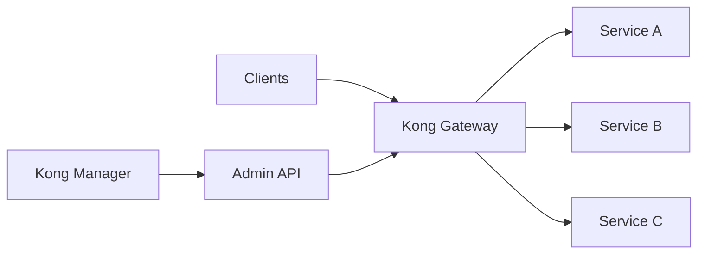
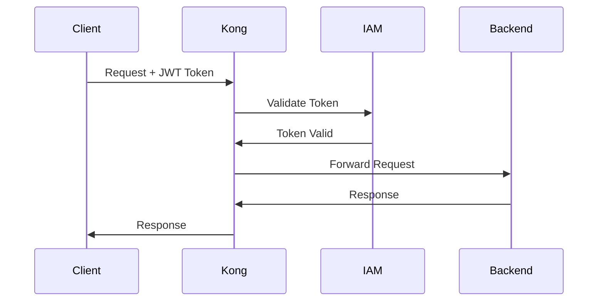

# Kong API Gateway

## Overview

Centralized API Gateway based on Kong, currently managing **250+ APIs** in production at BNC.

## Context

**Origin Sector**: Enterprise Architecture
**Status**: Transversal (validated by CAE)
**Proven-in-use**: 24 months, 250+ APIs
**Traffic**: 50M+ requests/day

## Architecture

### Components



### Technology Stack

- **Gateway**: Kong Gateway 3.4+ (Enterprise)
- **Database**: PostgreSQL 14+
- **Cache**: Redis 7+
- **Monitoring**: Prometheus + Grafana
- **APM**: Datadog

## Enabled Plugins

### Authentication & Security

- **OAuth 2.0**: Centralized authentication
- **JWT**: Token validation
- **CORS**: Cross-domain origin management
- **Rate Limiting**: Abuse protection
- **IP Restriction**: IP filtering

### Traffic Control

- **Request Transformer**: Request modification
- **Response Transformer**: Response modification
- **Request Size Limiting**: Size limitation
- **Canary Release**: Progressive deployments

### Observability

- **Logging**: Centralized logs
- **Prometheus**: Metrics
- **Zipkin**: Distributed tracing
- **Datadog**: APM

## Configuration

### Service Configuration

```yaml
# kong.yaml
_format_version: "3.0"

services:
  - name: customer-service
    url: http://customers.bnc.ca:8080
    routes:
      - name: customer-api
        paths:
          - /api/v1/customers
    plugins:
      - name: rate-limiting
        config:
          minute: 100
          policy: local
      - name: jwt
        config:
          secret_is_base64: false
```

### Plugin Configuration

```bash
# Rate Limiting
curl -X POST http://kong-admin:8001/services/customer-service/plugins \
  --data "name=rate-limiting" \
  --data "config.minute=100" \
  --data "config.policy=local"

# JWT Authentication
curl -X POST http://kong-admin:8001/services/customer-service/plugins \
  --data "name=jwt"
```

## Metrics

### Performance

- **Latency p50**: 12ms
- **Latency p95**: 45ms
- **Latency p99**: 120ms
- **Throughput**: 50M+ req/day
- **Availability**: 99.95%

### Adoption

- **Registered APIs**: 250+
- **Backend Services**: 80+
- **Consumers**: 500+ applications
- **Teams**: 25+

## Security

### Authentication Flow



### ACL (Access Control Lists)

```bash
# Create a consumer
curl -X POST http://kong-admin:8001/consumers \
  --data "username=mobile-app"

# Associate JWT credential
curl -X POST http://kong-admin:8001/consumers/mobile-app/jwt \
  --data "key=mobile-app-key" \
  --data "secret=my-secret-key"

# Configure ACL
curl -X POST http://kong-admin:8001/consumers/mobile-app/acls \
  --data "group=customers-read"
```

## Monitoring

### Kong Metrics

- **Request Count**: Number of requests
- **Request Latency**: Request latency
- **Bandwidth**: Used bandwidth
- **Status Codes**: HTTP code distribution

### Alerts

```yaml
# Prometheus Alert Rules
groups:
  - name: kong
    rules:
      - alert: HighErrorRate
        expr: rate(kong_http_status{code="5xx"}[5m]) > 0.05
        for: 5m
        annotations:
          summary: "High error rate detected"

      - alert: HighLatency
        expr: histogram_quantile(0.95, kong_latency_bucket) > 1000
        for: 5m
        annotations:
          summary: "High latency detected (p95 > 1s)"
```

## Compliance

### Audit Trail

- All API calls logged
- Integration with BNC SIEM
- Minimum 90-day retention

### Security Policies

- **TLS 1.2+** mandatory
- **mTLS** for critical APIs
- **API Keys rotation** quarterly
- **Rate limiting** by default

## Documentation

### Getting Started

#### 1. Register Your API

```bash
# Create a service
curl -i -X POST http://kong-admin:8001/services \
  --data "name=my-service" \
  --data "url=http://my-api.bnc.ca:8080"

# Create a route
curl -i -X POST http://kong-admin:8001/services/my-service/routes \
  --data "paths[]=/api/v1/my-service"
```

#### 2. Enable Authentication

```bash
# Enable JWT plugin
curl -X POST http://kong-admin:8001/services/my-service/plugins \
  --data "name=jwt"
```

#### 3. Test

```bash
# Without authentication (should fail)
curl -i http://kong:8000/api/v1/my-service

# With JWT token
curl -i http://kong:8000/api/v1/my-service \
  -H "Authorization: Bearer <JWT_TOKEN>"
```

### Support

- **Documentation**: https://docs.bnc.ca/api-gateway
- **Slack Channel**: #api-gateway-support
- **Training**: Monthly Kong training
- **SLA**: 99.9% uptime

## Roadmap

### Q1 2025

- [ ] Service Mesh integration (Istio)
- [ ] GraphQL support
- [ ] Developer Portal v2

### Q2 2025

- [ ] Multi-region deployment
- [ ] Advanced analytics dashboard
- [ ] Self-service API registration

## References

- [Kong Gateway Documentation](https://docs.konghq.com/)
- [API Gateway Pattern](https://microservices.io/patterns/apigateway.html)
- [BNC API Standards](https://standards.bnc.ca/api)

## Contacts

- **Product Owner**: Sophie Lapointe (sophie.lapointe@bnc.ca)
- **Tech Lead**: Pierre Gagnon (pierre.gagnon@bnc.ca)
- **Support**: api-gateway-support@bnc.ca
