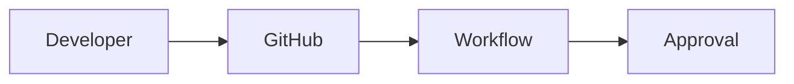

# Test Workflow Pattern

## Overview

This is a test PRA created to validate the GitHub Actions approval workflows.

**Problem Solved**: Need to test the workflow approval system.

**Solution**: A simple test pattern that triggers all validation workflows.

## Context

**Sector of Origin**: IT Central (DSI)
**Status**: Candidate
**Proven-in-use**: Test only
**Teams**: Architecture Team

## Architecture

### Components



### Technology Stack

- **Source Control**: GitHub
- **CI/CD**: GitHub Actions
- **Governance**: Committee Reviews

## Implementation

### Workflow Structure

```yaml
on:
  pull_request:
    types: [opened, synchronize]

jobs:
  validate:
    runs-on: ubuntu-latest
    steps:
      - name: Validate
        run: echo "Validation successful"
```

## ADR

### ADR-001: Choice of GitHub Actions

**Context**: Need to automate governance approval workflows.

**Decision**: Use GitHub Actions for workflow automation.

**Reasons**:
- Native integration with GitHub
- Wide ecosystem
- Easy to maintain
- Free for public repositories

**Alternatives Considered**:
- Jenkins: More complex setup
- GitLab CI: Different platform

**Consequences**:
- ✅ Native GitHub integration
- ✅ Easy to extend
- ⚠️ Limited to GitHub platform

## Examples

### Example 1: Basic Workflow

```yaml
name: Test Workflow

on:
  pull_request:
    types: [opened]

jobs:
  test:
    runs-on: ubuntu-latest
    steps:
      - uses: actions/checkout@v4
      - name: Run tests
        run: npm test
```

## Proven-in-use

### Test Implementation (Architecture Team - 2025-12-03)

**Context**: Testing the approval workflow system.

**Implementation**:
- GitHub Actions workflows
- Automated validation
- Committee approval tracking

**Results**:
- ✅ **Validation**: Workflows trigger correctly
- ✅ **Approval**: Committee reviews work as expected
- ✅ **Integration**: Seamless GitHub integration

**Feedback**: "The workflow system validates PRAs effectively and ensures proper governance."

**Learnings**:
- Importance of clear workflow triggers
- Need for detailed validation messages
- Value of automated checks
