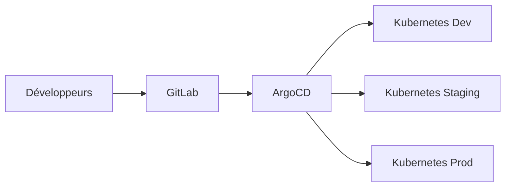

# CI/CD GitOps avec ArgoCD

## Vue d'ensemble

Pipeline de déploiement continu basé sur GitOps avec ArgoCD, gérant actuellement **100+ projets** en production à la BNC.

## Contexte

**Secteur d'origine** : IT Central (DSI)
**Statut** : Transversal (validé par CAE)
**Proven-in-use** : 18 mois, 100+ projets
**Équipes** : 15+ équipes de développement

## Architecture

### Composants



### Stack Technologique

- **Source Control** : GitLab Enterprise
- **GitOps Engine** : ArgoCD 2.8+
- **Orchestration** : Kubernetes 1.27+
- **CI** : GitLab CI/CD
- **Monitoring** : Prometheus + Grafana

## Implémentation

### Structure de Dépôt

```
project-repo/
 apps/
    dev/
    staging/
    prod/
 base/
    deployment.yaml
    service.yaml
    kustomization.yaml
 argocd/
     application.yaml
```

### Configuration ArgoCD

```yaml
apiVersion: argoproj.io/v1alpha1
kind: Application
metadata:
  name: my-app
  namespace: argocd
spec:
  project: default
  source:
    repoURL: https://gitlab.bnc.ca/my-team/my-app
    targetRevision: main
    path: apps/prod
  destination:
    server: https://kubernetes.default.svc
    namespace: my-app-prod
  syncPolicy:
    automated:
      prune: true
      selfHeal: true
```

## Workflow

### 1. Développement

```bash
# Développeur commit le code
git add .
git commit -m "feat: nouvelle fonctionnalité"
git push origin feature/nouvelle-fonctionnalite
```

### 2. CI Pipeline

```yaml
# .gitlab-ci.yml
stages:
  - test
  - build
  - deploy

test:
  stage: test
  script:
    - npm test

build:
  stage: build
  script:
    - docker build -t registry.bnc.ca/my-app:${CI_COMMIT_SHA} .
    - docker push registry.bnc.ca/my-app:${CI_COMMIT_SHA}

update-manifest:
  stage: deploy
  script:
    - sed -i "s|image:.*|image: registry.bnc.ca/my-app:${CI_COMMIT_SHA}|" apps/dev/deployment.yaml
    - git commit -am "chore: update image to ${CI_COMMIT_SHA}"
    - git push origin main
```

### 3. Déploiement Automatique

ArgoCD détecte le changement dans Git et synchronise automatiquement le cluster Kubernetes.

## Métriques

### Performance

- **Temps de déploiement** : < 5 minutes
- **Taux de réussite** : 98.5%
- **MTTR** : < 15 minutes
- **Fréquence de déploiement** : 50+ déploiements/jour

### Adoption

- **Projets actifs** : 100+
- **Équipes** : 15+
- **Déploiements/mois** : 1500+
- **Uptime** : 99.9%

## Sécurité

### RBAC

```yaml
# ArgoCD RBAC
policy.csv: |
  p, role:dev-team, applications, get, my-team/*, allow
  p, role:dev-team, applications, sync, my-team/*, allow
  g, my-team, role:dev-team
```

### Secrets Management

- Secrets chiffrés avec **Sealed Secrets**
- Intégration avec **HashiCorp Vault**
- Rotation automatique des credentials

## Conformité

### Audit Trail

- Tous les déploiements tracés dans GitLab
- Historique complet dans ArgoCD
- Intégration avec SIEM BNC

### Approbations

- **Dev** : Déploiement automatique
- **Staging** : Approbation chef d'équipe
- **Production** : Approbation gestionnaire + CAB

## Documentation

### Getting Started

1. **Créer le dépôt GitOps**
   ```bash
   git clone https://gitlab.bnc.ca/templates/gitops-template
   cd gitops-template
   ```

2. **Configurer ArgoCD Application**
   ```bash
   kubectl apply -f argocd/application.yaml
   ```

3. **Premier déploiement**
   ```bash
   git add apps/dev/
   git commit -m "feat: initial deployment"
   git push origin main
   ```

### Support

- **Documentation** : https://docs.bnc.ca/gitops
- **Canal Slack** : #gitops-support
- **Formation** : Formation mensuelle ArgoCD

## Roadmap

### Q1 2025

- [ ] Multi-cluster management
- [ ] Progressive delivery (Canary/Blue-Green)
- [ ] Integration avec Istio

### Q2 2025

- [ ] Self-service portal
- [ ] Cost optimization dashboard
- [ ] Advanced RBAC policies

## Références

- [ArgoCD Official Documentation](https://argo-cd.readthedocs.io/)
- [GitOps Principles](https://opengitops.dev/)
- [Kubernetes Best Practices](https://kubernetes.io/docs/concepts/configuration/overview/)

## Contacts

- **Product Owner** : Jean Tremblay (jean.tremblay@bnc.ca)
- **Tech Lead** : Marie Dubois (marie.dubois@bnc.ca)
- **Support** : gitops-support@bnc.ca
