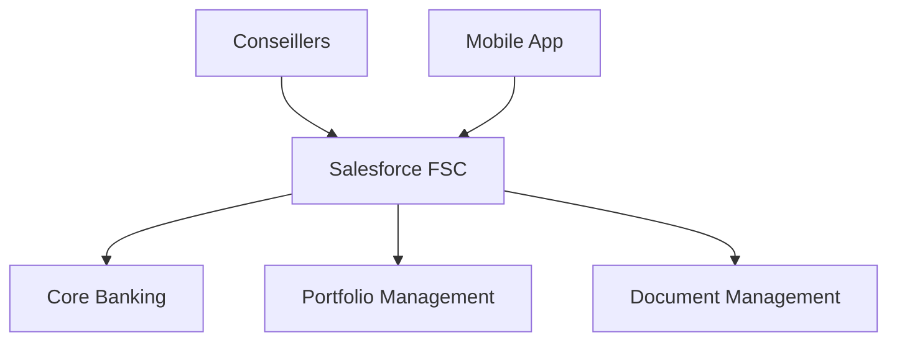
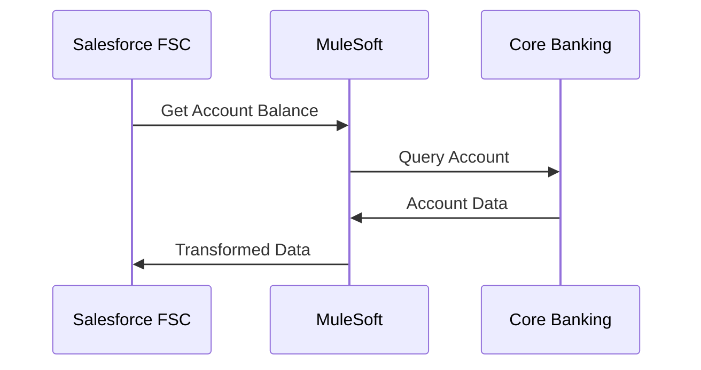

# Salesforce Financial Services Cloud

## Vue d'ensemble

Solution CRM basée sur **Salesforce Financial Services Cloud**, déployée pour le secteur Gestion de Patrimoine de la BNC.

## Contexte

**Secteur** : Gestion de Patrimoine
**Statut** :  **EN PROMOTION** vers Transversal
**Proven-in-use** : 18 mois en production
**Adoption** : 100% des conseillers (50+ utilisateurs)

## Architecture

### Composants



### Stack Technologique

- **Platform** : Salesforce Financial Services Cloud
- **Edition** : Enterprise
- **Integration** : MuleSoft Anypoint Platform
- **Data** : Salesforce Data Cloud
- **Mobile** : Salesforce Mobile App

## Fonctionnalités

### Gestion Client 360°

- **Profil client** complet (données démographiques, financières, préférences)
- **Vue patrimoniale** consolidée
- **Objectifs financiers** et planification
- **Documents** centralisés

### Gestion de Portefeuille

- **Holdings** en temps réel
- **Performance tracking**
- **Risk assessment**
- **Rebalancing recommendations**

### Relationship Management

- **Interactions** tracées (appels, meetings, emails)
- **Next best actions** (IA)
- **Opportunités** de vente
- **Pipeline** de prospects

### Compliance & Risk

- **KYC** (Know Your Customer)
- **AML** (Anti-Money Laundering)
- **Suitability checks**
- **Audit trail** complet

## Intégrations

### Core Banking System



**Technologies** :
- MuleSoft Anypoint Platform
- REST APIs
- Real-time data sync (every 15min)

### Portfolio Management System

- **Vendor** : Bloomberg AIM
- **Protocol** : SFTP + REST API
- **Frequency** : Daily EOD + Real-time prices
- **Data** : Holdings, transactions, market data

### Document Management

- **ECM** : OpenText Documentum
- **Integration** : Salesforce Files Connect
- **Storage** : S3-compatible object storage
- **Compliance** : 7 years retention

## Métriques

### Adoption

- **Utilisateurs actifs** : 50+ conseillers
- **Clients gérés** : 5,000+ clients HNW/UHNW
- **AUM** : $15B+ sous gestion
- **Taux d'adoption** : 100%

### Performance

- **User satisfaction** : 4.2/5
- **Time to onboard new advisor** : 2 jours
- **Mobile usage** : 40% des interactions
- **Response time (p95)** : < 2s

### Business Impact

- **Client onboarding time** : -50% (de 4 jours à 2 jours)
- **Client satisfaction** : +15%
- **Cross-sell rate** : +25%
- **Compliance incidents** : -80%

## Sécurité

### Authentication

- **SSO** : SAML 2.0 avec Azure AD
- **MFA** : Obligatoire pour accès externe
- **Session timeout** : 30 minutes

### Authorization

- **Profiles** : Conseiller, Manager, Admin
- **Permission Sets** : Feature-based access
- **Sharing Rules** : Territory-based

### Data Protection

- **Encryption at rest** : AES-256
- **Encryption in transit** : TLS 1.3
- **Field-level encryption** : SSN, account numbers
- **Shield Platform Encryption** : Enabled

## Conformité

### Réglementations

- **PIPEDA** : Protection des données personnelles
- **FINTRAC** : Anti-blanchiment d'argent
- **IIROC** : Règles sur les valeurs mobilières
- **AMF** : Autorité des marchés financiers

### Audit & Reporting

- **Audit Trail** : 10 ans de rétention
- **Field History Tracking** : Tous les champs critiques
- **Event Monitoring** : Logs d'accès et modifications
- **Compliance Reports** : 25+ rapports standard

## Coûts

### Licences

- **User Licences** : 50 x $300/mois = $15,000/mois
- **Data Cloud** : $5,000/mois
- **Shield** : $75/user/mois = $3,750/mois
- **Total** : ~$24,000/mois

### Infrastructure

- **MuleSoft** : 2 vCores = $10,000/mois
- **Storage** : 1TB = $2,000/mois
- **Sandbox** : $5,000/mois
- **Total** : ~$17,000/mois

**Coût total** : ~$41,000/mois (~$500k/an)

## Déploiement

### Environments

- **Production** : prod.my.salesforce.com
- **UAT** : uat.my.salesforce.com
- **Dev** : dev.my.salesforce.com
- **Sandbox Full** : full.my.salesforce.com

### CI/CD

```yaml
# .gitlab-ci.yml
stages:
  - validate
  - deploy

validate:
  script:
    - sfdx force:source:deploy --checkonly --testlevel RunLocalTests

deploy:
  script:
    - sfdx force:source:deploy --targetusername prod
  only:
    - main
```

## Formation & Support

### Formation

- **Onboarding** : 2 jours (formation initiale)
- **Advanced** : 1 jour/trimestre
- **Certification** : Salesforce Financial Services Cloud Consultant (optionnelle)

### Support

- **Équipe** : 2 admins Salesforce
- **SLA** : 4h pour incidents critiques
- **Canal** : Slack #salesforce-support
- **Hours** : 8h-18h EST, lundi-vendredi

## Promotion vers Transversal

### Dossier de Promotion

Ce patron est **actuellement en promotion** vers le statut Transversal. Voir le dossier complet dans [Promotions - Salesforce FSC](/registre/en-promotion/salesforce-fsc).

### Justification

- **Proven-in-use** : 18 mois en production, 100% adoption
- **Applicabilité** : Potentiel pour Entreprises, Institutionnel
- **ROI** : -50% temps onboarding, +25% cross-sell
- **Maturité** : Architecture stable, processus établis

### Timeline

- **Phase 1** : Proposition  Complétée (Oct 2024)
- **Phase 2** : Review  En cours (Nov-Dec 2024)
- **Phase 3** : Migration  Planifiée (Q1 2025)
- **Phase 4** : Adoption  Planifiée (Q2 2025)

## Roadmap

### Q1 2025

- [ ] Integration avec nouveau Portfolio Management System
- [ ] AI-powered client insights
- [ ] Enhanced mobile experience

### Q2 2025

- [ ] Expansion vers secteur Entreprises (si promotion validée)
- [ ] Advanced analytics dashboard
- [ ] Client self-service portal

## Références

- [Salesforce FSC Documentation](https://help.salesforce.com/s/articleView?id=sf.fsc_overview.htm)
- [MuleSoft Integration Patterns](https://www.mulesoft.com/integration-patterns)
- [BNC Salesforce Standards](https://standards.bnc.ca/salesforce)

## Contacts

- **Product Owner** : Marie Bouchard (marie.bouchard@bnc.ca)
- **Tech Lead** : Luc Tremblay (luc.tremblay@bnc.ca)
- **Salesforce Admin** : Julie Côté (julie.cote@bnc.ca)
- **Support** : salesforce-support@bnc.ca
