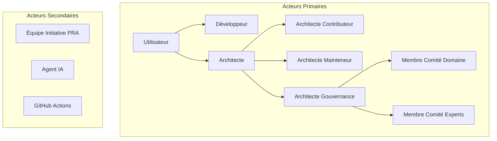

# Cas d'Utilisation du Registre PRA

## Proven Reusable Architecture - Documentation UML

**Version** : 1.0
**Date** : 2025-02-01
**Auteur** : Équipe Architecture

---

## Table des Matières

1. [Vue d'Ensemble](#1-vue-densemble)
2. [Acteurs du Système](#2-acteurs-du-système)
3. [Diagramme de Cas d'Utilisation Global](#3-diagramme-de-cas-dutilisation-global)
4. [Cas d'Utilisation Détaillés](#4-cas-dutilisation-détaillés)
   - [UC-01: Consulter le Catalogue](#uc-01-consulter-le-catalogue)
   - [UC-02: Rechercher un PRA](#uc-02-rechercher-un-pra)
   - [UC-03: Soumettre un PRA Candidat](#uc-03-soumettre-un-pra-candidat)
   - [UC-04: Ajouter un Proven-in-Use](#uc-04-ajouter-un-proven-in-use)
   - [UC-05: Valider un PRA](#uc-05-valider-un-pra)
   - [UC-06: Promouvoir un PRA](#uc-06-promouvoir-un-pra)
   - [UC-07: Déprécier un PRA](#uc-07-déprécier-un-pra)
   - [UC-08: Implémenter un PRA](#uc-08-implémenter-un-pra)
   - [UC-09: Maintenir un PRA](#uc-09-maintenir-un-pra)
   - [UC-10: Administrer la Plateforme](#uc-10-administrer-la-plateforme)
5. [Diagrammes par Package](#5-diagrammes-par-package)
6. [Matrice Acteurs / Cas d'Utilisation](#6-matrice-acteurs--cas-dutilisation)
7. [Scénarios et Flux Alternatifs](#7-scénarios-et-flux-alternatifs)

---

## 1. Vue d'Ensemble

### 1.1 Objectif du Document

Ce document décrit l'ensemble des cas d'utilisation du **Registre PRA (Proven Reusable Architecture)** de la Banque Nationale du Canada. Il identifie les acteurs, leurs interactions avec le système, et les flux de travail associés.

### 1.2 Périmètre du Système

Le Registre PRA est une plateforme de documentation et de gestion des architectures réutilisables éprouvées. Il permet de :

- **Capitaliser** les solutions architecturales validées en production
- **Partager** les bonnes pratiques entre équipes
- **Standardiser** les approches techniques
- **Accélérer** la conception de nouveaux projets

### 1.3 Boundaries du Système

```
┌─────────────────────────────────────────────────────────────────────────┐
│                        REGISTRE PRA (Système)                           │
│  ┌───────────────────────────────────────────────────────────────────┐  │
│  │                                                                   │  │
│  │   ┌─────────────┐  ┌─────────────┐  ┌─────────────┐              │  │
│  │   │  Catalogue  │  │  Registre   │  │   Guides    │              │  │
│  │   │  Interactif │  │Documentation│  │Contribution │              │  │
│  │   └─────────────┘  └─────────────┘  └─────────────┘              │  │
│  │                                                                   │  │
│  │   ┌─────────────┐  ┌─────────────┐  ┌─────────────┐              │  │
│  │   │  Workflow   │  │ Validation  │  │  Recherche  │              │  │
│  │   │    Git      │  │  Automatique│  │  Full-Text  │              │  │
│  │   └─────────────┘  └─────────────┘  └─────────────┘              │  │
│  │                                                                   │  │
│  └───────────────────────────────────────────────────────────────────┘  │
└─────────────────────────────────────────────────────────────────────────┘
          ▲                    ▲                    ▲
          │                    │                    │
     Utilisateurs         Gouvernance          Systèmes
      (Humains)            (Comités)           Externes
```

---

## 2. Acteurs du Système

### 2.1 Hiérarchie des Acteurs



### 2.2 Description des Acteurs

| Acteur | Type | Description | Permissions |
|--------|------|-------------|-------------|
| **Développeur** | Primaire | Consomme les PRA pour ses projets | Lecture seule |
| **Architecte Contributeur** | Primaire | Propose et documente des PRA | Lecture + Soumission |
| **Architecte Mainteneur** | Primaire | Responsable d'un ou plusieurs PRA | Lecture + Modification PRA assignés |
| **Membre Comité Domaine** | Primaire | Valide les PRA Domain-Wide | Validation domaine |
| **Membre Comité Experts** | Primaire | Valide les PRA Bank-Wide | Validation transversale |
| **Équipe Initiative PRA** | Secondaire | Administre la plateforme | Admin complet |
| **Agent IA** | Secondaire | Recommande des PRA automatiquement | Lecture + API |
| **GitHub Actions** | Système | Automatise les validations | Exécution workflows |

### 2.3 Diagramme des Acteurs

```
                              ┌─────────────────┐
                              │   Utilisateur   │
                              │   (Générique)   │
                              └────────┬────────┘
                                       │
              ┌────────────────────────┼────────────────────────┐
              │                        │                        │
              ▼                        ▼                        ▼
     ┌─────────────────┐     ┌─────────────────┐     ┌─────────────────┐
     │   Développeur   │     │   Architecte    │     │   Agent IA      │
     │                 │     │  Contributeur   │     │                 │
     │ • Consulte      │     │                 │     │ • Recommande    │
     │ • Recherche     │     │ • Soumet PRA    │     │ • Interroge     │
     │ • Implémente    │     │ • Documente     │     │                 │
     └─────────────────┘     └────────┬────────┘     └─────────────────┘
                                      │
                    ┌─────────────────┼─────────────────┐
                    │                                   │
                    ▼                                   ▼
           ┌─────────────────┐               ┌─────────────────┐
           │   Architecte    │               │   Architecte    │
           │   Mainteneur    │               │   Gouvernance   │
           │                 │               │                 │
           │ • Maintient     │               │ • Valide        │
           │ • Met à jour    │               │ • Arbitre       │
           │ • Répond        │               │ • Révise        │
           └─────────────────┘               └────────┬────────┘
                                                      │
                                    ┌─────────────────┴─────────────────┐
                                    │                                   │
                                    ▼                                   ▼
                           ┌─────────────────┐               ┌─────────────────┐
                           │ Membre Comité   │               │ Membre Comité   │
                           │    Domaine      │               │    Experts      │
                           │                 │               │                 │
                           │ • Particuliers  │               │ • Bank-Wide     │
                           │ • Entreprises   │               │ • Promotion     │
                           │ • Gestion Pat.  │               │ • Standards     │
                           └─────────────────┘               └─────────────────┘


                    ┌─────────────────────────────────────────┐
                    │           Acteurs Système               │
                    ├─────────────────┬───────────────────────┤
                    │  Équipe         │    GitHub Actions     │
                    │  Initiative     │                       │
                    │                 │    • Validation YAML  │
                    │  • Infrastructure│    • Lint MDX        │
                    │  • Support      │    • Check Links      │
                    │  • Formation    │    • Deploy           │
                    └─────────────────┴───────────────────────┘
```

---

## 3. Diagramme de Cas d'Utilisation Global

### 3.1 Vue d'Ensemble Complète

```mermaid
graph TB
    subgraph "Système Registre PRA"
        subgraph "Package: Consultation"
            UC01[UC-01: Consulter Catalogue]
            UC02[UC-02: Rechercher PRA]
            UC03[UC-03: Voir Détails PRA]
        end

        subgraph "Package: Contribution"
            UC04[UC-04: Soumettre PRA Candidat]
            UC05[UC-05: Ajouter Proven-in-Use]
            UC06[UC-06: Mettre à Jour PRA]
        end

        subgraph "Package: Gouvernance"
            UC07[UC-07: Valider PRA Domain-Wide]
            UC08[UC-08: Valider PRA Bank-Wide]
            UC09[UC-09: Promouvoir PRA]
            UC10[UC-10: Déprécier PRA]
            UC11[UC-11: Archiver PRA]
        end

        subgraph "Package: Implémentation"
            UC12[UC-12: Implémenter PRA]
            UC13[UC-13: Documenter Feedback]
        end

        subgraph "Package: Administration"
            UC14[UC-14: Maintenir Plateforme]
            UC15[UC-15: Gérer CI/CD]
            UC16[UC-16: Reporter Métriques]
        end
    end

    DEV[Développeur] --> UC01
    DEV --> UC02
    DEV --> UC03
    DEV --> UC12

    ARCH[Architecte Contributeur] --> UC01
    ARCH --> UC02
    ARCH --> UC04
    ARCH --> UC05
    ARCH --> UC06

    MAINT[Architecte Mainteneur] --> UC06
    MAINT --> UC05
    MAINT --> UC09
    MAINT --> UC10

    GOVD[Comité Domaine] --> UC07
    GOVD --> UC10

    GOVE[Comité Experts] --> UC08
    GOVE --> UC09
    GOVE --> UC10
    GOVE --> UC11

    INIT[Équipe Initiative] --> UC14
    INIT --> UC15
    INIT --> UC16

    AI[Agent IA] --> UC02
    AI --> UC03
```



### 3.2 Représentation UML Textuelle

```
┌─────────────────────────────────────────────────────────────────────────────────────┐
│                                 REGISTRE PRA                                         │
│                                                                                      │
│  ╔════════════════════════════════════════════════════════════════════════════════╗ │
│  ║                          PACKAGE: CONSULTATION                                  ║ │
│  ║  ┌──────────────────┐  ┌──────────────────┐  ┌──────────────────┐              ║ │
│  ║  │  (UC-01)         │  │  (UC-02)         │  │  (UC-03)         │              ║ │
│  ║  │  Consulter       │  │  Rechercher      │  │  Voir Détails    │              ║ │
│  ║  │  Catalogue       │  │  PRA             │  │  PRA             │              ║ │
│  ║  └──────────────────┘  └──────────────────┘  └──────────────────┘              ║ │
│  ╚════════════════════════════════════════════════════════════════════════════════╝ │
│                                                                                      │
│  ╔════════════════════════════════════════════════════════════════════════════════╗ │
│  ║                          PACKAGE: CONTRIBUTION                                  ║ │
│  ║  ┌──────────────────┐  ┌──────────────────┐  ┌──────────────────┐              ║ │
│  ║  │  (UC-04)         │  │  (UC-05)         │  │  (UC-06)         │              ║ │
│  ║  │  Soumettre PRA   │  │  Ajouter         │  │  Mettre à Jour   │              ║ │
│  ║  │  Candidat        │  │  Proven-in-Use   │  │  PRA             │              ║ │
│  ║  └──────────────────┘  └──────────────────┘  └──────────────────┘              ║ │
│  ╚════════════════════════════════════════════════════════════════════════════════╝ │
│                                                                                      │
│  ╔════════════════════════════════════════════════════════════════════════════════╗ │
│  ║                          PACKAGE: GOUVERNANCE                                   ║ │
│  ║  ┌──────────────────┐  ┌──────────────────┐  ┌──────────────────┐              ║ │
│  ║  │  (UC-07)         │  │  (UC-08)         │  │  (UC-09)         │              ║ │
│  ║  │  Valider PRA     │  │  Valider PRA     │  │  Promouvoir      │              ║ │
│  ║  │  Domain-Wide     │  │  Bank-Wide       │  │  PRA             │              ║ │
│  ║  └──────────────────┘  └──────────────────┘  └──────────────────┘              ║ │
│  ║  ┌──────────────────┐  ┌──────────────────┐                                    ║ │
│  ║  │  (UC-10)         │  │  (UC-11)         │                                    ║ │
│  ║  │  Déprécier       │  │  Archiver        │                                    ║ │
│  ║  │  PRA             │  │  PRA             │                                    ║ │
│  ║  └──────────────────┘  └──────────────────┘                                    ║ │
│  ╚════════════════════════════════════════════════════════════════════════════════╝ │
│                                                                                      │
│  ╔════════════════════════════════════════════════════════════════════════════════╗ │
│  ║                         PACKAGE: IMPLÉMENTATION                                 ║ │
│  ║  ┌──────────────────┐  ┌──────────────────┐                                    ║ │
│  ║  │  (UC-12)         │  │  (UC-13)         │                                    ║ │
│  ║  │  Implémenter     │  │  Documenter      │                                    ║ │
│  ║  │  PRA             │  │  Feedback        │                                    ║ │
│  ║  └──────────────────┘  └──────────────────┘                                    ║ │
│  ╚════════════════════════════════════════════════════════════════════════════════╝ │
│                                                                                      │
│  ╔════════════════════════════════════════════════════════════════════════════════╗ │
│  ║                         PACKAGE: ADMINISTRATION                                 ║ │
│  ║  ┌──────────────────┐  ┌──────────────────┐  ┌──────────────────┐              ║ │
│  ║  │  (UC-14)         │  │  (UC-15)         │  │  (UC-16)         │              ║ │
│  ║  │  Maintenir       │  │  Gérer           │  │  Reporter        │              ║ │
│  ║  │  Plateforme      │  │  CI/CD           │  │  Métriques       │              ║ │
│  ║  └──────────────────┘  └──────────────────┘  └──────────────────┘              ║ │
│  ╚════════════════════════════════════════════════════════════════════════════════╝ │
│                                                                                      │
└─────────────────────────────────────────────────────────────────────────────────────┘

        ┌─────────┐      ┌─────────┐      ┌─────────┐      ┌─────────┐
        │   DEV   │      │  ARCH   │      │  MAINT  │      │  GOVD   │
        │         │      │         │      │         │      │         │
        └────┬────┘      └────┬────┘      └────┬────┘      └────┬────┘
             │                │                │                │
             │   UC-01,02,03  │   UC-01,02     │   UC-05,06     │   UC-07
             │   UC-12        │   UC-04,05,06  │   UC-09,10     │   UC-10
             │                │                │                │
             └────────────────┴────────────────┴────────────────┘

        ┌─────────┐      ┌─────────┐      ┌─────────┐
        │  GOVE   │      │  INIT   │      │   AI    │
        │         │      │         │      │         │
        └────┬────┘      └────┬────┘      └────┬────┘
             │                │                │
             │   UC-08,09     │   UC-14,15     │   UC-02,03
             │   UC-10,11     │   UC-16        │
             │                │                │
             └────────────────┴────────────────┘
```

---

## 4. Cas d'Utilisation Détaillés

### UC-01: Consulter le Catalogue

```
╔══════════════════════════════════════════════════════════════════════════════╗
║  UC-01: CONSULTER LE CATALOGUE                                               ║
╠══════════════════════════════════════════════════════════════════════════════╣
║                                                                              ║
║  ID           : UC-01                                                        ║
║  Nom          : Consulter le Catalogue                                       ║
║  Package      : Consultation                                                 ║
║  Acteurs      : Développeur, Architecte, Agent IA                            ║
║  Priorité     : Haute                                                        ║
║                                                                              ║
╠══════════════════════════════════════════════════════════════════════════════╣
║  DESCRIPTION                                                                 ║
║  Permet à un utilisateur de parcourir la liste complète des PRA             ║
║  disponibles avec filtrage et tri.                                          ║
║                                                                              ║
╠══════════════════════════════════════════════════════════════════════════════╣
║  PRÉ-CONDITIONS                                                              ║
║  • L'utilisateur a accès au registre PRA                                     ║
║  • Le catalogue contient au moins un PRA                                     ║
║                                                                              ║
╠══════════════════════════════════════════════════════════════════════════════╣
║  POST-CONDITIONS                                                             ║
║  • L'utilisateur visualise la liste des PRA                                  ║
║  • Les filtres appliqués sont persistés dans l'URL                           ║
║                                                                              ║
╠══════════════════════════════════════════════════════════════════════════════╣
║  SCÉNARIO PRINCIPAL                                                          ║
║                                                                              ║
║  1. L'utilisateur accède à la page Catalogue (/catalogue)                    ║
║  2. Le système affiche la liste des PRA avec pagination                      ║
║  3. L'utilisateur peut filtrer par :                                         ║
║     - Scope (Bank-Wide, Domain-Wide)                                         ║
║     - Catégorie (CTP, Software Engineering, Pratique Architecture...)        ║
║     - Statut (Operationalized, Operationalizing, Deprecated)                 ║
║     - Domaine (Particuliers, Entreprises, Gestion Patrimoine)                ║
║  4. L'utilisateur peut trier par :                                           ║
║     - Nom (A-Z, Z-A)                                                         ║
║     - Date de mise à jour                                                    ║
║     - Nombre de proven-in-use                                                ║
║  5. Le système met à jour la liste selon les critères                        ║
║                                                                              ║
╠══════════════════════════════════════════════════════════════════════════════╣
║  EXTENSIONS                                                                  ║
║                                                                              ║
║  3a. Aucun PRA ne correspond aux filtres                                     ║
║      → Le système affiche un message "Aucun résultat"                        ║
║      → Le système propose de réinitialiser les filtres                       ║
║                                                                              ║
║  5a. L'utilisateur clique sur un PRA                                         ║
║      → Déclenche UC-03: Voir Détails PRA                                     ║
║                                                                              ║
╠══════════════════════════════════════════════════════════════════════════════╣
║  RELATIONS                                                                   ║
║                                                                              ║
║  • Include: UC-02 (Rechercher PRA)                                           ║
║  • Extend: UC-03 (Voir Détails PRA)                                          ║
║                                                                              ║
╚══════════════════════════════════════════════════════════════════════════════╝
```

**Diagramme de Séquence UC-01:**

```
┌─────────┐          ┌──────────────┐          ┌───────────┐          ┌─────────┐
│Utilisat.│          │  Catalogue   │          │   Orama   │          │  Source │
│         │          │    Client    │          │  Search   │          │   Data  │
└────┬────┘          └──────┬───────┘          └─────┬─────┘          └────┬────┘
     │                      │                        │                     │
     │  Accède /catalogue   │                        │                     │
     │─────────────────────>│                        │                     │
     │                      │                        │                     │
     │                      │  Charge les PRA        │                     │
     │                      │────────────────────────────────────────────>│
     │                      │                        │                     │
     │                      │<────────────────────────────────────────────│
     │                      │     Liste des PRA      │                     │
     │                      │                        │                     │
     │                      │  Indexe les données    │                     │
     │                      │───────────────────────>│                     │
     │                      │                        │                     │
     │  Affiche catalogue   │                        │                     │
     │<─────────────────────│                        │                     │
     │                      │                        │                     │
     │  Applique filtre     │                        │                     │
     │─────────────────────>│                        │                     │
     │                      │                        │                     │
     │                      │  Recherche filtrée     │                     │
     │                      │───────────────────────>│                     │
     │                      │                        │                     │
     │                      │<───────────────────────│                     │
     │                      │   Résultats filtrés    │                     │
     │                      │                        │                     │
     │  Affiche résultats   │                        │                     │
     │<─────────────────────│                        │                     │
     │                      │                        │                     │
```

---

### UC-02: Rechercher un PRA

```
╔══════════════════════════════════════════════════════════════════════════════╗
║  UC-02: RECHERCHER UN PRA                                                    ║
╠══════════════════════════════════════════════════════════════════════════════╣
║                                                                              ║
║  ID           : UC-02                                                        ║
║  Nom          : Rechercher un PRA                                            ║
║  Package      : Consultation                                                 ║
║  Acteurs      : Développeur, Architecte, Agent IA                            ║
║  Priorité     : Haute                                                        ║
║                                                                              ║
╠══════════════════════════════════════════════════════════════════════════════╣
║  DESCRIPTION                                                                 ║
║  Permet de rechercher des PRA par mots-clés avec matching fuzzy.             ║
║                                                                              ║
╠══════════════════════════════════════════════════════════════════════════════╣
║  PRÉ-CONDITIONS                                                              ║
║  • L'index de recherche Orama est initialisé                                 ║
║                                                                              ║
╠══════════════════════════════════════════════════════════════════════════════╣
║  SCÉNARIO PRINCIPAL                                                          ║
║                                                                              ║
║  1. L'utilisateur saisit un terme de recherche                               ║
║  2. Le système effectue une recherche full-text avec :                       ║
║     - Fuzzy matching (tolérance: 1 caractère)                                ║
║     - Boost sur le nom (x2)                                                  ║
║     - Boost sur les tags (x1.5)                                              ║
║     - Recherche dans la description (x1)                                     ║
║  3. Le système affiche les résultats classés par pertinence                  ║
║                                                                              ║
╠══════════════════════════════════════════════════════════════════════════════╣
║  EXTENSIONS                                                                  ║
║                                                                              ║
║  2a. Faute de frappe dans la recherche                                       ║
║      → Le fuzzy matching corrige automatiquement                             ║
║      → Ex: "salesforse" trouve "Salesforce FSC"                              ║
║                                                                              ║
║  3a. Aucun résultat trouvé                                                   ║
║      → Le système suggère des termes alternatifs                             ║
║                                                                              ║
╚══════════════════════════════════════════════════════════════════════════════╝
```

---

### UC-03: Soumettre un PRA Candidat

```
╔══════════════════════════════════════════════════════════════════════════════╗
║  UC-03: SOUMETTRE UN PRA CANDIDAT                                            ║
╠══════════════════════════════════════════════════════════════════════════════╣
║                                                                              ║
║  ID           : UC-03                                                        ║
║  Nom          : Soumettre un PRA Candidat                                    ║
║  Package      : Contribution                                                 ║
║  Acteurs      : Architecte Contributeur                                      ║
║  Priorité     : Haute                                                        ║
║                                                                              ║
╠══════════════════════════════════════════════════════════════════════════════╣
║  DESCRIPTION                                                                 ║
║  Permet à un architecte de proposer une nouvelle architecture                ║
║  réutilisable au registre.                                                   ║
║                                                                              ║
╠══════════════════════════════════════════════════════════════════════════════╣
║  PRÉ-CONDITIONS                                                              ║
║  • L'architecte a un compte GitHub avec accès au repo                        ║
║  • L'architecte a au moins 1 implémentation documentée                       ║
║  • Aucun PRA similaire n'existe dans le registre                             ║
║                                                                              ║
╠══════════════════════════════════════════════════════════════════════════════╣
║  POST-CONDITIONS                                                             ║
║  • Une PR est créée sur le repository                                        ║
║  • Le PRA apparaît en statut "En attente de review"                          ║
║  • Les reviewers sont notifiés                                               ║
║                                                                              ║
╠══════════════════════════════════════════════════════════════════════════════╣
║  SCÉNARIO PRINCIPAL                                                          ║
║                                                                              ║
║  1. L'architecte vérifie l'absence de doublon (UC-02)                        ║
║  2. L'architecte crée une branche: pra/nouveau-[category]-[nom]              ║
║  3. L'architecte copie le template PRA                                       ║
║  4. L'architecte remplit les sections obligatoires :                         ║
║     - Métadonnées YAML (frontmatter)                                         ║
║     - Résumé exécutif                                                        ║
║     - Contexte d'application                                                 ║
║     - Problème résolu                                                        ║
║     - Solution proposée                                                      ║
║     - Au moins 1 ADR                                                         ║
║     - Au moins 1 exemple                                                     ║
║     - Au moins 1 proven-in-use                                               ║
║  5. L'architecte exécute la validation locale                                ║
║  6. L'architecte commit et push la branche                                   ║
║  7. L'architecte crée une Pull Request                                       ║
║  8. GitHub Actions exécute les validations automatiques                      ║
║  9. Le système notifie les membres du comité approprié                       ║
║                                                                              ║
╠══════════════════════════════════════════════════════════════════════════════╣
║  EXTENSIONS                                                                  ║
║                                                                              ║
║  1a. Un PRA similaire existe                                                 ║
║      → L'architecte contribue au PRA existant (UC-05)                        ║
║      → OU justifie pourquoi un nouveau PRA est nécessaire                    ║
║                                                                              ║
║  5a. La validation locale échoue                                             ║
║      → L'architecte corrige les erreurs                                      ║
║      → Retour à l'étape 5                                                    ║
║                                                                              ║
║  8a. Les validations automatiques échouent                                   ║
║      → GitHub Actions commente la PR avec les erreurs                        ║
║      → L'architecte corrige et re-push                                       ║
║                                                                              ║
╠══════════════════════════════════════════════════════════════════════════════╣
║  RELATIONS                                                                   ║
║                                                                              ║
║  • Include: UC-02 (Vérification doublon)                                     ║
║  • Extend: UC-05 (Si ajout à PRA existant)                                   ║
║  • Précède: UC-07 ou UC-08 (Validation)                                      ║
║                                                                              ║
╚══════════════════════════════════════════════════════════════════════════════╝
```

**Diagramme de Séquence UC-03:**

```
┌─────────┐     ┌─────────┐     ┌─────────┐     ┌─────────┐     ┌─────────┐
│Architect│     │   Git   │     │  GitHub │     │  GitHub │     │ Comité  │
│         │     │  Local  │     │   Repo  │     │ Actions │     │         │
└────┬────┘     └────┬────┘     └────┬────┘     └────┬────┘     └────┬────┘
     │               │               │               │               │
     │ git checkout  │               │               │               │
     │──────────────>│               │               │               │
     │               │               │               │               │
     │ Crée PRA doc  │               │               │               │
     │──────────────>│               │               │               │
     │               │               │               │               │
     │ validate-meta │               │               │               │
     │──────────────>│               │               │               │
     │<──────────────│ OK            │               │               │
     │               │               │               │               │
     │ git commit    │               │               │               │
     │──────────────>│               │               │               │
     │               │               │               │               │
     │ git push      │               │               │               │
     │──────────────>│──────────────>│               │               │
     │               │               │               │               │
     │ Crée PR       │               │               │               │
     │───────────────────────────────>│               │               │
     │               │               │               │               │
     │               │               │  Trigger      │               │
     │               │               │──────────────>│               │
     │               │               │               │               │
     │               │               │               │ Validate YAML │
     │               │               │               │──────┐        │
     │               │               │               │<─────┘        │
     │               │               │               │               │
     │               │               │               │ Validate MDX  │
     │               │               │               │──────┐        │
     │               │               │               │<─────┘        │
     │               │               │               │               │
     │               │               │  Status: OK   │               │
     │               │               │<──────────────│               │
     │               │               │               │               │
     │               │               │ Notify        │               │
     │               │               │───────────────────────────────>│
     │               │               │               │               │
     │<───────────────────────────────────────────────────────────────│
     │               │       Assignation reviewers   │               │
     │               │               │               │               │
```

---

### UC-04: Ajouter un Proven-in-Use

```
╔══════════════════════════════════════════════════════════════════════════════╗
║  UC-04: AJOUTER UN PROVEN-IN-USE                                             ║
╠══════════════════════════════════════════════════════════════════════════════╣
║                                                                              ║
║  ID           : UC-04                                                        ║
║  Nom          : Ajouter un Proven-in-Use                                     ║
║  Package      : Contribution                                                 ║
║  Acteurs      : Architecte Contributeur, Développeur                         ║
║  Priorité     : Haute                                                        ║
║                                                                              ║
╠══════════════════════════════════════════════════════════════════════════════╣
║  DESCRIPTION                                                                 ║
║  Permet de documenter une nouvelle implémentation réussie d'un PRA          ║
║  existant, enrichissant ainsi son historique de validation.                  ║
║                                                                              ║
╠══════════════════════════════════════════════════════════════════════════════╣
║  PRÉ-CONDITIONS                                                              ║
║  • Le PRA cible existe dans le registre                                      ║
║  • L'utilisateur a implémenté le PRA avec succès                             ║
║  • Le projet est en production ou proche de la production                    ║
║                                                                              ║
╠══════════════════════════════════════════════════════════════════════════════╣
║  SCÉNARIO PRINCIPAL                                                          ║
║                                                                              ║
║  1. L'utilisateur identifie le PRA implémenté                                ║
║  2. L'utilisateur crée une branche: pra/proven-[pra-name]-[project]          ║
║  3. L'utilisateur ajoute au frontmatter YAML :                               ║
║     proven_in_use:                                                           ║
║       - project: "Nom du Projet"                                             ║
║         team: "Nom de l'Équipe"                                              ║
║         date: "YYYY-MM-DD"                                                   ║
║         feedback: "Résultats quantifiés"                                     ║
║  4. L'utilisateur ajoute une section "Retour d'Expérience" détaillée         ║
║  5. L'utilisateur met à jour la date updated_at                              ║
║  6. L'utilisateur soumet la PR                                               ║
║  7. Le mainteneur du PRA valide et merge                                     ║
║                                                                              ║
╠══════════════════════════════════════════════════════════════════════════════╣
║  IMPACT                                                                      ║
║                                                                              ║
║  • Si proven_in_use atteint 3+ → Éligible pour UC-06 (Promotion)             ║
║  • Augmente la crédibilité et la visibilité du PRA                           ║
║                                                                              ║
╚══════════════════════════════════════════════════════════════════════════════╝
```

---

### UC-05: Valider un PRA

```
╔══════════════════════════════════════════════════════════════════════════════╗
║  UC-05: VALIDER UN PRA                                                       ║
╠══════════════════════════════════════════════════════════════════════════════╣
║                                                                              ║
║  ID           : UC-05                                                        ║
║  Nom          : Valider un PRA                                               ║
║  Package      : Gouvernance                                                  ║
║  Acteurs      : Membre Comité Domaine, Membre Comité Experts                 ║
║  Priorité     : Critique                                                     ║
║                                                                              ║
╠══════════════════════════════════════════════════════════════════════════════╣
║  DESCRIPTION                                                                 ║
║  Processus de review et d'approbation d'un PRA candidat par                  ║
║  les instances de gouvernance appropriées.                                   ║
║                                                                              ║
╠══════════════════════════════════════════════════════════════════════════════╣
║  PRÉ-CONDITIONS                                                              ║
║  • Une PR de soumission PRA existe                                           ║
║  • Les validations automatiques sont passées                                 ║
║  • 2 reviewers du comité sont assignés                                       ║
║                                                                              ║
╠══════════════════════════════════════════════════════════════════════════════╣
║  POST-CONDITIONS (Succès)                                                    ║
║  • Le PRA est mergé dans main                                                ║
║  • Le PRA apparaît dans le catalogue                                         ║
║  • Une notification est envoyée à la communauté                              ║
║                                                                              ║
╠══════════════════════════════════════════════════════════════════════════════╣
║  SCÉNARIO PRINCIPAL                                                          ║
║                                                                              ║
║  1. Le reviewer accède à la PR                                               ║
║  2. Le reviewer vérifie les critères :                                       ║
║     □ Template complet                                                       ║
║     □ Métadonnées valides                                                    ║
║     □ Au moins 1 ADR                                                         ║
║     □ Au moins 1 exemple                                                     ║
║     □ Minimum 1 proven-in-use (candidat) ou 3+ (approved)                    ║
║     □ Clarté de la documentation                                             ║
║     □ Pertinence et réutilisabilité                                          ║
║  3. Le reviewer ajoute ses commentaires                                      ║
║  4. Si modifications requises → Demande de changements                       ║
║  5. Si acceptable → Approve la PR                                            ║
║  6. Après 2 approvals → Merge automatique                                    ║
║                                                                              ║
╠══════════════════════════════════════════════════════════════════════════════╣
║  SOUS-CAS D'UTILISATION                                                      ║
║                                                                              ║
║  UC-05a: Valider PRA Domain-Wide                                             ║
║          Acteur: Membre Comité Domaine                                       ║
║          Critère: 1+ proven-in-use dans le domaine                           ║
║                                                                              ║
║  UC-05b: Valider PRA Bank-Wide                                               ║
║          Acteur: Membre Comité Experts                                       ║
║          Critère: 3+ proven-in-use multi-secteur                             ║
║                                                                              ║
╠══════════════════════════════════════════════════════════════════════════════╣
║  EXTENSIONS                                                                  ║
║                                                                              ║
║  4a. Le contributeur ne répond pas sous 2 semaines                           ║
║      → La PR est marquée "stale"                                             ║
║      → Après 4 semaines → Fermeture automatique                              ║
║                                                                              ║
║  5a. Désaccord entre reviewers                                               ║
║      → Escalade au Comité complet                                            ║
║      → Vote à majorité simple                                                ║
║                                                                              ║
╚══════════════════════════════════════════════════════════════════════════════╝
```

---

### UC-06: Promouvoir un PRA

```
╔══════════════════════════════════════════════════════════════════════════════╗
║  UC-06: PROMOUVOIR UN PRA                                                    ║
╠══════════════════════════════════════════════════════════════════════════════╣
║                                                                              ║
║  ID           : UC-06                                                        ║
║  Nom          : Promouvoir un PRA                                            ║
║  Package      : Gouvernance                                                  ║
║  Acteurs      : Architecte Mainteneur, Comité Experts                        ║
║  Priorité     : Moyenne                                                      ║
║                                                                              ║
╠══════════════════════════════════════════════════════════════════════════════╣
║  DESCRIPTION                                                                 ║
║  Processus de promotion d'un PRA :                                           ║
║  • Operationalizing → Operationalized                                        ║
║  • Domain-Wide → Bank-Wide                                                   ║
║                                                                              ║
╠══════════════════════════════════════════════════════════════════════════════╣
║  PRÉ-CONDITIONS (Candidate → Approved)                                       ║
║  • 3+ proven-in-use documentés                                               ║
║  • Au moins 2 équipes différentes                                            ║
║  • Minimum 6 mois en statut candidat                                         ║
║  • Pas de changements majeurs depuis 3 mois                                  ║
║  • Feedback positif (>80% satisfaction)                                      ║
║                                                                              ║
╠══════════════════════════════════════════════════════════════════════════════╣
║  PRÉ-CONDITIONS (Domain → Bank-Wide)                                         ║
║  • PRA déjà Approved dans son domaine                                        ║
║  • Implémentations dans au moins 2 secteurs différents                       ║
║  • Documentation généralisée (non secteur-spécifique)                        ║
║                                                                              ║
╠══════════════════════════════════════════════════════════════════════════════╣
║  SCÉNARIO PRINCIPAL                                                          ║
║                                                                              ║
║  1. Le mainteneur vérifie les critères de promotion                          ║
║  2. Le mainteneur crée une branche: pra/promote-[pra-name]                   ║
║  3. Le mainteneur déplace le fichier vers le nouveau dossier :               ║
║     • operationalizing/ → operationalized/                                   ║
║     • domain-wide/ → bank-wide/                                              ║
║  4. Le mainteneur met à jour le frontmatter :                                ║
║     • status: operationalized                                                ║
║     • scope: bank-wide (si applicable)                                       ║
║  5. Le mainteneur soumet la PR de promotion                                  ║
║  6. GitHub Actions valide les critères automatiquement                       ║
║  7. Le Comité Experts review et approuve                                     ║
║  8. Merge → Communication à la communauté                                    ║
║                                                                              ║
╚══════════════════════════════════════════════════════════════════════════════╝
```

**Diagramme d'État - Cycle de Vie du PRA:**

```
                                    ┌─────────────────┐
                                    │    IDEATION     │
                                    │   (Pré-PRA)     │
                                    └────────┬────────┘
                                             │
                                             │ Création PR
                                             │ (UC-03)
                                             ▼
                    ┌────────────────────────────────────────────┐
                    │                                            │
                    │             OPERATIONALIZING               │
                    │          (En cours d'opérationnalisation)  │
                    │                                            │
                    │  • 1+ proven-in-use                        │
                    │  • En validation                           │
                    │  • Peut évoluer                            │
                    │                                            │
                    └────────────────┬───────────────────────────┘
                                     │
                     ┌───────────────┼───────────────┐
                     │               │               │
            Rejet    │    Promotion  │    Abandon    │
           (Vote)    │   (3+ proven) │   (12+ mois)  │
                     │               │               │
                     ▼               ▼               ▼
              ┌──────────┐   ┌──────────────┐   ┌──────────┐
              │ REJETÉ   │   │OPERATIONALIZED│   │ ARCHIVED │
              │(Feedback)│   │(Opérationnalisé)│ │          │
              └──────────┘   └───────┬──────┘   └──────────┘
                                     │                 ▲
                                     │                 │
                            ┌────────┼────────┐        │
                            │        │        │        │
                  Obsolète  │        │        │ Non    │
                  (Tech)    │        │        │ utilisé│
                            ▼        │        │  12m   │
                     ┌──────────┐    │        │        │
                     │DEPRECATED│────┼────────┴────────┘
                     │          │    │    6+ mois
                     └──────────┘    │
                                     │
                                     ▼
                              ┌──────────────┐
                              │   ACTIF      │
                              │  (Maintenu)  │
                              └──────────────┘
```

---

### UC-07: Déprécier un PRA

```
╔══════════════════════════════════════════════════════════════════════════════╗
║  UC-07: DÉPRÉCIER UN PRA                                                     ║
╠══════════════════════════════════════════════════════════════════════════════╣
║                                                                              ║
║  ID           : UC-07                                                        ║
║  Nom          : Déprécier un PRA                                             ║
║  Package      : Gouvernance                                                  ║
║  Acteurs      : Architecte Mainteneur, Comité Experts                        ║
║  Priorité     : Basse                                                        ║
║                                                                              ║
╠══════════════════════════════════════════════════════════════════════════════╣
║  DESCRIPTION                                                                 ║
║  Marquer un PRA comme obsolète et non recommandé pour les nouveaux projets.  ║
║                                                                              ║
╠══════════════════════════════════════════════════════════════════════════════╣
║  RAISONS DE DÉPRÉCIATION                                                     ║
║  • Technologie obsolète                                                      ║
║  • Meilleur patron disponible (remplacé par autre PRA)                       ║
║  • Non utilisé depuis 12+ mois                                               ║
║  • Feedback négatif récurrent                                                ║
║  • Vulnérabilités de sécurité non patchables                                 ║
║                                                                              ║
╠══════════════════════════════════════════════════════════════════════════════╣
║  SCÉNARIO PRINCIPAL                                                          ║
║                                                                              ║
║  1. Le mainteneur identifie le besoin de dépréciation                        ║
║  2. Le mainteneur crée une PR de dépréciation                                ║
║  3. Le mainteneur ajoute :                                                   ║
║     • status: deprecated                                                     ║
║     • replaced_by: pra-XXX (si applicable)                                   ║
║     • Banner de dépréciation en haut du document                             ║
║  4. Le Comité Experts review et approuve                                     ║
║  5. Merge → Communication de la dépréciation                                 ║
║  6. Le PRA reste visible avec warning pendant 6 mois                         ║
║  7. Après 6 mois → Éligible pour archivage                                   ║
║                                                                              ║
╚══════════════════════════════════════════════════════════════════════════════╝
```

---

### UC-08: Implémenter un PRA

```
╔══════════════════════════════════════════════════════════════════════════════╗
║  UC-08: IMPLÉMENTER UN PRA                                                   ║
╠══════════════════════════════════════════════════════════════════════════════╣
║                                                                              ║
║  ID           : UC-08                                                        ║
║  Nom          : Implémenter un PRA                                           ║
║  Package      : Implémentation                                               ║
║  Acteurs      : Développeur, Architecte                                      ║
║  Priorité     : Haute                                                        ║
║                                                                              ║
╠══════════════════════════════════════════════════════════════════════════════╣
║  DESCRIPTION                                                                 ║
║  Processus d'adoption et d'implémentation d'un PRA dans un projet.           ║
║                                                                              ║
╠══════════════════════════════════════════════════════════════════════════════╣
║  PRÉ-CONDITIONS                                                              ║
║  • Le contexte du projet correspond au PRA                                   ║
║  • Le PRA est en statut Operationalized ou Operationalizing                  ║
║                                                                              ║
╠══════════════════════════════════════════════════════════════════════════════╣
║  SCÉNARIO PRINCIPAL                                                          ║
║                                                                              ║
║  1. L'utilisateur recherche un PRA adapté (UC-01, UC-02)                     ║
║  2. L'utilisateur étudie la documentation :                                  ║
║     • Contexte d'application                                                 ║
║     • Architecture proposée                                                  ║
║     • ADRs (décisions et alternatives)                                       ║
║     • Exemples de code                                                       ║
║     • Retours d'expérience                                                   ║
║  3. L'utilisateur vérifie que le contexte projet correspond                  ║
║  4. L'utilisateur adapte l'architecture à son contexte                       ║
║  5. L'utilisateur implémente la solution                                     ║
║  6. L'utilisateur valide en production                                       ║
║  7. L'utilisateur documente son retour d'expérience (UC-04)                  ║
║                                                                              ║
╠══════════════════════════════════════════════════════════════════════════════╣
║  EXTENSIONS                                                                  ║
║                                                                              ║
║  3a. Le contexte ne correspond pas parfaitement                              ║
║      → L'utilisateur consulte le mainteneur pour guidance                    ║
║      → L'utilisateur documente les adaptations nécessaires                   ║
║                                                                              ║
║  6a. L'implémentation échoue                                                 ║
║      → L'utilisateur remonte le problème au mainteneur                       ║
║      → Le PRA peut être mis à jour pour clarifier                            ║
║                                                                              ║
╚══════════════════════════════════════════════════════════════════════════════╝
```

---

### UC-09: Maintenir un PRA

```
╔══════════════════════════════════════════════════════════════════════════════╗
║  UC-09: MAINTENIR UN PRA                                                     ║
╠══════════════════════════════════════════════════════════════════════════════╣
║                                                                              ║
║  ID           : UC-09                                                        ║
║  Nom          : Maintenir un PRA                                             ║
║  Package      : Administration                                               ║
║  Acteurs      : Architecte Mainteneur                                        ║
║  Priorité     : Moyenne                                                      ║
║                                                                              ║
╠══════════════════════════════════════════════════════════════════════════════╣
║  ACTIVITÉS DE MAINTENANCE                                                    ║
║                                                                              ║
║  HEBDOMADAIRE:                                                               ║
║  • Répondre aux questions de la communauté                                   ║
║  • Trier les Issues GitHub                                                   ║
║  • Review des PRs mineures                                                   ║
║                                                                              ║
║  MENSUELLE:                                                                  ║
║  • Vérifier les liens externes                                               ║
║  • Vérifier les dépendances technologiques                                   ║
║  • Mettre à jour les versions si nécessaire                                  ║
║                                                                              ║
║  TRIMESTRIELLE:                                                              ║
║  • Review feedback communauté                                                ║
║  • Analyser métriques d'utilisation                                          ║
║  • Évaluer la santé du PRA                                                   ║
║                                                                              ║
║  ANNUELLE:                                                                   ║
║  • Audit complet du PRA                                                      ║
║  • Évaluation pertinence long terme                                          ║
║  • Révision si technologie évolue                                            ║
║                                                                              ║
╚══════════════════════════════════════════════════════════════════════════════╝
```

---

### UC-10: Administrer la Plateforme

```
╔══════════════════════════════════════════════════════════════════════════════╗
║  UC-10: ADMINISTRER LA PLATEFORME                                            ║
╠══════════════════════════════════════════════════════════════════════════════╣
║                                                                              ║
║  ID           : UC-10                                                        ║
║  Nom          : Administrer la Plateforme                                    ║
║  Package      : Administration                                               ║
║  Acteurs      : Équipe Initiative PRA                                        ║
║  Priorité     : Critique                                                     ║
║                                                                              ║
╠══════════════════════════════════════════════════════════════════════════════╣
║  SOUS-CAS D'UTILISATION                                                      ║
║                                                                              ║
║  UC-10a: Maintenir l'Infrastructure                                          ║
║  • Gérer le repository GitHub                                                ║
║  • Maintenir le site Fumadocs                                                ║
║  • Gérer les déploiements                                                    ║
║                                                                              ║
║  UC-10b: Gérer les CI/CD                                                     ║
║  • Configurer GitHub Actions                                                 ║
║  • Maintenir les scripts de validation                                       ║
║  • Gérer les secrets                                                         ║
║                                                                              ║
║  UC-10c: Supporter la Communauté                                             ║
║  • Répondre aux questions                                                    ║
║  • Animer les formations                                                     ║
║  • Onboarder les nouveaux contributeurs                                      ║
║                                                                              ║
║  UC-10d: Reporter les Métriques                                              ║
║  • Collecter les statistiques d'utilisation                                  ║
║  • Générer les dashboards                                                    ║
║  • Rapporter au leadership                                                   ║
║                                                                              ║
╚══════════════════════════════════════════════════════════════════════════════╝
```

---

## 5. Diagrammes par Package

### 5.1 Package Consultation

```
┌─────────────────────────────────────────────────────────────────┐
│                    PACKAGE: CONSULTATION                         │
│                                                                  │
│  ┌────────────┐                                                  │
│  │Développeur │──────────────────────────────────────┐           │
│  └────────────┘                                      │           │
│        │                                             │           │
│        │         ┌────────────────────────┐          │           │
│        ├────────>│  (UC-01)               │          │           │
│        │         │  Consulter Catalogue   │<─────────┤           │
│        │         └──────────┬─────────────┘          │           │
│        │                    │                        │           │
│        │                    │ <<include>>            │           │
│        │                    ▼                        │           │
│        │         ┌────────────────────────┐          │           │
│        ├────────>│  (UC-02)               │          │           │
│        │         │  Rechercher PRA        │<─────────┤           │
│        │         └──────────┬─────────────┘          │           │
│        │                    │                        │           │
│        │                    │ <<extend>>             │           │
│        │                    ▼                        │           │
│        │         ┌────────────────────────┐          │           │
│        └────────>│  (UC-03)               │          │           │
│                  │  Voir Détails PRA      │<─────────┘           │
│                  └────────────────────────┘                      │
│                                                      ┌──────────┐│
│                                                      │ Agent IA ││
│                                                      └──────────┘│
└─────────────────────────────────────────────────────────────────┘
```

### 5.2 Package Contribution

```
┌─────────────────────────────────────────────────────────────────┐
│                    PACKAGE: CONTRIBUTION                         │
│                                                                  │
│  ┌────────────────┐                                              │
│  │   Architecte   │                                              │
│  │  Contributeur  │                                              │
│  └───────┬────────┘                                              │
│          │                                                       │
│          │         ┌────────────────────────┐                    │
│          ├────────>│  (UC-04)               │                    │
│          │         │  Soumettre PRA         │                    │
│          │         │  Candidat              │                    │
│          │         └──────────┬─────────────┘                    │
│          │                    │                                  │
│          │                    │ <<include>>                      │
│          │                    ▼                                  │
│          │         ┌────────────────────────┐                    │
│          │         │  (UC-02)               │                    │
│          │         │  Vérifier Doublon      │                    │
│          │         └────────────────────────┘                    │
│          │                                                       │
│          │         ┌────────────────────────┐                    │
│          ├────────>│  (UC-05)               │                    │
│          │         │  Ajouter Proven-in-Use │<───────────────────┤
│          │         └────────────────────────┘      ┌────────────┐│
│          │                                         │Développeur ││
│          │         ┌────────────────────────┐      └────────────┘│
│          └────────>│  (UC-06)               │                    │
│                    │  Mettre à Jour PRA     │<────────┐          │
│                    └────────────────────────┘         │          │
│                                               ┌───────┴────────┐ │
│                                               │   Architecte   │ │
│                                               │   Mainteneur   │ │
│                                               └────────────────┘ │
└─────────────────────────────────────────────────────────────────┘
```

### 5.3 Package Gouvernance

```
┌─────────────────────────────────────────────────────────────────┐
│                    PACKAGE: GOUVERNANCE                          │
│                                                                  │
│  ┌─────────────────┐                    ┌─────────────────┐      │
│  │ Comité Domaine  │                    │ Comité Experts  │      │
│  └────────┬────────┘                    └────────┬────────┘      │
│           │                                      │               │
│           │    ┌────────────────────────┐        │               │
│           └───>│  (UC-07)               │        │               │
│                │  Valider PRA           │        │               │
│                │  Domain-Wide           │        │               │
│                └────────────────────────┘        │               │
│                                                  │               │
│                ┌────────────────────────┐        │               │
│                │  (UC-08)               │<───────┤               │
│                │  Valider PRA           │        │               │
│                │  Bank-Wide             │        │               │
│                └────────────────────────┘        │               │
│                                                  │               │
│                ┌────────────────────────┐        │               │
│                │  (UC-09)               │<───────┤               │
│                │  Promouvoir PRA        │        │               │
│                └────────────────────────┘        │               │
│                         ▲                        │               │
│                         │                        │               │
│                ┌────────┴───────┐                │               │
│                │   Architecte   │                │               │
│                │   Mainteneur   │                │               │
│                └────────────────┘                │               │
│                                                  │               │
│                ┌────────────────────────┐        │               │
│           ┌───>│  (UC-10)               │<───────┤               │
│           │    │  Déprécier PRA         │        │               │
│           │    └────────────────────────┘        │               │
│           │                                      │               │
│           │    ┌────────────────────────┐        │               │
│           │    │  (UC-11)               │<───────┘               │
│           │    │  Archiver PRA          │                        │
│           │    └────────────────────────┘                        │
│           │                                                      │
│  ┌────────┴────────┐                                             │
│  │ Comité Domaine  │                                             │
│  └─────────────────┘                                             │
└─────────────────────────────────────────────────────────────────┘
```

---

## 6. Matrice Acteurs / Cas d'Utilisation

### 6.1 Matrice de Responsabilités

| Cas d'Utilisation | DEV | ARCH | MAINT | GOVD | GOVE | INIT | AI |
|-------------------|:---:|:----:|:-----:|:----:|:----:|:----:|:--:|
| UC-01: Consulter Catalogue | ● | ● | ● | ● | ● | ● | ● |
| UC-02: Rechercher PRA | ● | ● | ● | ● | ● | ● | ● |
| UC-03: Voir Détails PRA | ● | ● | ● | ● | ● | ● | ● |
| UC-04: Soumettre PRA Candidat | ○ | ● | ● | ○ | ○ | ○ | ○ |
| UC-05: Ajouter Proven-in-Use | ● | ● | ● | ○ | ○ | ○ | ○ |
| UC-06: Mettre à Jour PRA | ○ | ● | ● | ○ | ○ | ○ | ○ |
| UC-07: Valider Domain-Wide | ○ | ○ | ○ | ● | ○ | ○ | ○ |
| UC-08: Valider Bank-Wide | ○ | ○ | ○ | ○ | ● | ○ | ○ |
| UC-09: Promouvoir PRA | ○ | ○ | ● | ○ | ● | ○ | ○ |
| UC-10: Déprécier PRA | ○ | ○ | ● | ● | ● | ○ | ○ |
| UC-11: Archiver PRA | ○ | ○ | ○ | ○ | ● | ○ | ○ |
| UC-12: Implémenter PRA | ● | ● | ○ | ○ | ○ | ○ | ○ |
| UC-13: Documenter Feedback | ● | ● | ● | ○ | ○ | ○ | ○ |
| UC-14: Maintenir Plateforme | ○ | ○ | ○ | ○ | ○ | ● | ○ |
| UC-15: Gérer CI/CD | ○ | ○ | ○ | ○ | ○ | ● | ○ |
| UC-16: Reporter Métriques | ○ | ○ | ○ | ○ | ○ | ● | ○ |

**Légende:**
- ● = Acteur principal (peut exécuter)
- ○ = Non concerné

### 6.2 Fréquence d'Utilisation

| Cas d'Utilisation | Fréquence | Volume/Mois |
|-------------------|-----------|-------------|
| UC-01: Consulter Catalogue | Quotidienne | ~500 |
| UC-02: Rechercher PRA | Quotidienne | ~300 |
| UC-03: Voir Détails PRA | Quotidienne | ~200 |
| UC-04: Soumettre PRA | Mensuelle | 2-3 |
| UC-05: Ajouter Proven-in-Use | Hebdomadaire | 5-10 |
| UC-06: Mettre à Jour PRA | Hebdomadaire | 3-5 |
| UC-07/08: Valider PRA | Bimensuelle | 2-3 |
| UC-09: Promouvoir PRA | Trimestrielle | 1-2 |
| UC-10: Déprécier PRA | Annuelle | <1 |
| UC-12: Implémenter PRA | Hebdomadaire | 10-15 |

---

## 7. Scénarios et Flux Alternatifs

### 7.1 Flux de Travail Complet: Nouveau PRA

```
┌─────────────────────────────────────────────────────────────────────────────┐
│                                                                             │
│   ARCHITECTE                    SYSTÈME                    GOUVERNANCE     │
│                                                                             │
│       │                            │                            │          │
│       │  1. Vérifier doublon       │                            │          │
│       │───────────────────────────>│                            │          │
│       │                            │                            │          │
│       │       Pas de doublon       │                            │          │
│       │<───────────────────────────│                            │          │
│       │                            │                            │          │
│       │  2. Créer branche          │                            │          │
│       │───────────────────────────>│                            │          │
│       │                            │                            │          │
│       │  3. Documenter PRA         │                            │          │
│       │───────────────────────────>│                            │          │
│       │                            │                            │          │
│       │  4. Validation locale      │                            │          │
│       │───────────────────────────>│                            │          │
│       │                            │                            │          │
│       │       Validation OK        │                            │          │
│       │<───────────────────────────│                            │          │
│       │                            │                            │          │
│       │  5. Créer PR               │                            │          │
│       │───────────────────────────>│                            │          │
│       │                            │                            │          │
│       │                            │  6. Trigger CI/CD          │          │
│       │                            │───────────┐                │          │
│       │                            │<──────────┘                │          │
│       │                            │                            │          │
│       │                            │  7. Notifier reviewers     │          │
│       │                            │───────────────────────────>│          │
│       │                            │                            │          │
│       │                            │                            │  8. Review│
│       │                            │                            │────┐     │
│       │                            │                            │<───┘     │
│       │                            │                            │          │
│       │       Demande de modifs    │                            │          │
│       │<────────────────────────────────────────────────────────│          │
│       │                            │                            │          │
│       │  9. Corrections            │                            │          │
│       │───────────────────────────>│                            │          │
│       │                            │                            │          │
│       │                            │                            │ 10.Approve│
│       │                            │                            │────┐     │
│       │                            │                            │<───┘     │
│       │                            │                            │          │
│       │                            │ 11. Merge                  │          │
│       │                            │<───────────────────────────│          │
│       │                            │                            │          │
│       │                            │ 12. Deploy                 │          │
│       │                            │───────────┐                │          │
│       │                            │<──────────┘                │          │
│       │                            │                            │          │
│       │      PRA Publié!           │                            │          │
│       │<───────────────────────────│                            │          │
│       │                            │                            │          │
└─────────────────────────────────────────────────────────────────────────────┘
```

### 7.2 Scénario de Rejet

```
SCÉNARIO: Rejet d'un PRA Candidat

Acteur: Architecte Contributeur (Alice)
Contexte: Alice soumet un PRA qui ne répond pas aux critères

ÉTAPES:
1. Alice soumet un PRA sur l'API Gateway Pattern
2. GitHub Actions passe (validation technique OK)
3. Reviewer 1 (Bob) demande des modifications:
   - "Il manque des ADR pour justifier le choix de Kong vs AWS API Gateway"
4. Alice ajoute l'ADR demandé
5. Reviewer 2 (Carol) rejette:
   - "Ce pattern est trop similaire au PRA-045 existant"
   - "Suggestion: contribuer au PRA-045 plutôt que créer un nouveau"
6. Discussion en commentaires
7. Vote du Comité: 4 contre, 1 pour
8. PR fermée avec feedback constructif
9. Alice contribue à PRA-045 avec son cas d'usage

RÉSULTAT: PRA non créé, mais enrichissement de PRA existant
```

### 7.3 Scénario de Promotion

```
SCÉNARIO: Promotion Domain-Wide → Bank-Wide

Acteur: Architecte Mainteneur (David)
PRA: Event Sourcing Pattern (Particuliers)

ÉTAPES:
1. David constate 4 proven-in-use dans le domaine Particuliers
2. David identifie 2 implémentations dans le domaine Entreprises
3. David prépare le dossier de promotion:
   - 6 proven-in-use total
   - 3 équipes différentes
   - 2 secteurs couverts
   - 8 mois depuis création
4. David crée PR: pra/promote-event-sourcing-bank-wide
5. David généralise la documentation (retire références spécifiques)
6. Comité Experts review:
   - Vérifie la diversité des implémentations
   - Vérifie l'absence de dépendance sectorielle
7. 2 approbations obtenues
8. Merge → PRA déplacé vers bank-wide/
9. Communication à l'ensemble de l'entreprise

RÉSULTAT: PRA Event Sourcing disponible pour tous les secteurs
```

---

## 8. Glossaire

| Terme | Définition |
|-------|------------|
| **PRA** | Proven Reusable Architecture - Solution architecturale validée en production |
| **Proven-in-use** | Implémentation documentée d'un PRA dans un projet réel |
| **Bank-Wide** | Scope transversal applicable à tous les secteurs de la banque |
| **Domain-Wide** | Scope limité à un secteur spécifique (Particuliers, Entreprises, Gestion Patrimoine) |
| **Operationalizing** | Statut candidat, en cours de validation (1+ proven-in-use) |
| **Operationalized** | Statut approuvé, recommandé pour utilisation (3+ proven-in-use) |
| **Deprecated** | Statut obsolète, ne plus utiliser pour nouveaux projets |
| **ADR** | Architecture Decision Record - Documentation d'une décision architecturale |
| **Comité Domaine** | Instance de gouvernance pour validation des PRA Domain-Wide |
| **Comité Experts** | Instance de gouvernance pour validation des PRA Bank-Wide |
| **Équipe Initiative** | Équipe technique gérant la plateforme PRA |

---

## 9. Annexes

### A. Templates de Référence

- [Template PRA](/templates/pra-template.md)
- [Template ADR](/templates/adr-template.md)
- [Template Proven-in-Use](/templates/proven-in-use-template.md)

### B. Documents Connexes

- [GOVERNANCE.md](/docs/GOVERNANCE.md) - Processus de gouvernance détaillé
- [LIFECYCLE.md](/docs/LIFECYCLE.md) - Cycle de vie des PRA
- [CONTRIBUTING.md](/docs/CONTRIBUTING.md) - Guide de contribution
- [STANDARDS.md](/docs/STANDARDS.md) - Standards de qualité

---

**Document maintenu par**: Équipe Architecture
**Dernière révision**: 2025-02-01
**Version**: 1.0
