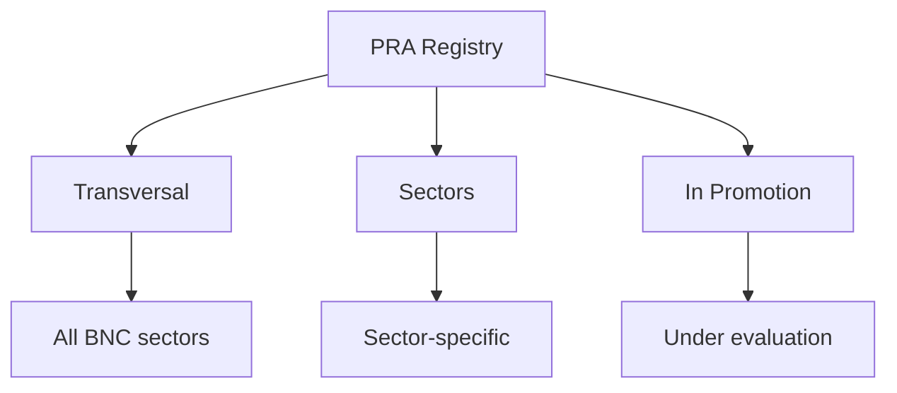

# 🚀 Getting Started with PRAs

Welcome to the **Proven Reusable Architecture (PRA) Registry**!

This guide will help you quickly understand what a PRA is and how to use it in your projects.

## 📚 What is a PRA?

A **Proven Reusable Architecture (PRA)** is a **proven solution** to a recurring software architecture problem.

### 3 Key Points

1. **✅ Proven-in-use**: Validated in real production (not theoretical)
2. **♻️ Reusable**: Applicable to multiple contexts and projects
3. **📖 Well documented**: Context, architecture, examples, feedback

### Simple Analogy

Think of PRAs as **proven recipes**:
- The recipe (the PRA) has been tested multiple times
- It works in different kitchens (contexts)
- It documents ingredients (tech stack), steps (implementation) and pitfalls to avoid

## 🎯 Why Use PRAs?

### Time Savings
- ⏰ Avoid reinventing the wheel
- 📦 Ready-to-use solutions
- 📊 Documented feedback

### Quality
- ✅ Solutions validated in production
- 🏆 Best practices integrated
- 🛡️ Common pitfalls documented

### Consistency
- 🤝 Architectural alignment between teams
- 💬 Common vocabulary
- 📋 Shared standards

## 🗺️ How to Navigate the Registry?

The PRA registry is organized into **3 scopes**:

---

**Next**: [Understanding PRAs](/en/guides/02-understanding-pra)
