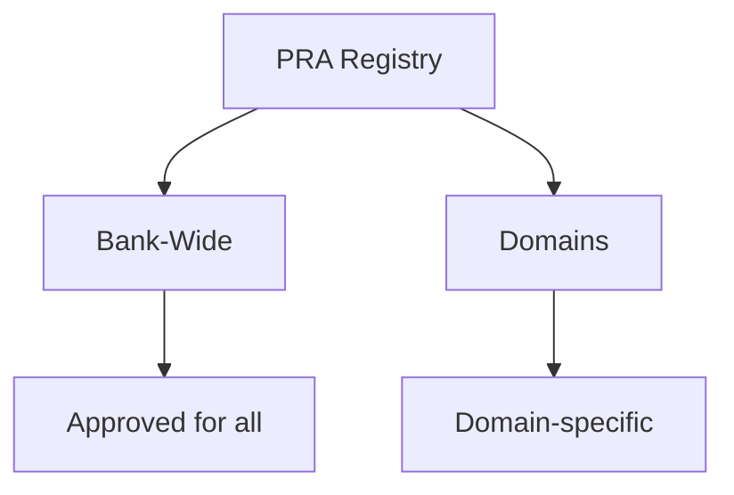

# 🚀 Getting Started with PRAs

Welcome to the **Proven Reusable Architecture (PRA) Registry**!

This guide will help you quickly understand what a PRA is and how to use it in your projects.

## 📚 What is a PRA?

A **Proven Reusable Architecture (PRA)** is a **proven solution** to a recurring software architecture problem.

### 3 Key Points

1. **✅ Proven-in-use**: Validated in real production (not theoretical)
2. **♻️ Reusable**: Applicable to multiple contexts and projects
3. **📖 Well documented**: Context, architecture, examples, feedback

### Simple Analogy

Think of PRAs as **proven recipes**:
- The recipe (the PRA) has been tested multiple times
- It works in different kitchens (contexts)
- It documents ingredients (tech stack), steps (implementation) and pitfalls to avoid

## 🎯 Why Use PRAs?

### Time Savings
- ⏰ Avoid reinventing the wheel
- 📦 Ready-to-use solutions
- 📊 Documented feedback

### Quality
- ✅ Solutions validated in production
- 🏆 Best practices integrated
- 🛡️ Common pitfalls documented

### Consistency
- 🤝 Architectural alignment between teams
- 💬 Common vocabulary
- 📋 Shared standards

## 🗺️ How to Navigate the Registry?

The PRA registry is organized into **2 scopes**:

### Bank-Wide
- **For whom?** All teams across all domains
- **Maturity**: Validated by the **Expert Architects Governance Committee** (3+ proven-in-use)
- **Examples**: Observability, CI/CD, Authentication

### Domains
- **For whom?** Teams from a specific domain (Retail, Corporate, Wealth Management)
- **Maturity**: Validated by the **Domain Governance Committee** (1+ proven-in-use)
- **Content**: All pattern types (functional AND technical)
- **Note**: PRAs being promoted to Bank-Wide have a specific status visible in their metadata

## 🧭 Quick Start by Profile

### 👨💻 I'm a Developer

1. **Browse the catalogue**: `/catalogue`
2. **Search** for your need (e.g., "authentication", "deployment")
3. **Read** the PRA (context, solution, examples)
4. **Implement** following the guide
5. **Share feedback** once in production

### 🏗️ I'm an Architect

1. **Explore** Bank-Wide and Domain PRAs
2. **Recommend** applicable PRAs in designs
3. **Identify** new reusable patterns in your projects
4. **Contribute** new PRAs
5. **Participate** in Domain Committee reviews

### 🆕 I'm New to BNC

1. **Start here**: This guide
2. **Read**: [Understanding PRAs](/guides/02-understanding-pra)
3. **Browse**: Approved Bank-Wide PRAs
4. **Ask**: #pra-registry Teams channel

## ❓ FAQ

### How long to implement a PRA?

**Depends on the PRA**, but typically:
- Simple patterns (logging): 1-2 days
- Medium patterns (CI/CD): 1-2 weeks
- Complex patterns (authentication): 2-4 weeks

The time saved compared to starting from scratch: **30-60%**

### Are PRAs mandatory?

**No**, but:
- **Bank-Wide Approved PRAs** are strongly recommended
- Must justify if not using an applicable PRA
- Non-compliance may be discussed in architecture reviews

### How to get help?

- **Teams Channel**: `#pra-registry`
- **Email**: pra-support@company.com
- **GitHub Issues**: For PRA-specific questions

---

**Next**: [Understanding PRAs](/guides/02-understanding-pra)
