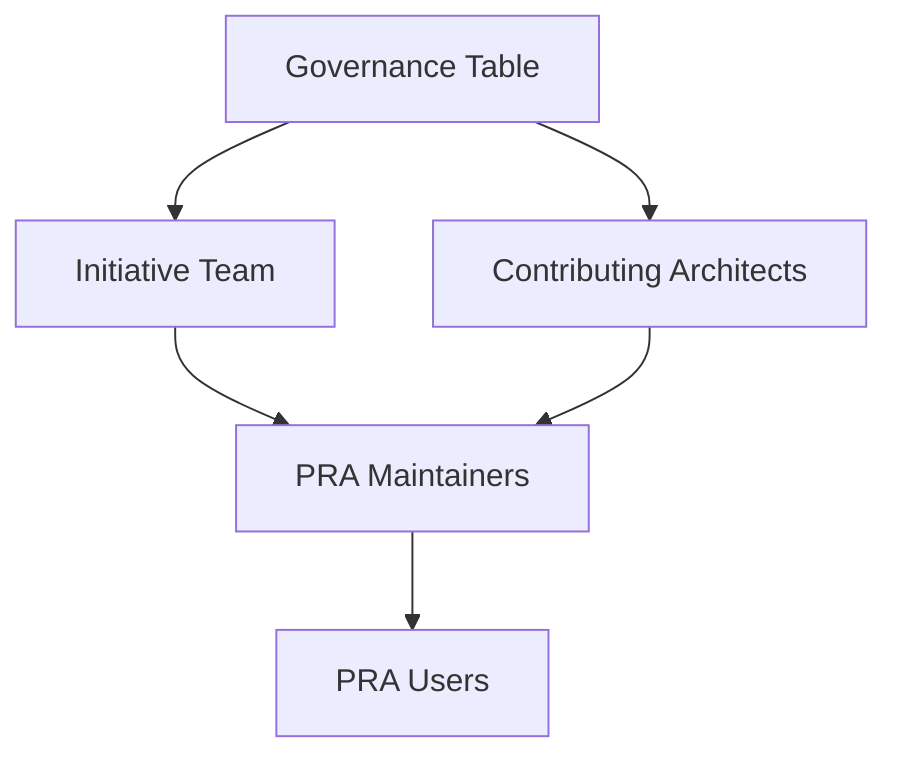

# Roles and Responsibilities

This document defines the key roles in the PRA registry ecosystem and their respective responsibilities.

##  Roles Overview

##  Governance Table

### Composition

- **Number**: 5 to 7 senior architects
- **Representation**: Cross-team and cross-sector
- **Term**: Renewable annually
- **Decisions**: By consensus or majority vote

### Responsibilities

#### 1. Review Submissions

- Evaluate new PRAs technically and qualitatively
- Verify compliance with standards
- Request clarifications or improvements
- **Timeline**: Initial review within 5 business days

#### 2. Approve PRAs

**For Candidate PRAs**:
- Validate compliance with template
- Verify proven-in-use (minimum 1)
- Approve transition to Candidate status
- **Threshold**: 2 approvals required

**For Approved promotion**:
- Verify 3+ documented proven-in-use
- Validate positive multi-team feedback
- Approve transition to Approved status
- **Threshold**: 2 approvals required

#### 3. Cross-Cutting Governance

- Decide Sectorial  Transversal promotions
- Approve deprecations
- Validate standard evolutions
- Arbitrate conflicts between sectors

#### 4. Strategic Maintenance

- Annual review of all Approved PRAs
- Identify obsolete or underused PRAs
- Propose process improvements
- Monitor technological evolution

### Meetings

- **Frequency**: Biweekly (every 2 weeks)
- **Duration**: 1 hour maximum
- **Typical agenda**:
  - Review new submissions (30 min)
  - Candidate PRA follow-up (15 min)
  - Strategic topics (10 min)
  - Miscellaneous questions (5 min)

### Expected Commitment

- **Time**: 2-4 hours/month
- **Availability**: PR review within 48h
- **Participation**: 80%+ meetings

##  PRA Initiative Team

### Composition

- **Number**: 2-3 dedicated people
- **Profiles**:
  - 1 Senior Architect (lead)
  - 1 DevOps/Platform Engineer
  - 1 Developer Experience (DX) Specialist (optional)

### Responsibilities

#### 1. Infrastructure & Tooling

- Maintain Git repository and structure
- Manage Fumadocs site and Orama search
- Maintain GitHub Actions workflows
- Manage Confluence sync
- Monitoring and alerts

#### 2. Community Support

- Answer questions on `#pra-registry`
- Help contributors with templates and processes
- Organize training sessions
- Create documentation and guides

#### 3. Continuous Evolution

- Propose process improvements
- Implement new features
- Collect and analyze feedback
- Roadmap and prioritization

#### 4. Communication

- Monthly newsletter
- New PRA announcements
- Sector  transversal promotions
- Adoption stats and metrics

### Expected Commitment

- **Time**: 20-40% work time
- **Availability**: Active community support
- **Proactivity**: Continuous improvement

##  Contributing Architects

### Who are they?

**All architects** in the organization can contribute:
- Enterprise architects
- Solution architects
- Technical architects
- Sector architects

### Responsibilities

#### 1. Identify Reusable Patterns

- Observe recurring patterns in projects
- Identify proven production solutions
- Evaluate reusability and generalization

#### 2. Document PRAs

- Use official template
- Provide complete context and ADRs
- Include examples and proven-in-use
- Respect quality standards

#### 3. Maintain their PRAs

- Answer user questions
- Integrate feedback and learnings
- Update documentation
- Propose evolutions

#### 4. Review PRAs

- Participate in PR reviews
- Provide constructive feedback
- Validate applicability in their context
- Share similar experience

### Rights

-  **Free choice**: No obligation to use a PRA
-  **Full access**: All approved and candidate PRAs
-  **Support**: Initiative team assistance
-  **Visibility**: Contribution recognition

### Duties

-  **Justification**: Explain if not using an applicable PRA
-  **Feedback**: Share feedback on used PRAs
-  **Documentation**: Document proven-in-use
-  **Respect**: Follow processes and standards

##  PRA Maintainers

### Who are they?

Architects designated as responsible for one or more specific PRAs.

### Responsibilities

#### 1. PRA Ownership

- Ensure quality and currency
- Decide evolutions and modifications
- Validate PRs from external contributions

#### 2. Documentation

- Keep documentation up to date
- Enrich with new learnings
- Clarify ambiguous points
- Add examples

#### 3. User Support

- Answer questions about the PRA
- Help adoption in new projects
- Unblock implementation issues
- Collect feedback

#### 4. Evolution

- Propose improvements based on feedback
- Adapt to new technology versions
- Identify deprecation needs
- Create successor versions if necessary

### Commitment Duration

- **Minimum**: 1 year
- **Transfer**: Possible with Governance Table validation
- **Rotation**: Encouraged every 2-3 years

##  PRA Users

### Who are they?

- **Developers**: Implement PRAs in code
- **Architects**: Use PRAs in designs
- **Product Owners**: Reference PRAs in specs
- **Tech Leads**: Recommend PRAs to their teams

### Responsibilities

#### 1. Appropriate Use

- Understand PRA application context
- Respect guidelines and best practices
- Adapt to project specificities (with justification)

#### 2. Feedback

- Document implementation (proven-in-use)
- Report problems or limitations
- Propose improvements
- Share learnings

#### 3. Contribution

- Enrich examples and use cases
- Correct documentation errors
- Propose clarifications
- Help other users

### Rights

-  **Free access**: All PRAs without restriction
-  **Support**: Help from maintainers and community
-  **Adaptation**: Flexibility in implementation (justified)
-  **Contribution**: Propose modifications via PR

##  RACI Matrix

| Activity | Gov. Table | Init. Team | Contributors | Maintainers | Users |
|----------|------------|------------|--------------|-------------|-------|
| Submit new PRA | C | I | **R** | I | I |
| Review candidate PRA | **R/A** | C | C | I | I |
| Approve candidate PRA | **A** | I | I | C | I |
| Maintain infrastructure | I | **R/A** | I | I | I |
| Maintain PRA | I | C | I | **R/A** | C |
| Use PRA | I | I | I | C | **R/A** |
| Promote sectoraltransversal | **A** | C | R | C | I |
| Deprecate PRA | **A** | C | C | R | C |
| Train community | C | **R/A** | C | C | I |

**Legend**:
- **R**: Responsible (does the work)
- **A**: Accountable (makes decisions)
- **C**: Consulted (provides input)
- **I**: Informed (receives notification)

##  Contacts

### Governance Table
- **Email**: pra-governance@company.com
- **Members**: See [Governance Page](/registre/governance)

### Initiative Team
- **Teams Channel**: `#pra-initiative`
- **Email**: pra-team@company.com
- **Lead**: [Team Lead Name]

### Community Support
- **Teams Channel**: `#pra-registry`
- **Email**: pra-support@company.com
- **GitHub Issues**: [Repository Link]

---

**Recommended Path**:
1. [Getting Started with PRAs](/guides/01-getting-started)
2. [Understanding PRAs](/guides/02-understanding-pra)
3.  **Roles and Responsibilities** (you are here)
4. [Lifecycle](/guides/04-lifecycle)
5. [Quality Standards](/guides/05-standards)
6. [Contributing a PRA](/guides/06-contributing)
7. [Promotion Process](/guides/07-promotion-process)
8. [Governance](/guides/08-governance)

---

**Navigation**:
-  **Previous**: [Understanding PRAs](/guides/02-understanding-pra)
-  **Next**: [Lifecycle](/guides/04-lifecycle)

---

**Last updated**: 2025-11-28
**Next review**: 2026-05-28
