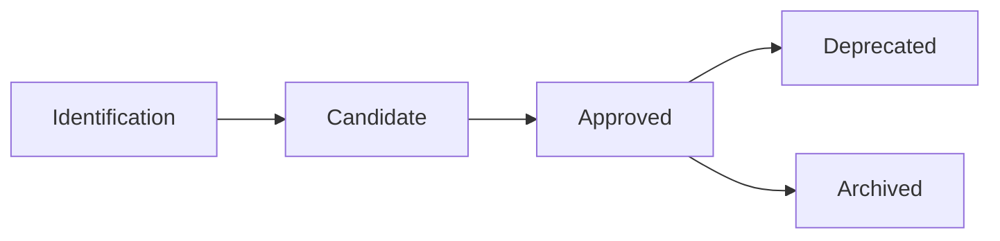

# PRA Lifecycle

This document describes the different stages in the lifecycle of a Proven Reusable Architecture (PRA), from its initial conception to its eventual deprecation.

## Overview

A PRA goes through several statuses during its lifecycle:



## PRA Statuses

### Candidate

**Definition**: PRA under validation, with fewer than 3 proven implementations.

**Criteria**:
- At least **1 proven implementation** in production
- Complete documentation (context, architecture, ADRs, examples)
- Demonstrated reusability
- Technical quality validated by the Governance Table

**Location**: `pra/candidates/[category]/`

**Usage**: May be used with caution and feedback required

### Approved

**Definition**: Validated PRA recommended for general use.

**Criteria**:
- At least **3 proven implementations** in production
- Positive feedback from user teams
- Documentation enriched with learnings
- Validity confirmed across multiple contexts

**Location**: `pra/approved/[category]/`

**Usage**: Recommended for all applicable projects

### Deprecated

**Definition**: Obsolete PRA, not recommended for new implementations.

**Reasons**:
- Obsolete technologies
- Better alternatives available
- Repeated negative feedback
- No maintenance for 12+ months

**Location**: `pra/deprecated/[category]/`

**Usage**: Maintenance only for existing projects

## Status Transitions

### From Candidate to Approved

**Trigger**: 3+ documented proven implementations

**Process**:
1. Contributor creates PR to move from `candidates/` to `approved/`
2. Update metadata: `status: approved`
3. Automatic validation via GitHub Actions
4. Review by Governance Table (2 approvals required)
5. Merge → PRA becomes Approved
6. Automatic publication to Confluence
7. Announcement to community (Teams/email)

**Timeline**: 5-10 business days

### From Approved to Deprecated

**Trigger**: Proposal from Governance Table or repeated negative feedback

**Process**:
1. Deprecation proposal (with justification)
2. Discussion with original contributors
3. Governance Table vote (simple majority)
4. PR to move from `approved/` to `deprecated/`
5. Update metadata: `status: deprecated`, `deprecated_date`, `replaces` (if applicable)
6. Documentation updated with recommended alternative
7. Communication to teams using the PRA
8. 6-month transition period
9. Optional archiving after transition period

**Timeline**: 2-4 weeks + 6 months transition

## Ongoing Maintenance

### Approved PRA

**Responsibilities**:
- **Designated maintainer**: Documentation updates, answering questions
- **Governance Table**: Quality monitoring, update validation

**Cadence**:
- **Annual review**: Relevance, usage, feedback
- **As-needed updates**: New technology versions, learnings

### Candidate PRA

**Responsibilities**:
- **Original contributor**: Initial documentation, early feedback
- **Early adopters**: Active feedback, documenting learnings

**Objective**: Reach 3 implementations for Approved promotion

## Proven-in-Use Feedback

Each PRA implementation must be documented with:

```yaml
proven_in_use:
  - project: "Project name"
    team: "Team name"
    date: "YYYY-MM-DD"
    feedback: "Concrete results and learnings"
    metrics:
      - "40% reduction in deployment time"
      - "100% change traceability"
```

**Quality criteria**:
- Project in **production** (not dev/staging)
- **Concrete** and **measurable** feedback
- Recent implementation date (< 2 years)

## Success Criteria

### For a Candidate PRA

- [ ] 1+ documented proven-in-use
- [ ] Complete and clear documentation
- [ ] Positive feedback from pilot team
- [ ] No major technical blockers

### For Approved promotion

- [ ] 3+ documented proven-in-use
- [ ] Positive feedback from multiple teams
- [ ] Documentation enriched with learnings
- [ ] Varied use cases (different contexts)

### For an Approved PRA

- [ ] Active use in 3+ projects
- [ ] User satisfaction > 8/10
- [ ] Regular maintenance (< 6 months since last update)
- [ ] Up-to-date documentation

## Support and Questions

For any questions about the PRA lifecycle:

- **Teams Channel**: `#pra-registry`
- **Email**: pra-governance@company.com
- **GitHub Issues**: [Open an issue](https://github.com/org/pra-registry/issues)

---

**Recommended path**:
1. [Getting Started with PRAs](/guides/01-getting-started)
2. [Understanding PRAs](/guides/02-understanding-pra)
3. [Roles and Responsibilities](/guides/03-roles-responsibilities)
4. **Lifecycle** (you are here)
5. [Quality Standards](/guides/05-standards)
6. [Contributing a PRA](/guides/06-contributing)
7. [Promotion Process](/guides/07-promotion-process)
8. [Governance](/guides/08-governance)

---

**Navigation**:
- **Previous**: [Roles and Responsibilities](/guides/03-roles-responsibilities)
- **Next**: [Quality Standards](/guides/05-standards)

---

**Last updated**: 2025-11-28
**Next review**: 2026-05-28
