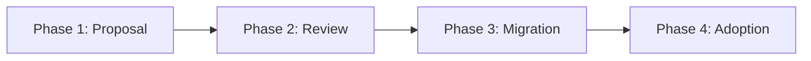

# Promotion Process (Domain → Bank-Wide)

**This represents Flow 1** of the three PRA creation flows described in [Governance](/guides/08-governance). This is the organic, bottom-up flow where Domain PRAs are identified as having multi-domain value and promoted to Bank-Wide status.

This document describes the process for promoting a Domain pattern to the Bank-Wide level, making it applicable across all organizational domains.

## 📋 Overview

The promotion of a Domain pattern to the Bank-Wide level follows a 4-phase process:



## 📝 Phase 1: Proposal

### Trigger

A **Domain Governance Committee** identifies a Domain pattern that could benefit other domains.

### Required Actions

1. **Create promotion folder**
   ```
   content/registre/en-promotion/[sector]-[category]-[pattern-name]/
   ```

2. **Document justification**

   Create `justification.md`:
   ```markdown
   # Promotion Justification

   ## Proposed Pattern
   - **Name**: [Pattern Name]
   - **Original Domain**: [Domain]
   - **Category**: tech | integration | security | business

   ## Why is this pattern of Bank-Wide interest?
   - [Reason 1: Recurring need across domains]
   - [Reason 2: Multi-domain applicable]
   - [Reason 3: Mature and proven]

   ## Proven-in-use within the domain
   - **Project 1**: [Project name, date, results]
   - **Project 2**: [Project name, date, results]
   - **Project 3**: [Project name, date, results]

   ## Expected Benefits
   - [Benefit 1]
   - [Benefit 2]
   ```

3. **Analyze multi-sector impact**

   Create `impact-analysis.md`:
   ```markdown
   # Multi-Domain Impact Analysis

   ## Domains that can benefit

   ### Domain 1: [Name]
   - **Use case**: [Description]
   - **Added value**: [Benefits]
   - **Adoption effort**: Low | Medium | High

   ### Domain 2: [Name]
   - **Use case**: [Description]
   - **Added value**: [Benefits]
   - **Adoption effort**: Low | Medium | High

   ## Necessary Adaptations
   - [Modification 1 for generalization]
   - [Modification 2 for generalization]

   ## Identified Risks
   - [Risk 1 + mitigation]
   - [Risk 2 + mitigation]
   ```

4. **Update the pattern**

   In the Domain pattern frontmatter:
   ```yaml
   promotion_status: proposed
   ```

5. **Submit PR**

   ```bash
   git checkout -b promotion/[domain]-[pattern]
   git add content/registre/en-promotion/[folder]/
   git add content/registre/domaines/[domain]/[pattern].md
   git commit -m "feat: propose promotion [pattern] to Bank-Wide"
   git push origin promotion/[domain]-[pattern]
   ```

## 🔍 Phase 2: Review

### Assignment

The Pull Request is automatically assigned to the **Expert Architects Governance Committee**.

### Committee Analysis

The committee evaluates according to these criteria:

#### 1. Multi-Domain Reusability

- ✅ Does the pattern solve a problem common to 3+ domains?
- ✅ Are the necessary adaptations minor?
- ✅ Can domain-specific aspects be parameterized?

#### 2. Pattern Maturity

- ✅ 1+ proven implementation in the original domain (Domain Approved)?
- ✅ Positive feedback from domain teams?
- ✅ Complete and clear documentation?

#### 3. Compliance with Bank-Wide Standards

- ✅ Complies with enterprise technical standards?
- ✅ Compatible with target architecture?
- ✅ Security and compliance validated?

#### 4. Impact on Enterprise Consistency

- ✅ Strengthens architectural alignment across domains?
- ✅ Avoids solution duplication?
- ✅ Facilitates multi-domain interoperability?

### Possible Decisions

1. **✅ Approved** → Proceeds to Phase 3 (Migration)
2. **🔄 Revisions required** → Returns to domain with feedback
3. **❌ Rejected** → Remains Domain-level with justification

### Timeline

- **Initial review**: 1 week
- **Discussion**: 1-2 weeks if clarifications needed
- **Final decision**: Maximum 4 weeks

## 🚀 Phase 3: Migration (if approved)

### 7. Cleanup and Generalization

The pattern maintainer (with Expert Architects Committee support):

1. **Remove domain-specific aspects**
   - Replace specific references with generic parameters
   - Document configuration points

2. **Enrich documentation**
   - Add multi-domain examples
   - Document domain-specific variations
   - Create adaptation guide

### 8. Technical Migration

```bash
# Move the pattern
git mv content/registre/domaines/[domain]/[category]/[pattern].md \
       content/registre/bank-wide/[category]/[pattern].md

# Update metadata
# In the frontmatter:
scope: bank-wide
original_domain: [original-domain]
promotion_status: promoted
promotion_date: YYYY-MM-DD
```

### 9. Historical Marking

In the original domain, create a redirect:

```markdown
---
title: [Pattern Name]
redirect: /registre/bank-wide/[category]/[pattern]
---

# [Pattern Name]

📢 This pattern was **promoted to Bank-Wide level** on [date].

It is now accessible to all domains:
👉 [View the Bank-Wide pattern](/registre/bank-wide/[category]/[pattern])
```

### 10. Communication

Automated email sent to:
- All architects
- Architecture managers of each domain
- PRA distribution list

Template:
```
Subject: 🎉 New Bank-Wide pattern: [Pattern Name]

The pattern "[Pattern Name]" from the [Domain] domain has been promoted
to Bank-Wide level.

Benefits: [Summary]
Applicable domains: [List]
Documentation: [Link]

Use it in your new projects!
```

### 11. Archive Promotion

```bash
# Archive the promotion folder
git mv content/registre/en-promotion/[folder]/ \
       content/registre/en-promotion/archive/YYYY-MM-[pattern]/
```

## 📈 Phase 4: Adoption

### Multi-Domain Encouragement

The Expert Architects Committee:
- Presents the pattern in enterprise architecture meetings
- Identifies pilot projects in different domains
- Organizes Q&A sessions

### Feedback and Improvement

Adopting teams:
- Document their implementations (proven-in-use)
- Report feedback and suggestions
- Propose improvements via PR

### Continuous Evolution

The maintainer (now at Bank-Wide level):
- Integrates multi-domain learnings
- Publishes regular updates
- Maintains compatibility across domains

## 📊 Success Metrics

A promotion is considered successful if:

- ✅ **3+ domains** adopt the pattern within 6 months (to reach Bank-Wide Approved)
- ✅ **80%+ satisfaction** from user teams
- ✅ **Reduced duplication**: no new similar domain-specific pattern
- ✅ **Maintained documentation**: < 6 months since last update

## ❓ FAQ

### How long does the process take?

**Minimum**: 6 weeks (2 weeks review + 4 weeks migration)
**Typical**: 2-3 months (with revisions and communication)

### Who decides on the promotion?

The **Expert Architects Governance Committee**, with consultation from the original domain committee.

### Can we propose multiple patterns simultaneously?

Yes, but max **2 active promotions** per domain to avoid overload.

### What happens if the promotion is rejected?

The pattern remains at Domain level. The rejection rationale is documented and can be reevaluated after 6 months.

### Can a Bank-Wide pattern be "demoted"?

No. If a Bank-Wide pattern becomes obsolete, it transitions to `deprecated`, but does not return to Domain level.

## 🆘 Support

For any questions about promotions:

- **Teams Channel**: `#pra-promotions`
- **Committee Email**: pra-governance@company.com
- **GitHub Issues**: Tag `promotion` on your PRs

---

**Recommended Journey**:
1. [Getting Started with PRAs](/guides/01-getting-started)
2. [Understanding PRAs](/guides/02-understanding-pra)
3. [Roles and Responsibilities](/guides/03-roles-responsibilities)
4. [Lifecycle](/guides/04-lifecycle)
5. [Quality Standards](/guides/05-standards)
6. [Contributing a PRA](/guides/06-contributing)
7. 👉 **Promotion Process** (you are here)
8. [Governance](/guides/08-governance)

---

**Navigation**:
- ⬅️ **Previous**: [Contributing a PRA](/guides/06-contributing)
- ➡️ **Next**: [Governance](/guides/08-governance)

---

**Last Updated**: 2025-12-02
**Next Review**: 2026-06-02
