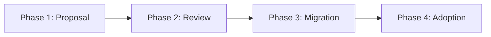

# Promotion Process (Sectorial → Transversal)

This document describes the process for promoting a sectorial pattern to the transversal level, making it applicable across all organizational sectors.

## 📋 Overview

The promotion of a sectorial pattern to the transversal level follows a 4-phase process:



## 📝 Phase 1: Proposal

### Trigger

A sector identifies a pattern that could benefit other sectors.

### Required Actions

1. **Create promotion folder**
   ```
   content/registre/en-promotion/[sector]-[category]-[pattern-name]/
   ```

2. **Document justification**

   Create `justification.md`:
   ```markdown
   # Promotion Justification

   ## Proposed Pattern
   - **Name**: [Pattern Name]
   - **Original Sector**: [Sector]
   - **Category**: tech | integration | security | business

   ## Why is this pattern of transversal interest?
   - [Reason 1: Recurring need]
   - [Reason 2: Multi-sector applicable]
   - [Reason 3: Mature and proven]

   ## Proven-in-use within the sector
   - **Project 1**: [Project name, date, results]
   - **Project 2**: [Project name, date, results]
   - **Project 3**: [Project name, date, results]

   ## Expected Benefits
   - [Benefit 1]
   - [Benefit 2]
   ```

3. **Analyze multi-sector impact**

   Create `impact-analysis.md`:
   ```markdown
   # Multi-Sector Impact Analysis

   ## Sectors that can benefit

   ### Sector 1: [Name]
   - **Use case**: [Description]
   - **Added value**: [Benefits]
   - **Adoption effort**: Low | Medium | High

   ### Sector 2: [Name]
   - **Use case**: [Description]
   - **Added value**: [Benefits]
   - **Adoption effort**: Low | Medium | High

   ## Necessary Adaptations
   - [Modification 1 for generalization]
   - [Modification 2 for generalization]

   ## Identified Risks
   - [Risk 1 + mitigation]
   - [Risk 2 + mitigation]
   ```

4. **Update the pattern**

   In the sectorial pattern frontmatter:
   ```yaml
   promotion_status: proposed
   ```

5. **Submit PR**

   ```bash
   git checkout -b promotion/[sector]-[pattern]
   git add content/registre/en-promotion/[folder]/
   git add content/registre/secteurs/[sector]/[pattern].md
   git commit -m "feat: propose promotion [pattern] to transversal"
   git push origin promotion/[sector]-[pattern]
   ```

## 🔍 Phase 2: Review

### Assignment

The Pull Request is automatically assigned to the **Transversal Governance Committee**.

### Committee Analysis

The committee evaluates according to these criteria:

#### 1. Multi-Sector Reusability

- ✅ Does the pattern solve a problem common to 3+ sectors?
- ✅ Are the necessary adaptations minor?
- ✅ Can sector-specific aspects be parameterized?

#### 2. Pattern Maturity

- ✅ 3+ proven implementations in the original sector?
- ✅ Positive feedback from user teams?
- ✅ Complete and clear documentation?

#### 3. Compliance with Transversal Standards

- ✅ Complies with enterprise technical standards?
- ✅ Compatible with target architecture?
- ✅ Security and compliance validated?

#### 4. Impact on Enterprise Consistency

- ✅ Strengthens architectural alignment?
- ✅ Avoids solution duplication?
- ✅ Facilitates interoperability?

### Possible Decisions

1. **✅ Approved** → Proceeds to Phase 3 (Migration)
2. **🔄 Revisions required** → Returns to sector with feedback
3. **❌ Rejected** → Remains sectorial with justification

### Timeline

- **Initial review**: 1 week
- **Discussion**: 1-2 weeks if clarifications needed
- **Final decision**: Maximum 4 weeks

## 🚀 Phase 3: Migration (if approved)

### 7. Cleanup and Generalization

The pattern maintainer (with committee support):

1. **Remove sector-specific aspects**
   - Replace specific references with generic parameters
   - Document configuration points

2. **Enrich documentation**
   - Add multi-sector examples
   - Document sectorial variations
   - Create adaptation guide

### 8. Technical Migration

```bash
# Move the pattern
git mv content/registre/secteurs/[sector]/[category]/[pattern].md \
       content/registre/transversal/[category]/[pattern].md

# Update metadata
# In the frontmatter:
scope: transversal
original_sector: [original-sector]
promotion_status: promoted
promotion_date: YYYY-MM-DD
```

### 9. Historical Marking

In the original sector, create a redirect:

```markdown
---
title: [Pattern Name]
redirect: /registre/transversal/[category]/[pattern]
---

# [Pattern Name]

📢 This pattern was **promoted to transversal level** on [date].

It is now accessible to all sectors:
👉 [View the transversal pattern](/registre/transversal/[category]/[pattern])
```

### 10. Communication

Automated email sent to:
- All architects
- Architecture managers of each sector
- PRA distribution list

Template:
```
Subject: 🎉 New transversal pattern: [Pattern Name]

The pattern "[Pattern Name]" from the [Sector] sector has been promoted
to transversal level.

Benefits: [Summary]
Applicable sectors: [List]
Documentation: [Link]

Use it in your new projects!
```

### 11. Archive Promotion

```bash
# Archive the promotion folder
git mv content/registre/en-promotion/[folder]/ \
       content/registre/en-promotion/archive/YYYY-MM-[pattern]/
```

## 📈 Phase 4: Adoption

### Multi-Sector Encouragement

The transversal committee:
- Presents the pattern in enterprise architecture meeting
- Identifies pilot projects in different sectors
- Organizes Q&A sessions

### Feedback and Improvement

Adopting teams:
- Document their implementations (proven-in-use)
- Report feedback and suggestions
- Propose improvements via PR

### Continuous Evolution

The maintainer (now at transversal level):
- Integrates multi-sector learnings
- Publishes regular updates
- Maintains compatibility across sectors

## 📊 Success Metrics

A promotion is considered successful if:

- ✅ **3+ sectors** adopt the pattern within 6 months
- ✅ **80%+ satisfaction** from user teams
- ✅ **Reduced duplication**: no new similar sectorial pattern
- ✅ **Maintained documentation**: < 3 months since last update

## ❓ FAQ

### How long does the process take?

**Minimum**: 6 weeks (2 weeks review + 4 weeks migration)
**Typical**: 2-3 months (with revisions and communication)

### Who decides on the promotion?

The **Transversal Governance Committee**, with consultation from the original sector.

### Can we propose multiple patterns simultaneously?

Yes, but max **2 active promotions** per sector to avoid overload.

### What happens if the promotion is rejected?

The pattern remains sectorial. The rejection rationale is documented and can be reevaluated after 6 months.

### Can a transversal pattern be "demoted"?

No. If a transversal pattern becomes obsolete, it transitions to `deprecated`, but does not return to sectorial level.

## 🆘 Support

For any questions about promotions:

- **Teams Channel**: `#pra-promotions`
- **Committee Email**: pra-governance@company.com
- **GitHub Issues**: Tag `promotion` on your PRs

---

**Recommended Journey**:
1. [Getting Started with PRAs](/registre/01-getting-started)
2. [Understanding PRAs](/registre/02-understanding-pra)
3. [Roles and Responsibilities](/registre/03-roles-responsibilities)
4. [Lifecycle](/registre/04-lifecycle)
5. [Quality Standards](/registre/05-standards)
6. [Contributing a PRA](/registre/06-contributing)
7. 👉 **Promotion Process** (you are here)
8. [Governance](/registre/08-governance)

---

**Navigation**:
- ⬅️ **Previous**: [Contributing a PRA](/registre/06-contributing)
- ➡️ **Next**: [Governance](/registre/08-governance)

---

**Last Updated**: 2025-11-28
**Next Review**: 2026-05-28
