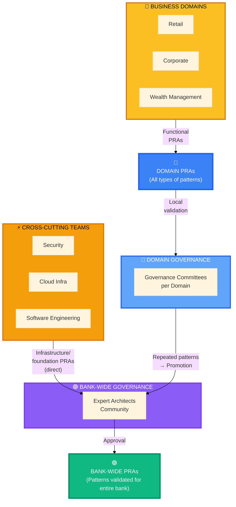

# Welcome to the PRA Registry

## Don't reinvent the wheel, reuse what works

Starting a new project? Looking for the best way to implement authentication, CI/CD, or Salesforce integration? **The PRA Registry is your library of production-validated architectures.**

##  What is a PRA?

A **PRA (Proven Reusable Architecture)** is a **proven solution** that has already been validated in real projects at the National Bank.

### PRA Ecosystem Overview

**Two PRA Creation Flows:**

**🟠 Flow 1: Direct Bank-Wide (Cross-Cutting Teams)**
- Cross-cutting teams: Security, Cloud Infra, Software Engineering
- **Ideally** create PRAs directly as Bank-Wide (infrastructure/foundation patterns)
- Examples: CI/CD, observability, network security, secrets management
- Validated by Expert Architects Community

**🔵 Flow 2: Domain → Bank-Wide (Pragmatic)**
- Solution architects in domains create **all types of PRAs**:
  - Functional: Customer Onboarding, Payment Processing, Notification System
  - **Technical too**: Serverless AWS, file transfer, async APIs
- Why technical too? **Absence of Bank-Wide pattern** → domains fill the gap
- Validated locally by Domain Governance Committees
- **Repeated patterns across domains** or **particularly robust** → Bank-Wide promotion

**Current Reality:**
- Same topic (e.g., serverless) may exist in multiple domains (duplication)
- The PRA Registry helps **identify these duplications** and **promote the best** to Bank-Wide
- A technical pattern from a domain can become Bank-Wide if robust and proven (e.g., file transfer from Wealth Management)

### How a PRA is born and evolves

### In 4 key points

 **Production proven**: Validated in at least 1 real implementation (Domain) or 3+ implementations (Bank-Wide)
 **Reusable**: Generalizable across different contexts and projects
 **Documented**: With context, architectural decisions (ADRs), code examples, and feedback from architects
 **Maintained**: Versioned and supported by the BNC architects community (experts and solution architects)

### Simple analogy

Think of PRAs as **proven cooking recipes**:

- The recipe (the PRA) has been tested multiple times
- It works in different kitchens (contexts)
- It documents the ingredients (tech stack), steps (implementation), and pitfalls to avoid
- You can adapt it to your taste (your context)

##  Quick Start

### Are you a solution architect?

**Need: "I'm looking for a pattern for my project"**

1.  Explore the [Catalogue](/catalogue) or browse [Bank-Wide PRAs](/registre/transversal)
2.  Check [PRAs in your Domain](/registre/secteurs) for functional patterns
3.  Verify if the context matches your project
4.  Follow the implementation guide and ADRs
5.  Document your feedback with your governance committee

### Are you in a cross-cutting team?

**Need: "I want to contribute an infrastructure/foundation pattern"**

1.  Review the [Quality Standards](/guides/05-standards)
2.  Prepare your documentation (ADRs, code examples, proven-in-use)
3.  Follow the [Contribution Guide](/guides/06-contributing)
4.  Submit directly to the Expert Architects Community for Bank-Wide validation

### Are you discovering PRAs?

**Need: "I want to understand the PRA system"**

Follow our **8-step guided journey**:

1. [Getting Started with PRAs](/guides/01-getting-started) - Introduction and first steps
2. [Understanding PRAs](/guides/02-understanding-pra) - Detailed anatomy
3. [Roles and Responsibilities](/guides/03-roles-responsibilities) - Who does what
4. [Lifecycle](/guides/04-lifecycle) - From Candidate to Approved
5. [Quality Standards](/guides/05-standards) - Criteria for excellence
6. [Contributing a PRA](/guides/06-contributing) - Submission process
7. [Promotion Process](/guides/07-promotion-process) - Sectoral  Transversal
8. [Governance](/guides/08-governance) - Structure and decisions

##  Registry Organization

The registry is organized into **3 scopes** based on their reach:

###  Bank-Wide

**For whom?** All domains of the National Bank
**Maturity**: Validated by Expert Architects Community (3+ proven-in-use)
**Examples**:
- Infrastructure: SSO Authentication, GitOps CI/CD, Observability
- Technical: File Transfer (e.g., promoted from Wealth Mgmt), Async APIs
- Functional: Customer Onboarding, Payment Processing (repeated patterns)

 [Explore Bank-Wide PRAs](/registre/transversal)

###  Domains

**For whom?** Teams from a specific domain (Retail, Corporate, Wealth Management)
**Maturity**: Locally validated by Domain Governance Committee (1+ proven-in-use)
**Content**: All types of patterns (functional AND technical)
**Examples**:
- Functional: Digital Onboarding (Retail), SAP ERP Integration (Corporate)
- Technical: Serverless AWS, file transfer, data pipelines (in absence of Bank-Wide pattern)
**Note**: Can be promoted to Bank-Wide if repeated or particularly robust

 [Explore Domain PRAs](/registre/secteurs)

###  In Promotion

**For whom?** Everyone (under observation)
**Status**: Sectoral patterns proposed to become transversal
**Purpose**: See emerging patterns before their generalization

 [Explore PRAs in Promotion](/registre/en-promotion)

##  PRA Categories

Regardless of scope, PRAs are organized into 4 categories:

###  Tech

Infrastructure and platform patterns

**Examples**: CI/CD, Observability (Prometheus/Grafana), Infrastructure as Code (Terraform), Orchestration (Kubernetes)

###  Integration

Inter-system integration patterns

**Examples**: API Gateway, Message Broker (Kafka/RabbitMQ), Event-Driven Architecture, Data Synchronization

###  Security

Security and compliance patterns

**Examples**: RBAC/ABAC, Secrets Management (Vault), Network Security (Zero Trust), Audit & Compliance

###  Business

Reusable business patterns

**Examples**: Customer Onboarding, Payment Processing, Notification System, Workflow Orchestration

##  Why use PRAs?

###  Time Savings

- No need to reinvent the wheel
- Ready-to-use solutions with code examples
- Documented feedback = fewer trial-and-error iterations

**Concrete example**: Implementing GitOps CI/CD with ArgoCD takes 2 days instead of 2 weeks of research and POCs.

###  Quality

- Solutions validated in real production
- Built-in best practices
- Common pitfalls documented and avoided

**Concrete example**: The "RBAC with CASL" PRA includes edge cases for permission management that you would have discovered after several bugs.

###  Consistency

- Architectural alignment across teams
- Common vocabulary (fewer misunderstandings)
- Shared standards (easier to maintain)

**Concrete example**: All projects use the same observability stack  a new architect can quickly understand any project.

###  Measurable ROI

- **40-60% reduction** in architecture design time
- **+30%** code and component reuse
- **-50%** production incidents (thanks to documented learnings)

##  Frequently Asked Questions

### Must I use a PRA?

**No.** PRAs are **recommendations**, not obligations.

**But**: If an applicable PRA exists and you don't use it, you'll need to justify why during architecture reviews (to avoid duplication of efforts).

### Can I adapt a PRA to my context?

**Yes, absolutely!** PRAs are **patterns**, not frozen code.

**Important**: Document your adaptations and share your learnings to enrich the PRA.

### How many PRAs are there currently?

The registry currently contains:
- **~15 Transversal PRAs** (validated for everyone)
- **~20 Sectoral PRAs** (specific to a sector)
- **~5 PRAs in Promotion** (undergoing transversal validation)

### How are PRAs validated?

Two processes depending on the type:

**Domain PRAs (functional):**
1. **Submission** → Review by Domain Governance Committee
2. **Candidate** → Validated with 1+ proven-in-use within the domain
3. **Approved** → Locally validated, can be proposed for Bank-Wide promotion

**Bank-Wide PRAs (infrastructure/common patterns):**
1. **Submission** → Review by Expert Architects Community
2. **Approved** → Validated with 3+ proven-in-use from different teams/domains

[Learn more about the Lifecycle](/guides/04-lifecycle)

### Who decides if a domain PRA becomes Bank-Wide?

The **Expert Architects Community** (architects close to practice, representing different domains).

**Domain Governance Committees** validate functional PRAs locally before proposing them for promotion.

[Learn more about Governance](/guides/08-governance)

##  Next Steps

### Are you in a hurry?

 [Explore the Transversal catalog](/registre/transversal) and find a PRA for your needs

### Do you have 15 minutes?

 Follow the [Getting Started Guide](/guides/01-getting-started) for a complete introduction

### Do you want to understand everything?

 Go through the [8 numbered guides](/guides/01-getting-started) in order

##  Need Help?

- **Teams Channel**: `#pra-registry`
- **Email**: pra-support@company.com
- **GitHub Issues**: [Open an issue](https://github.com/org/pra-registry/issues)
- **Governance Table**: pra-governance@company.com

---

**Last updated**: 2025-12-02
**Active contributors**: 45+ BNC architects (solution and expert)
**Validated PRAs**: 40+ proven patterns (infrastructure and functional)
**Governance**: Domain committees + Expert Architects Community
