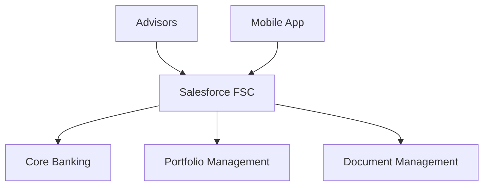
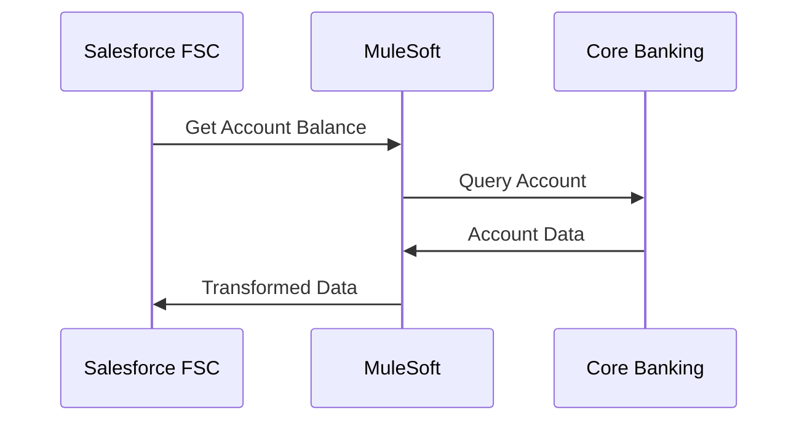

# Salesforce Financial Services Cloud

## Overview

CRM solution based on **Salesforce Financial Services Cloud**, deployed for BNC's Wealth Management sector.

## Context

**Sector**: Wealth Management
**Status**: **UNDER PROMOTION** to Transversal
**Proven-in-use**: 18 months in production
**Adoption**: 100% of advisors (50+ users)

## Architecture

### Components



### Technology Stack

- **Platform**: Salesforce Financial Services Cloud
- **Edition**: Enterprise
- **Integration**: MuleSoft Anypoint Platform
- **Data**: Salesforce Data Cloud
- **Mobile**: Salesforce Mobile App

## Features

### 360° Client Management

- Complete **client profile** (demographic, financial, preferences)
- Consolidated **wealth view**
- **Financial goals** and planning
- Centralized **documents**

### Portfolio Management

- Real-time **holdings**
- **Performance tracking**
- **Risk assessment**
- **Rebalancing recommendations**

### Relationship Management

- Tracked **interactions** (calls, meetings, emails)
- AI-powered **next best actions**
- Sales **opportunities**
- Prospect **pipeline**

### Compliance & Risk

- **KYC** (Know Your Customer)
- **AML** (Anti-Money Laundering)
- **Suitability checks**
- Complete **audit trail**

## Integrations

### Core Banking System



**Technologies**:
- MuleSoft Anypoint Platform
- REST APIs
- Real-time data sync (every 15min)

### Portfolio Management System

- **Vendor**: Bloomberg AIM
- **Protocol**: SFTP + REST API
- **Frequency**: Daily EOD + Real-time prices
- **Data**: Holdings, transactions, market data

### Document Management

- **ECM**: OpenText Documentum
- **Integration**: Salesforce Files Connect
- **Storage**: S3-compatible object storage
- **Compliance**: 7 years retention

## Metrics

### Adoption

- **Active users**: 50+ advisors
- **Managed clients**: 5,000+ HNW/UHNW clients
- **AUM**: $15B+ under management
- **Adoption rate**: 100%

### Performance

- **User satisfaction**: 4.2/5
- **Time to onboard new advisor**: 2 days
- **Mobile usage**: 40% of interactions
- **Response time (p95)**: < 2s

### Business Impact

- **Client onboarding time**: -50% (from 4 days to 2 days)
- **Client satisfaction**: +15%
- **Cross-sell rate**: +25%
- **Compliance incidents**: -80%

## Security

### Authentication

- **SSO**: SAML 2.0 with Azure AD
- **MFA**: Required for external access
- **Session timeout**: 30 minutes

### Authorization

- **Profiles**: Advisor, Manager, Admin
- **Permission Sets**: Feature-based access
- **Sharing Rules**: Territory-based

### Data Protection

- **Encryption at rest**: AES-256
- **Encryption in transit**: TLS 1.3
- **Field-level encryption**: SSN, account numbers
- **Shield Platform Encryption**: Enabled

## Compliance

### Regulations

- **PIPEDA**: Personal data protection
- **FINTRAC**: Anti-money laundering
- **IIROC**: Investment industry regulatory rules
- **AMF**: Financial markets authority

### Audit & Reporting

- **Audit Trail**: 10 years retention
- **Field History Tracking**: All critical fields
- **Event Monitoring**: Access and modification logs
- **Compliance Reports**: 25+ standard reports

## Costs

### Licenses

- **User Licenses**: 50 x $300/month = $15,000/month
- **Data Cloud**: $5,000/month
- **Shield**: $75/user/month = $3,750/month
- **Total**: ~$24,000/month

### Infrastructure

- **MuleSoft**: 2 vCores = $10,000/month
- **Storage**: 1TB = $2,000/month
- **Sandbox**: $5,000/month
- **Total**: ~$17,000/month

**Total cost**: ~$41,000/month (~$500k/year)

## Deployment

### Environments

- **Production**: prod.my.salesforce.com
- **UAT**: uat.my.salesforce.com
- **Dev**: dev.my.salesforce.com
- **Sandbox Full**: full.my.salesforce.com

### CI/CD

```yaml
# .gitlab-ci.yml
stages:
  - validate
  - deploy

validate:
  script:
    - sfdx force:source:deploy --checkonly --testlevel RunLocalTests

deploy:
  script:
    - sfdx force:source:deploy --targetusername prod
  only:
    - main
```

## Training & Support

### Training

- **Onboarding**: 2 days (initial training)
- **Advanced**: 1 day/quarter
- **Certification**: Salesforce Financial Services Cloud Consultant (optional)

### Support

- **Team**: 2 Salesforce admins
- **SLA**: 4h for critical incidents
- **Channel**: Slack #salesforce-support
- **Hours**: 8am-6pm EST, Monday-Friday

## Promotion to Transversal

### Promotion Dossier

This pattern is **currently under promotion** to Transversal status. See the complete dossier in [Promotions - Salesforce FSC](/registre/en-promotion/salesforce-fsc).

### Justification

- **Proven-in-use**: 18 months in production, 100% adoption
- **Applicability**: Potential for Corporate, Institutional sectors
- **ROI**: -50% onboarding time, +25% cross-sell
- **Maturity**: Stable architecture, established processes

### Timeline

- **Phase 1**: Proposal ✅ Completed (Oct 2024)
- **Phase 2**: Review ⏳ In progress (Nov-Dec 2024)
- **Phase 3**: Migration 📅 Planned (Q1 2025)
- **Phase 4**: Adoption 📅 Planned (Q2 2025)

## Roadmap

### Q1 2025

- [ ] Integration with new Portfolio Management System
- [ ] AI-powered client insights
- [ ] Enhanced mobile experience

### Q2 2025

- [ ] Expansion to Corporate sector (if promotion validated)
- [ ] Advanced analytics dashboard
- [ ] Client self-service portal

## References

- [Salesforce FSC Documentation](https://help.salesforce.com/s/articleView?id=sf.fsc_overview.htm)
- [MuleSoft Integration Patterns](https://www.mulesoft.com/integration-patterns)
- [BNC Salesforce Standards](https://standards.bnc.ca/salesforce)

## Contacts

- **Product Owner**: Marie Bouchard (marie.bouchard@bnc.ca)
- **Tech Lead**: Luc Tremblay (luc.tremblay@bnc.ca)
- **Salesforce Admin**: Julie Côté (julie.cote@bnc.ca)
- **Support**: salesforce-support@bnc.ca
