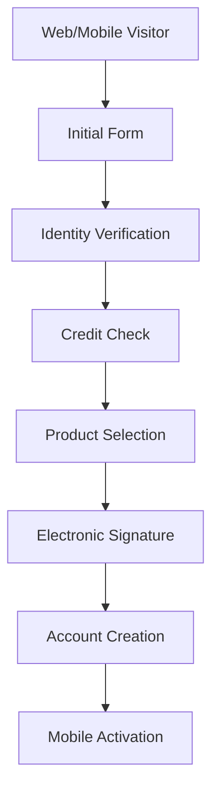
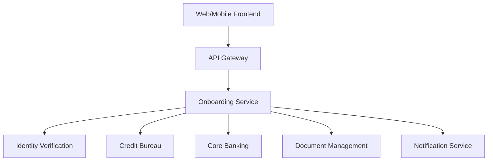

# Digital Client Onboarding

## Overview

A 100% digital onboarding solution enabling new clients to open a bank account in **less than 10 minutes**, without visiting a branch.

## Context

**Sector**: Retail Banking
**Status**: **UNDER PROMOTION** to Transversal
**Proven-in-use**: 12 months in production
**Adoption**: 75% of new clients (170k+ clients)

## Architecture

### Workflow



### Components



### Technology Stack

- **Frontend**: React SPA + React Native (mobile)
- **Backend**: Node.js (NestJS)
- **Database**: PostgreSQL 14
- **Cache**: Redis
- **Queue**: RabbitMQ
- **Storage**: AWS S3 (documents)

## Process Steps

### 1. Initial Form (2 minutes)

**Information Collected**:
- First name, last name, date of birth
- Residential address
- Contact (email, phone)
- Occupation and income

**Validation**:
- Email/phone format
- Minimum age (18 years)
- Canadian address

### 2. Identity Verification (3 minutes)

**Methods**:
1. **Document Scan**: Driver's license or passport
2. **Video Selfie**: Liveness detection
3. **Security Questions**: Based on credit history

**Technologies**:
- **OCR**: Tesseract + AWS Textract
- **Liveness Detection**: FaceTec
- **Document Verification**: Jumio

**Success Rate**: 92%

### 3. Credit Check (1 minute)

**Credit Bureaus**:
- Equifax Canada
- TransUnion Canada

**Information Obtained**:
- Credit Score
- Payment history
- Outstanding debts
- Bankruptcies/judgments

**Automatic Decision**:
- Score > 700: Automatic approval
- Score 600-700: Manual review
- Score < 600: Rejection with alternative product options

### 4. Product Selection (2 minutes)

**Available Products**:
- Checking Account (multiple types)
- Savings Account
- Debit Card
- Credit Card (if approved)
- Authorized Overdraft (if approved)

**Personalized Recommendations**:
- Based on client profile
- Machine Learning (similarity history)

### 5. Electronic Signature (1 minute)

**Documents Signed**:
- Account agreement
- Terms and conditions
- Credit check authorization
- PIPEDA consent

**Technologies**:
- **eSignature**: DocuSign
- **Timestamping**: RFC 3161 compliant
- **Archiving**: 7 years (compliance)

### 6. Account Creation (< 30 seconds)

**Process**:
1. Account number generation
2. Creation in Core Banking
3. Debit card assignment (instant virtual)
4. Mobile banking setup
5. Credentials delivery

**Core Banking Integration**:
- Real-time API
- Automatic rollback on failure
- Idempotence (retry-safe)

### 7. Mobile Activation (1 minute)

**Steps**:
1. Download BNC mobile app
2. Login with temporary credentials
3. Setup Face ID / Touch ID
4. Virtual debit card activation
5. First transfer (optional)

**First Time User Experience**:
- Interactive tutorial
- Push notification setup
- Feature discovery

## Metrics

### Adoption

- **New clients/month**: 12,000+
- **Completion rate**: 68%
- **Abandonment rate**: 32% (industry benchmark: 40%)
- **Average time**: 8.5 minutes
- **Mobile usage**: 60%

### Performance

- **Availability**: 99.8%
- **Time to account**: < 10 minutes (95th percentile)
- **API response time**: < 500ms (p95)
- **Identity verification success**: 92%
- **Credit check success**: 98%

### Business Impact

- **Cost per acquisition**: -60% (vs branch)
- **Customer satisfaction**: 4.5/5
- **First month activation**: 85%
- **Branch traffic reduction**: -35%

## Security

### Data Protection

- **Encryption at rest**: AES-256
- **Encryption in transit**: TLS 1.3
- **PII tokenization**: All sensitive fields
- **Data masking**: Logs and monitoring

### Fraud Prevention

- **Device fingerprinting**: ThreatMetrix
- **Behavioral analysis**: Pattern detection
- **Velocity checks**: Attempt limits per IP
- **Geolocation**: High-risk country blocking

### Compliance

- **PIPEDA**: Explicit consent, right to be forgotten
- **FINTRAC**: AML/KYC checks
- **PCI DSS**: No card storage
- **SOC 2 Type II**: Annual audit

## Costs

### Infrastructure

- **Cloud (AWS)**: $8,000/month
- **Third-party APIs**: $12,000/month
  - Identity verification: $4,000
  - Credit bureau: $6,000
  - eSignature: $2,000
- **Support**: $5,000/month

**Cost per client**: $2.50 (vs $25 at branch)

## Integrations

### Identity Verification (Jumio)

```typescript
// Example integration
const verifyIdentity = async (userId: string, documentImage: Buffer) => {
  const response = await jumio.verifyDocument({
    userId,
    documentImage,
    documentType: 'DRIVER_LICENSE',
    country: 'CA',
  });

  return {
    verified: response.status === 'APPROVED',
    confidence: response.confidence,
    extractedData: response.data,
  };
};
```

### Credit Bureau (Equifax)

```typescript
// Example integration
const checkCredit = async (applicant: Applicant) => {
  const response = await equifax.getCreditReport({
    firstName: applicant.firstName,
    lastName: applicant.lastName,
    dateOfBirth: applicant.dob,
    ssn: applicant.ssn,
  });

  return {
    score: response.creditScore,
    decision: response.creditScore > 700 ? 'APPROVED' : 'REVIEW',
    report: response.fullReport,
  };
};
```

### Core Banking

```typescript
// Example integration
const createAccount = async (customer: Customer, products: Product[]) => {
  const transaction = await db.transaction();

  try {
    // Create customer
    const customerId = await coreBank.createCustomer(customer);

    // Create accounts
    const accounts = await Promise.all(
      products.map(p => coreBank.createAccount({
        customerId,
        productCode: p.code,
        currency: 'CAD',
      }))
    );

    await transaction.commit();
    return { customerId, accounts };
  } catch (error) {
    await transaction.rollback();
    throw error;
  }
};
```

## Abandonment Recovery

### Triggers

- **Email** at 1h if abandonment at form
- **SMS** at 24h if abandonment at identity verification
- **Push notification** (mobile) if abandonment at activation

### A/B Testing

- Continuous testing on messaging
- Journey optimization
- Form simplification

**Impact**: +12% completion rate

## Accessibility

### WCAG 2.1 AA Compliance

- **Keyboard navigation**: 100%
- **Screen reader**: NVDA/JAWS compatible
- **Color contrast**: 4.5:1 minimum
- **Text resize**: Up to 200%

### Multilingual

- French (FR-CA)
- English (EN-CA)

## Promotion to Transversal

### Promotion Dossier

This pattern is **currently under promotion** to Transversal status. See the complete dossier in [Promotions - Digital Onboarding](/registre/en-promotion/onboarding-digital).

### Justification

- **Proven-in-use**: 12 months, 170k+ clients
- **Applicability**: Potential for Corporate (SME), Wealth Management
- **ROI**: -60% acquisition cost
- **Scalability**: Can handle 50k+ new clients/month

### Required Adaptations

**For Corporate**:
- Corporate document validation
- Multi-signing (administrators)
- REQ verification (Quebec Business Registry)

**For Wealth Management**:
- Enhanced due diligence
- Source of funds verification
- Investment profile questionnaire

### Timeline

- **Phase 1**: Proposal ✓ Completed (Sep 2024)
- **Phase 2**: Review → In Progress (Oct-Nov 2024)
- **Phase 3**: Migration → Planned (Q1 2025)
- **Phase 4**: Adoption → Planned (Q2 2025)

## Roadmap

### Q1 2025

- [ ] Support for joint accounts
- [ ] Enhanced product recommendations (AI)
- [ ] Video KYC option

### Q2 2025

- [ ] Expansion to Business onboarding (if promotion validated)
- [ ] Instant card issuance integration
- [ ] Open Banking integration

## References

- [Digital Identity Standards](https://www.digital.canada.ca/2019/02/27/the-public-digital-identity-authentication-standards/)
- [FINTRAC Guidance](https://www.fintrac-canafe.gc.ca/guidance-directives/client-clientele/Guide11/11-eng)
- [PIPEDA Compliance](https://www.priv.gc.ca/en/privacy-topics/privacy-laws-in-canada/the-personal-information-protection-and-electronic-documents-act-pipeda/)

## Contacts

- **Product Owner**: François Leblanc (francois.leblanc@bnc.ca)
- **Tech Lead**: Amélie Gagnon (amelie.gagnon@bnc.ca)
- **Compliance**: Marc Dupuis (marc.dupuis@bnc.ca)
- **Support**: onboarding-support@bnc.ca
