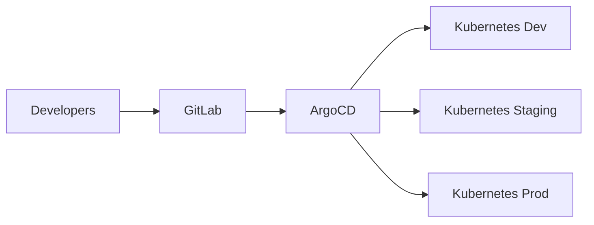

# CI/CD GitOps with ArgoCD

## Overview

GitOps-based continuous deployment pipeline with ArgoCD, currently managing **100+ projects** in production at BNC.

## Context

**Original Sector**: IT Central (DSI)
**Status**: Transversal (validated by CAE)
**Proven-in-use**: 18 months, 100+ projects
**Teams**: 15+ development teams

## Architecture

### Components



### Technology Stack

- **Source Control**: GitLab Enterprise
- **GitOps Engine**: ArgoCD 2.8+
- **Orchestration**: Kubernetes 1.27+
- **CI**: GitLab CI/CD
- **Monitoring**: Prometheus + Grafana

## Implementation

### Repository Structure

```
project-repo/
 apps/
    dev/
    staging/
    prod/
 base/
    deployment.yaml
    service.yaml
    kustomization.yaml
 argocd/
     application.yaml
```

### ArgoCD Configuration

```yaml
apiVersion: argoproj.io/v1alpha1
kind: Application
metadata:
  name: my-app
  namespace: argocd
spec:
  project: default
  source:
    repoURL: https://gitlab.bnc.ca/my-team/my-app
    targetRevision: main
    path: apps/prod
  destination:
    server: https://kubernetes.default.svc
    namespace: my-app-prod
  syncPolicy:
    automated:
      prune: true
      selfHeal: true
```

## Workflow

### 1. Development

```bash
# Developer commits code
git add .
git commit -m "feat: new feature"
git push origin feature/new-feature
```

### 2. CI Pipeline

```yaml
# .gitlab-ci.yml
stages:
  - test
  - build
  - deploy

test:
  stage: test
  script:
    - npm test

build:
  stage: build
  script:
    - docker build -t registry.bnc.ca/my-app:${CI_COMMIT_SHA} .
    - docker push registry.bnc.ca/my-app:${CI_COMMIT_SHA}

update-manifest:
  stage: deploy
  script:
    - sed -i "s|image:.*|image: registry.bnc.ca/my-app:${CI_COMMIT_SHA}|" apps/dev/deployment.yaml
    - git commit -am "chore: update image to ${CI_COMMIT_SHA}"
    - git push origin main
```

### 3. Automatic Deployment

ArgoCD detects the change in Git and automatically synchronizes the Kubernetes cluster.

## Metrics

### Performance

- **Deployment time**: < 5 minutes
- **Success rate**: 98.5%
- **MTTR**: < 15 minutes
- **Deployment frequency**: 50+ deployments/day

### Adoption

- **Active projects**: 100+
- **Teams**: 15+
- **Deployments/month**: 1500+
- **Uptime**: 99.9%

## Security

### RBAC

```yaml
# ArgoCD RBAC
policy.csv: |
  p, role:dev-team, applications, get, my-team/*, allow
  p, role:dev-team, applications, sync, my-team/*, allow
  g, my-team, role:dev-team
```

### Secrets Management

- Secrets encrypted with **Sealed Secrets**
- Integration with **HashiCorp Vault**
- Automatic credentials rotation

## Compliance

### Audit Trail

- All deployments tracked in GitLab
- Complete history in ArgoCD
- Integration with BNC SIEM

### Approvals

- **Dev**: Automatic deployment
- **Staging**: Team lead approval
- **Production**: Manager approval + CAB

## Documentation

### Getting Started

1. **Create GitOps repository**
   ```bash
   git clone https://gitlab.bnc.ca/templates/gitops-template
   cd gitops-template
   ```

2. **Configure ArgoCD Application**
   ```bash
   kubectl apply -f argocd/application.yaml
   ```

3. **First deployment**
   ```bash
   git add apps/dev/
   git commit -m "feat: initial deployment"
   git push origin main
   ```

### Support

- **Documentation**: https://docs.bnc.ca/gitops
- **Slack Channel**: #gitops-support
- **Training**: Monthly ArgoCD training

## Roadmap

### Q1 2025

- [ ] Multi-cluster management
- [ ] Progressive delivery (Canary/Blue-Green)
- [ ] Integration with Istio

### Q2 2025

- [ ] Self-service portal
- [ ] Cost optimization dashboard
- [ ] Advanced RBAC policies

## References

- [ArgoCD Official Documentation](https://argo-cd.readthedocs.io/)
- [GitOps Principles](https://opengitops.dev/)
- [Kubernetes Best Practices](https://kubernetes.io/docs/concepts/configuration/overview/)

## Contacts

- **Product Owner**: Jean Tremblay (jean.tremblay@bnc.ca)
- **Tech Lead**: Marie Dubois (marie.dubois@bnc.ca)
- **Support**: gitops-support@bnc.ca
