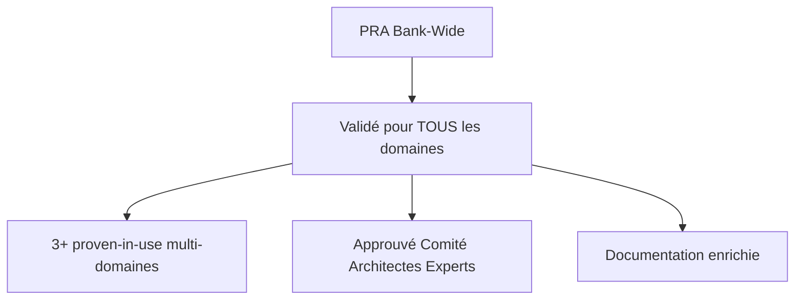
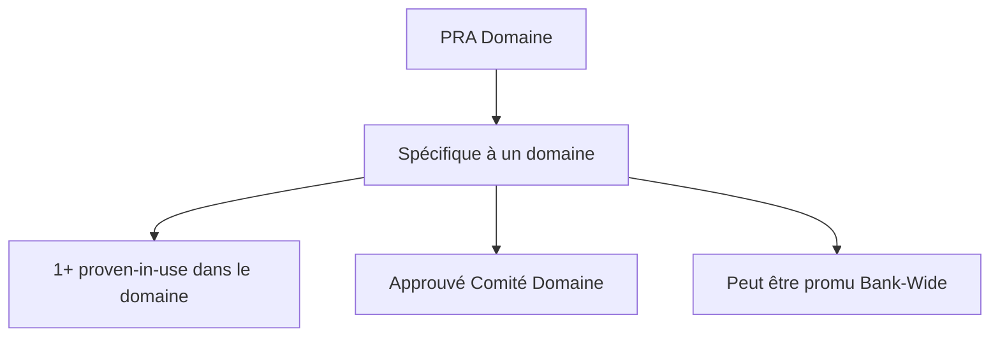
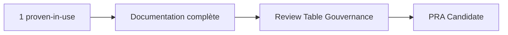
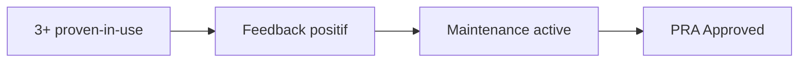
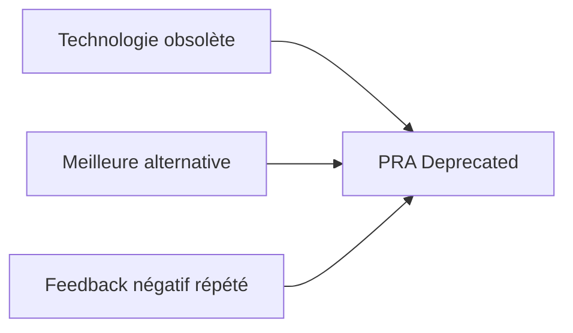
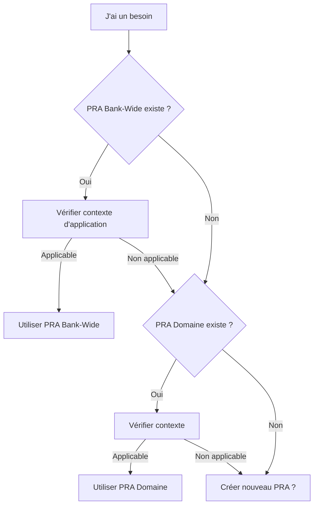

#  Comprendre les PRA

Maintenant que vous connaissez les bases, plongeons dans la structure et l'organisation des Proven Reusable Architecture.

##  Anatomie d'un PRA

Chaque PRA suit une structure standardisée pour garantir clarté et réutilisabilité.

### Structure Obligatoire

```markdown
# PRA-XXX : [Nom du Patron]

##  Résumé
Description concise en 2-3 phrases

##  Contexte d'application
### Quand utiliser ce PRA ?
### Quand NE PAS utiliser ce PRA ?

##  Problème résolu
Description du problème avec symptômes typiques

##  Solution
Architecture, stack technologique, diagrammes

##  Architecture Decision Records (ADR)
Décisions clés et justifications

##  Prérequis
Techniques et organisationnels

##  Implémentation
Guide pas à pas

##  Exemples
Code et configurations réels

##  Retours d'Expérience
Proven-in-use documentés

##  Limitations & Pièges
À connaître avant d'implémenter

##  Maintenance
Comment maintenir et faire évoluer

##  Références
Documentation, contacts
```

### Métadonnées (Frontmatter)

Chaque PRA contient des métadonnées au format YAML :

```yaml
---
id: pra-XXX
name: "Nom du Patron"
category: tech | integration | security | business
tags:
  - tag1
  - tag2
status: candidate | approved | deprecated
version: X.Y.Z
author:
  name: "Prénom Nom"
  email: "email@company.com"
maintainer:
  name: "Prénom Nom"
  email: "email@company.com"
created: YYYY-MM-DD
updated: YYYY-MM-DD
proven_in_use:
  - project: "Nom Projet"
    team: "Nom Équipe"
    date: "YYYY-MM-DD"
    feedback: "Résultats concrets"
dependencies: []
replaces: null
---
```

##  Les 2 Scopes d'un PRA

### 1. Bank-Wide (Transversal)



**Caractéristiques** :
-  Applicable à **tous les domaines**
-  Validé par le **Comité de Gouvernance Architectes Experts**
-  Au moins **3 proven-in-use** de différents domaines/équipes
-  **Recommandé** pour nouveaux projets
-  Localisation : `pra/transversal/[category]/`

**Exemples** :
- Authentication & Authorization
- Observabilité (Logs, Metrics, Traces)
- CI/CD Pipelines
- API Design Standards

### 2. Domaine



**Caractéristiques** :
-  Applicable à **un domaine spécifique** (Particuliers, Entreprises, Gestion de Patrimoine)
-  Validé par le **Comité de Gouvernance du Domaine**
-  Au moins **1 proven-in-use** dans le domaine
-  **Tout type de pattern** (fonctionnel ET technique)
-  Peut être promu vers Bank-Wide si réutilisable hors domaine (statut **"en promotion"**)
-  Localisation : `pra/secteurs/[domaine]/[category]/`

**Exemples** :
- Fonctionnels : Onboarding Digital (Particuliers), Intégration ERP SAP (Entreprises)
- Techniques : Serverless AWS, file transfer, data pipelines (en l'absence de pattern Bank-Wide)

**Note sur la promotion** : Quand un PRA Domaine est proposé pour devenir Bank-Wide, il reçoit le statut **"en promotion"** dans ses métadonnées. Ce statut est visible par tous les domaines pendant la période de revue par le Comité Architectes Experts.

##  Les Statuts d'un PRA

### Candidate



**Critères** :
-  **1+ proven-in-use** documenté en production
-  Documentation complète (toutes sections obligatoires)
-  Réutilisabilité démontrée
-  Qualité technique validée

**Utilisation** :
- Peut être utilisé avec **prudence**
- **Retour d'expérience requis**
- Aide à atteindre 3 proven-in-use pour promotion

**Badge** :  Candidate

### Approved



**Critères** :
-  **3+ proven-in-use** documentés
-  Retours **positifs** (satisfaction > 7/10)
-  Documentation **enrichie** avec learnings
-  Mainteneur **actif** (< 6 mois depuis update)

**Utilisation** :
- **Recommandé** pour tous projets applicables
- Support garanti
- Maintenance régulière

**Badge** :  Approved

### Deprecated



**Raisons** :
-  Technologies obsolètes
-  Meilleures alternatives disponibles
-  Retours négatifs répétés
-  Non maintenance (12+ mois)

**Utilisation** :
-  **Non recommandé** pour nouveaux projets
-  Maintenance uniquement pour existants
-  Alternative recommandée documentée

**Badge** :  Deprecated

##  Comment choisir le bon PRA ?

### Workflow de Sélection



**Note** : Les PRAs avec statut **"en promotion"** sont visibles dans les métadonnées des PRAs Domaine et peuvent être consultés pour voir les patterns émergents.

### Questions à se poser

#### 1. Le PRA résout-il mon problème ?
-  Lire section **"Problème résolu"**
-  Vérifier **symptômes typiques**

#### 2. Mon contexte est-il compatible ?
-  Lire section **"Quand utiliser ce PRA ?"**
-  Vérifier **"Quand NE PAS utiliser ce PRA ?"**

#### 3. Ai-je les prérequis ?
-  Stack technologique compatible
-  Compétences équipe
-  Infrastructure disponible

#### 4. Le PRA est-il mature ?
-  **Approved** : Go direct
-  **Candidate** : Évaluer risque
-  **Deprecated** : Éviter

##  Catégories de PRA

### Tech
Patterns techniques et infrastructures
- CI/CD, Deployment, Monitoring, Testing

### Integration
Intégrations entre systèmes
- API Design, Event-Driven, Message Queues

### Security
Sécurité et conformité
- Authentication, Authorization, Data Protection

### Business
Patterns métier
- Workflows, Business Rules, Domain Models

##  Prochaines Étapes

Vous comprenez maintenant la structure des PRA. Continuez votre apprentissage :

 **Suivant** : [Rôles et Responsabilités](/guides/03-roles-responsibilities) - Qui fait quoi dans l'écosystème PRA

---

**Parcours recommandé** :
1. [Démarrer avec les PRA](/guides/01-getting-started)
2.  **Comprendre les PRA** (vous êtes ici)
3. [Rôles et Responsabilités](/guides/03-roles-responsibilities)
4. [Cycle de Vie](/guides/04-lifecycle)
5. [Standards de Qualité](/guides/05-standards)
6. [Contribuer un PRA](/guides/06-contributing)
7. [Processus de Promotion](/guides/07-promotion-process)
8. [Gouvernance](/guides/08-governance)

---

**Navigation** :
-  **Précédent** : [Démarrer avec les PRA](/guides/01-getting-started)
-  **Suivant** : [Rôles et Responsabilités](/guides/03-roles-responsibilities)

---

**Dernière mise à jour** : 2025-12-02
