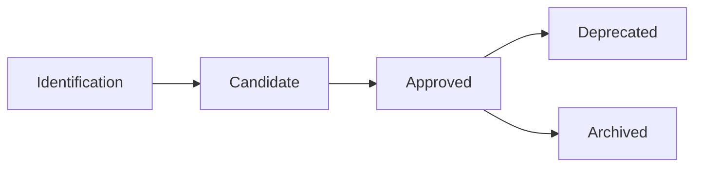

# Cycle de Vie d'un PRA

Ce document décrit les différentes étapes du cycle de vie d'un Proven Reusable Architecture (PRA), de sa conception initiale à sa dépréciation éventuelle.

##  Vue d'ensemble

Un PRA passe par plusieurs statuts au cours de son cycle de vie :



##  Statuts d'un PRA

### Candidate

**Définition** : PRA en cours de validation initiale.

**Critères selon le scope** :

**PRA Domaine** :
-  Au moins **1 implémentation** prouvée en production dans le domaine
-  Documentation complète (contexte, architecture, ADR, exemples)
-  Réutilisabilité démontrée au sein du domaine
-  Qualité technique validée par le **Comité de Gouvernance du Domaine**

**PRA Bank-Wide** :
-  Au moins **1 implémentation** prouvée en production
-  Documentation complète
-  Applicabilité multi-domaine démontrée
-  Qualité technique validée par le **Comité de Gouvernance Architectes Experts**

**Localisation** :
- Domaine : `pra/secteurs/[domaine]/[category]/`
- Bank-Wide : `pra/transversal/[category]/`

**Utilisation** : Peut être utilisé avec prudence et retour d'expérience requis

### Approved

**Définition** : PRA validé et recommandé pour usage.

**Critères selon le scope** :

**PRA Domaine Approved** :
-  Au moins **1 implémentation** prouvée dans le domaine
-  Retours positifs des équipes du domaine
-  Documentation enrichie avec learnings
-  Validé par **Comité de Gouvernance du Domaine**

**PRA Bank-Wide Approved** :
-  Au moins **3 implémentations** prouvées (différents domaines/équipes)
-  Retours positifs multi-domaines
-  Documentation enrichie avec learnings multi-contextes
-  Validité confirmée sur plusieurs domaines
-  Validé par **Comité de Gouvernance Architectes Experts**

**Localisation** :
- Domaine : `pra/secteurs/[domaine]/[category]/`
- Bank-Wide : `pra/transversal/[category]/`

**Utilisation** :
- Domaine : Recommandé pour projets du domaine
- Bank-Wide : Recommandé pour tous les domaines

### Deprecated

**Définition** : PRA obsolète, non recommandé pour nouvelles implémentations.

**Raisons** :
-  Technologies obsolètes
-  Meilleures alternatives disponibles
-  Retours négatifs répétés
-  Non maintenance pendant 12+ mois

**Localisation** : `pra/deprecated/[category]/`

**Utilisation** : Maintenance uniquement pour projets existants

##  Transitions de Statut

### PRA Domaine : De Candidate à Approved

**Déclencheur** : 1+ implémentation prouvée documentée dans le domaine

**Processus** :
1. Contributeur met à jour metadata : `status: approved`
2. GitHub Actions validation automatique
3. Review par **Comité de Gouvernance du Domaine** (2 approvals requis)
4. Merge → PRA devient Approved (échelle domaine)
5. Annonce au domaine (Teams/email)

**Timeline** : 5-10 jours ouvrés

### PRA Bank-Wide : De Candidate à Approved

**Déclencheur** : 3+ implémentations prouvées documentées (différents domaines/équipes)

**Processus** :
1. Contributeur met à jour metadata : `status: approved`
2. GitHub Actions validation automatique
3. Review par **Comité de Gouvernance Architectes Experts** (2 approvals requis)
4. Vérification applicabilité multi-domaine
5. Merge → PRA devient Bank-Wide Approved
6. Publication automatique sur Confluence
7. Annonce à tous les domaines (Teams/email)

**Timeline** : 2-4 semaines

### PRA Domaine : Promotion vers Bank-Wide

**Déclencheur** : PRA Domaine identifié comme réutilisable hors domaine

**Processus** :
1. **Comité Domaine** propose promotion (avec justification)
2. Création dossier promotion avec preuves multi-domaine
3. Review par **Comité Architectes Experts**
4. Validation critères Bank-Wide (3+ proven-in-use requis)
5. Si approuvé → déplacement vers `transversal/`
6. Communication à tous les domaines

**Timeline** : 4-8 semaines

Voir guide détaillé : [Processus de Promotion](/guides/07-promotion-process)

### De Approved à Deprecated

**Déclencheur** : Proposition comité concerné ou feedback négatif répété

**Processus selon le scope** :

**PRA Domaine** :
1. Proposition **Comité Domaine** (avec justification)
2. Discussion avec utilisateurs domaine
3. Vote Comité Domaine (majorité simple)
4. Update metadata : `status: deprecated`
5. Communication équipes du domaine
6. Période de transition de 3 mois

**PRA Bank-Wide** :
1. Proposition **Comité Architectes Experts** (avec justification)
2. Consultation multi-domaines
3. Vote Comité Architectes Experts (2/3)
4. Update metadata : `status: deprecated`, alternative recommandée
5. Communication à tous les domaines
6. Période de transition de 6 mois

**Timeline** : 2-4 semaines + période transition

##  Maintenance Continue

### PRA Domaine Approved

**Responsabilités** :
- **Mainteneur désigné** : Mise à jour documentation, réponse aux questions
- **Comité de Gouvernance Domaine** : Monitoring qualité, validation updates

**Rythme** :
- **Review trimestrielle** : Pertinence dans le domaine, utilisation, feedback
- **Updates as-needed** : Nouvelles versions technologiques, learnings

### PRA Bank-Wide Approved

**Responsabilités** :
- **Mainteneur désigné** : Mise à jour documentation, support multi-domaine
- **Comité Architectes Experts** : Monitoring qualité, validation updates

**Rythme** :
- **Review annuelle** : Pertinence multi-domaine, adoption, feedback
- **Updates as-needed** : Évolutions standards BNC, nouveaux learnings

### PRA Candidate

**Responsabilités** :
- **Contributeur original** : Documentation initiale, premiers retours
- **Early adopters** : Feedback actif, documentation learnings

**Objectif** :
- Domaine : Atteindre 1 implémentation prouvée pour Approved local
- Bank-Wide : Atteindre 3 implémentations multi-domaines pour Approved

##  Retour d'Expérience (Proven-in-use)

Chaque implémentation d'un PRA doit être documentée avec :

```yaml
proven_in_use:
  - project: "Nom du projet"
    team: "Nom de l'équipe"
    date: "YYYY-MM-DD"
    feedback: "Résultats et learnings concrets"
    metrics:
      - "Réduction 40% temps déploiement"
      - "100% traçabilité changements"
```

**Critères de qualité** :
- Projet en **production** (pas dev/staging)
- Feedback **concret** et **mesurable**
- Date d'implémentation récente (< 2 ans)

##  Critères de Succès

### Pour un PRA Domaine Candidate

- [ ] 1+ proven-in-use documenté dans le domaine
- [ ] Documentation complète et claire
- [ ] Feedback positif de l'équipe pilote
- [ ] Aucun blocage technique majeur
- [ ] Validé par Comité Domaine

### Pour un PRA Domaine Approved

- [ ] 1+ proven-in-use documenté dans le domaine
- [ ] Feedback positif des équipes domaine
- [ ] Documentation enrichie avec learnings
- [ ] Réutilisabilité confirmée au sein du domaine
- [ ] Maintenance régulière (< 6 mois depuis dernière update)

### Pour un PRA Bank-Wide Candidate

- [ ] 1+ proven-in-use documenté
- [ ] Documentation complète avec vision multi-domaine
- [ ] Applicabilité multi-domaine démontrée
- [ ] Aucun blocage technique majeur
- [ ] Validé par Comité Architectes Experts

### Pour un PRA Bank-Wide Approved

- [ ] 3+ proven-in-use documentés (différents domaines/équipes)
- [ ] Feedback positif multi-domaines
- [ ] Documentation enrichie avec learnings multi-contextes
- [ ] Cas d'usage variés (différents domaines)
- [ ] Satisfaction > 8/10 des utilisateurs
- [ ] Maintenance régulière (< 6 mois depuis dernière update)

##  Support et Questions

Pour toute question sur le cycle de vie d'un PRA :

- **Canal Teams** : `#pra-registry`
- **Email** : pra-governance@company.com
- **Issues GitHub** : [Ouvrir une issue](https://github.com/org/pra-registry/issues)

---

**Parcours recommandé** :
1. [Démarrer avec les PRA](/guides/01-getting-started)
2. [Comprendre les PRA](/guides/02-understanding-pra)
3. [Rôles et Responsabilités](/guides/03-roles-responsibilities)
4.  **Cycle de Vie** (vous êtes ici)
5. [Standards de Qualité](/guides/05-standards)
6. [Contribuer un PRA](/guides/06-contributing)
7. [Processus de Promotion](/guides/07-promotion-process)
8. [Gouvernance](/guides/08-governance)

---

**Navigation** :
-  **Précédent** : [Rôles et Responsabilités](/guides/03-roles-responsibilities)
-  **Suivant** : [Standards de Qualité](/guides/05-standards)

---

**Dernière mise à jour** : 2025-12-02
**Prochaine review** : 2026-06-02
