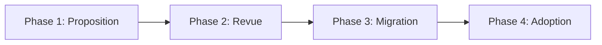

# Processus de Promotion (Sectoriel  Transversal)

Ce document décrit le processus permettant de promouvoir un patron sectoriel au niveau transversal, le rendant ainsi applicable à tous les secteurs de l'organisation.

##  Vue d'ensemble

La promotion d'un patron sectoriel vers le niveau transversal suit un processus en 4 phases :



##  Phase 1 : Proposition

### Déclencheur

Un secteur identifie un patron qui pourrait bénéficier à d'autres secteurs.

### Actions requises

1. **Créer dossier de promotion**
   ```
   content/registre/en-promotion/[secteur]-[categorie]-[nom-patron]/
   ```

2. **Documenter la justification**

   Créer `justification.md` :
   ```markdown
   # Justification de Promotion

   ## Patron Proposé
   - **Nom** : [Nom du patron]
   - **Secteur d'origine** : [Secteur]
   - **Catégorie** : tech | integration | security | business

   ## Pourquoi ce patron est d'intérêt transversal ?
   - [Raison 1 : Besoin récurrent]
   - [Raison 2 : Applicable multi-secteurs]
   - [Raison 3 : Mature et éprouvé]

   ## Proven-in-use dans le secteur
   - **Projet 1** : [Nom projet, date, résultats]
   - **Projet 2** : [Nom projet, date, résultats]
   - **Projet 3** : [Nom projet, date, résultats]

   ## Bénéfices attendus
   - [Bénéfice 1]
   - [Bénéfice 2]
   ```

3. **Analyser l'impact multi-secteur**

   Créer `impact-analysis.md` :
   ```markdown
   # Analyse d'Impact Multi-Secteur

   ## Secteurs pouvant bénéficier

   ### Secteur 1 : [Nom]
   - **Cas d'usage** : [Description]
   - **Valeur ajoutée** : [Bénéfices]
   - **Effort d'adoption** : Faible | Moyen | Élevé

   ### Secteur 2 : [Nom]
   - **Cas d'usage** : [Description]
   - **Valeur ajoutée** : [Bénéfices]
   - **Effort d'adoption** : Faible | Moyen | Élevé

   ## Adaptations nécessaires
   - [Modification 1 pour généralisation]
   - [Modification 2 pour généralisation]

   ## Risques identifiés
   - [Risque 1 + mitigation]
   - [Risque 2 + mitigation]
   ```

4. **Mettre à jour le patron**

   Dans le frontmatter du patron sectoriel :
   ```yaml
   promotion_status: proposed
   ```

5. **Soumettre PR**

   ```bash
   git checkout -b promotion/[secteur]-[patron]
   git add content/registre/en-promotion/[dossier]/
   git add content/registre/secteurs/[secteur]/[patron].md
   git commit -m "feat: propose promotion [patron] vers transversal"
   git push origin promotion/[secteur]-[patron]
   ```

##  Phase 2 : Revue

### Assignation

La Pull Request est automatiquement assignée au **Comité de Gouvernance Transversal**.

### Analyse du Comité

Le comité évalue selon ces critères :

#### 1. Réutilisabilité Multi-Secteur

-  Le patron résout-il un problème commun à 3+ secteurs ?
-  Les adaptations nécessaires sont-elles mineures ?
-  Les spécificités sectorielles peuvent-elles être paramétrées ?

#### 2. Maturité du Patron

-  3+ implémentations prouvées dans le secteur d'origine ?
-  Retours positifs des équipes utilisatrices ?
-  Documentation complète et claire ?

#### 3. Conformité aux Standards Transversaux

-  Respecte les standards techniques entreprise ?
-  Compatible avec l'architecture cible ?
-  Sécurité et conformité validées ?

#### 4. Impact sur la Cohérence d'Entreprise

-  Renforce l'alignement architectural ?
-  Évite la duplication de solutions ?
-  Facilite l'interopérabilité ?

### Décisions Possibles

1. ** Approuvé**  Passe en Phase 3 (Migration)
2. ** Révisions requises**  Retour au secteur avec feedback
3. ** Refusé**  Reste sectoriel avec justification

### Timeline

- **Review initiale** : 1 semaine
- **Discussion** : 1-2 semaines si clarifications
- **Décision finale** : Maximum 4 semaines

##  Phase 3 : Migration (si approuvé)

### 7. Nettoyage et Généralisation

Le mainteneur du patron (avec support du comité) :

1. **Retire les spécificités sectorielles**
   - Remplace références spécifiques par paramètres génériques
   - Documente les points de configuration

2. **Enrichit la documentation**
   - Ajoute exemples multi-secteurs
   - Documente les variations sectorielles
   - Crée guide d'adaptation

### 8. Migration Technique

```bash
# Déplacer le patron
git mv content/registre/secteurs/[secteur]/[categorie]/[patron].md \
       content/registre/transversal/[categorie]/[patron].md

# Mettre à jour metadata
# Dans le frontmatter :
scope: transversal
original_sector: [secteur-origine]
promotion_status: promoted
promotion_date: YYYY-MM-DD
```

### 9. Marquage Historique

Dans le secteur d'origine, créer une redirection :

```markdown
---
title: [Nom Patron]
redirect: /registre/transversal/[categorie]/[patron]
---

# [Nom Patron]

 Ce patron a été **promu au niveau transversal** le [date].

Il est maintenant accessible à tous les secteurs :
 [Voir le patron transversal](/registre/transversal/[categorie]/[patron])
```

### 10. Communication

Email automatique envoyé à :
- Tous les architectes
- Responsables architecture de chaque secteur
- Liste de diffusion PRA

Template :
```
Sujet:  Nouveau patron transversal : [Nom Patron]

Le patron "[Nom Patron]" du secteur [Secteur] a été promu
au niveau transversal.

Bénéfices : [Résumé]
Secteurs applicables : [Liste]
Documentation : [Lien]

Utilisez-le dans vos nouveaux projets !
```

### 11. Archive Promotion

```bash
# Archiver le dossier de promotion
git mv content/registre/en-promotion/[dossier]/ \
       content/registre/en-promotion/archive/YYYY-MM-[patron]/
```

##  Phase 4 : Adoption

### Encouragement Multi-Secteur

Le comité transversal :
- Présente le patron en réunion architecture d'entreprise
- Identifie projets pilotes dans différents secteurs
- Organise sessions de Q&A

### Feedback et Amélioration

Les équipes adoptantes :
- Documentent leurs implémentations (proven-in-use)
- Remontent feedbacks et suggestions
- Proposent améliorations via PR

### Évolution Continue

Le mainteneur (désormais au niveau transversal) :
- Intègre les learnings multi-secteurs
- Publie updates régulières
- Maintient compatibilité entre secteurs

##  Métriques de Succès

Une promotion est considérée réussie si :

-  **3+ secteurs** adoptent le patron dans les 6 mois
-  **80%+ satisfaction** des équipes utilisatrices
-  **Réduction duplication** : pas de nouveau patron sectoriel similaire
-  **Documentation maintenue** : < 3 mois depuis dernière update

##  FAQ

### Combien de temps prend le processus ?

**Minimum** : 6 semaines (2 semaines review + 4 semaines migration)
**Typique** : 2-3 mois (avec révisions et communication)

### Qui décide de la promotion ?

Le **Comité de Gouvernance Transversal**, avec consultation du secteur d'origine.

### Peut-on proposer plusieurs patrons simultanément ?

Oui, mais max **2 promotions actives** par secteur pour éviter surcharge.

### Que se passe-t-il si la promotion est refusée ?

Le patron reste sectoriel. La justification du refus est documentée et peut être réévaluée après 6 mois.

### Un patron transversal peut-il être "rétrogradé" ?

Non. Si un patron transversal devient obsolète, il passe à `deprecated`, mais ne retourne pas au niveau sectoriel.

##  Support

Pour toute question sur les promotions :

- **Canal Teams** : `#pra-promotions`
- **Email Comité** : pra-governance@company.com
- **Issues GitHub** : Tag `promotion` sur vos PRs

---

**Parcours recommandé** :
1. [Démarrer avec les PRA](/guides/01-getting-started)
2. [Comprendre les PRA](/guides/02-understanding-pra)
3. [Rôles et Responsabilités](/guides/03-roles-responsibilities)
4. [Cycle de Vie](/guides/04-lifecycle)
5. [Standards de Qualité](/guides/05-standards)
6. [Contribuer un PRA](/guides/06-contributing)
7.  **Processus de Promotion** (vous êtes ici)
8. [Gouvernance](/guides/08-governance)

---

**Navigation** :
-  **Précédent** : [Contribuer un PRA](/guides/06-contributing)
-  **Suivant** : [Gouvernance](/guides/08-governance)

---

**Dernière mise à jour** : 2025-11-28
**Prochaine review** : 2026-05-28
