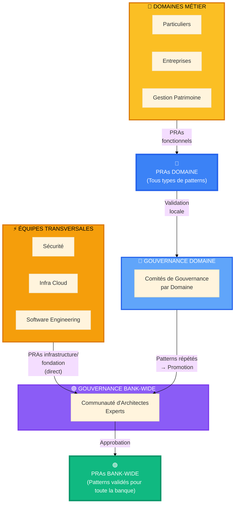
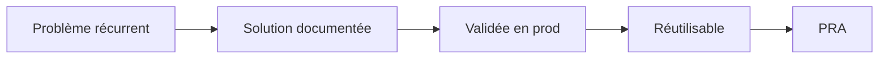

# Bienvenue dans le Registre PRA 

## Ne réinventez pas la roue, réutilisez ce qui fonctionne

Vous démarrez un nouveau projet ? Vous cherchez la meilleure façon d'implémenter l'authentification, le CI/CD, ou l'intégration avec Salesforce ? **Le Registre PRA est votre bibliothèque d'architectures validées en production.**

##  C'est quoi un PRA ?

Un **PRA (Proven Reusable Architecture)** est une **solution éprouvée** qui a déjà fait ses preuves dans de vrais projets de la Banque Nationale.

### Vue d'ensemble de l'écosystème PRA

**Deux flux de création de PRAs :**

**🟠 Flux 1 : Bank-Wide Direct (Équipes Transversales)**
- Équipes transversales : Sécurité, Infra Cloud, Software Engineering
- **Idéalement** créent des PRAs directement Bank-Wide (patterns infrastructure/fondation)
- Exemples : CI/CD, observabilité, sécurité réseau, gestion des secrets
- Validés par la Communauté d'Architectes Experts

**🔵 Flux 2 : Domaine → Bank-Wide (Pragmatique)**
- Architectes de solutions dans les domaines créent **tous types de PRAs** :
  - Fonctionnels : Customer Onboarding, Payment Processing, Notification System
  - **Techniques aussi** : Serverless AWS, file transfer, APIs asynchrones
- Pourquoi technique aussi ? **Absence de pattern Bank-Wide** → les domaines comblent le vide
- Validés localement par les Comités de Gouvernance
- **Patterns répétés entre domaines** ou **particulièrement robustes** → promotion Bank-Wide

**Réalité actuelle :**
- Même sujet (ex: serverless) peut exister dans plusieurs domaines (duplication)
- Le Registre PRA aide à **identifier ces duplications** et **promouvoir le meilleur** en Bank-Wide
- Un pattern technique d'un domaine peut devenir Bank-Wide si robuste et proven (ex: file transfer de Gestion Patrimoine)

### Comment un PRA naît et évolue

### En 4 points clés

 **Prouvée en production** : Validée dans au moins 1 implémentation réelle (Domaine) ou 3+ implémentations (Bank-Wide)
 **Réutilisable** : Généralisable à différents contextes et projets
 **Documentée** : Avec contexte, décisions architecturales (ADR), exemples de code et retours d'expérience par les architectes
 **Maintenue** : Versionnée et supportée par la communauté d'architectes BNC (experts et de solutions)

### Analogie simple

Pensez aux PRA comme des **recettes de cuisine éprouvées** :

- La recette (le PRA) a été testée plusieurs fois 
- Elle fonctionne dans différentes cuisines (contextes) 
- Elle documente les ingrédients (stack tech), les étapes (implémentation) et les pièges à éviter 
- Vous pouvez l'adapter à vos goûts (votre contexte) 

##  Démarrage rapide

### Vous êtes architecte de solutions ?

**Besoin : "Je cherche un pattern pour mon projet"**

1.  Explorez le [Catalogue](/catalogue) ou parcourez les [PRAs Bank-Wide](/registre/transversal)
2.  Consultez les [PRAs de votre Domaine](/registre/secteurs) pour des patterns fonctionnels
3.  Vérifiez si le contexte correspond à votre projet
4.  Suivez le guide d'implémentation et les ADRs
5.  Documentez votre retour d'expérience avec votre comité de gouvernance

### Vous êtes dans une équipe transversale ?

**Besoin : "Je veux contribuer un pattern infrastructure/fondation"**

1.  Consultez les [Standards de Qualité](/guides/05-standards)
2.  Préparez votre documentation (ADR, exemples de code, proven-in-use)
3.  Suivez le [Guide de Contribution](/guides/06-contributing)
4.  Soumettez directement à la Communauté d'Architectes Experts pour validation Bank-Wide

### Vous découvrez les PRA ?

**Besoin : "Je veux comprendre le système PRA"**

Suivez notre **parcours guidé en 8 étapes** :

1. [Démarrer avec les PRA](/guides/01-getting-started) - Introduction et premiers pas
2. [Comprendre les PRA](/guides/02-understanding-pra) - Anatomie détaillée
3. [Rôles et Responsabilités](/guides/03-roles-responsibilities) - Qui fait quoi
4. [Cycle de Vie](/guides/04-lifecycle) - De Candidate à Approved
5. [Standards de Qualité](/guides/05-standards) - Critères d'excellence
6. [Contribuer un PRA](/guides/06-contributing) - Processus de soumission
7. [Processus de Promotion](/guides/07-promotion-process) - Sectoriel  Transversal
8. [Gouvernance](/guides/08-governance) - Structure et décisions

##  Organisation du Registre

Le registre est organisé en **3 scopes** selon leur portée :

###  Bank-Wide

**Pour qui ?** Tous les domaines de la Banque Nationale
**Maturité** : Validés par la Communauté d'Architectes Experts (3+ proven-in-use)
**Exemples** :
- Infrastructure : Authentication SSO, CI/CD GitOps, Observabilité
- Techniques : File Transfer (ex: promu depuis GP), APIs asynchrones
- Fonctionnels : Customer Onboarding, Payment Processing (patterns répétés)

 [Explorer les PRAs Bank-Wide](/registre/transversal)

###  Domaines

**Pour qui ?** Équipes d'un domaine spécifique (Particuliers, Entreprises, Gestion de Patrimoine)
**Maturité** : Validés localement par Comité de Gouvernance du Domaine (1+ proven-in-use)
**Contenu** : Tous types de patterns (fonctionnels ET techniques)
**Exemples** :
- Fonctionnels : Onboarding Digital (Particuliers), Intégration ERP SAP (Entreprises)
- Techniques : Serverless AWS, file transfer, data pipelines (en l'absence de pattern Bank-Wide)
**Note** : Peuvent être promus en Bank-Wide si répétés ou particulièrement robustes

 [Explorer les PRAs par Domaine](/registre/secteurs)

###  En Promotion

**Pour qui ?** Tous (en observation)
**Statut** : Patrons sectoriels proposés pour devenir transversaux
**Utilité** : Voir les patterns émergents avant leur généralisation

 [Explorer les PRAs en Promotion](/registre/en-promotion)

##  Catégories de PRAs

Quel que soit le scope, les PRAs sont organisés en 4 catégories :

###  Tech

Patterns d'infrastructure et plateformes

**Exemples** : CI/CD, Observabilité (Prometheus/Grafana), Infrastructure as Code (Terraform), Orchestration (Kubernetes)

###  Integration

Patterns d'intégration inter-systèmes

**Exemples** : API Gateway, Message Broker (Kafka/RabbitMQ), Event-Driven Architecture, Data Synchronization

###  Security

Patterns de sécurité et conformité

**Exemples** : RBAC/ABAC, Secrets Management (Vault), Network Security (Zero Trust), Audit & Compliance

###  Business

Patterns métier réutilisables

**Exemples** : Customer Onboarding, Payment Processing, Notification System, Workflow Orchestration

##  Pourquoi utiliser les PRAs ?

###  Gain de Temps

- Pas besoin de réinventer la roue
- Solutions prêtes à l'emploi avec exemples de code
- Retours d'expérience documentés = moins d'essais-erreurs

**Exemple concret** : Implémenter un CI/CD GitOps avec ArgoCD prend 2 jours au lieu de 2 semaines de recherche et POC.

###  Qualité

- Solutions validées en production réelle
- Best practices intégrées
- Pièges courants documentés et évités

**Exemple concret** : Le PRA "RBAC avec CASL" inclut les cas limites de gestion des permissions que vous auriez découverts après plusieurs bugs.

###  Cohérence

- Alignement architectural entre équipes
- Vocabulaire commun (moins de malentendus)
- Standards partagés (plus facile à maintenir)

**Exemple concret** : Tous les projets utilisent la même stack d'observabilité  un nouvel architecte peut rapidement comprendre n'importe quel projet.

###  ROI Mesurable

- **Réduction 40-60%** du temps de conception architecture
- **+30%** de réutilisation de code et composants
- **-50%** des incidents de production (grâce aux learnings documentés)

##  Questions Fréquentes

### Dois-je obligatoirement utiliser un PRA ?

**Non.** Les PRAs sont des **recommandations**, pas des obligations.

**Mais** : Si un PRA applicable existe et que vous ne l'utilisez pas, vous devrez justifier pourquoi lors des revues d'architecture (pour éviter la duplication d'efforts).

### Puis-je adapter un PRA à mon contexte ?

**Oui, absolument !** Les PRAs sont des **patrons**, pas du code figé.

**Important** : Documentez vos adaptations et partagez vos learnings pour enrichir le PRA.

### Combien de PRAs y a-t-il actuellement ?

Le registre contient actuellement :
- **~15 PRAs Transversaux** (validés pour tous)
- **~20 PRAs Sectoriels** (spécifiques à un secteur)
- **~5 PRAs en Promotion** (en cours de validation transversale)

### Comment sont validés les PRAs ?

Deux processus selon le type :

**PRAs Domaine (fonctionnels):**
1. **Soumission** → Review par le Comité de Gouvernance du Domaine
2. **Candidate** → Validé avec 1+ proven-in-use dans le domaine
3. **Approved** → Validé localement, peut être proposé pour promotion Bank-Wide

**PRAs Bank-Wide (infrastructure/patterns communs):**
1. **Soumission** → Review par la Communauté d'Architectes Experts
2. **Approved** → Validé avec 3+ proven-in-use de différentes équipes/domaines

[En savoir plus sur le Cycle de Vie](/guides/04-lifecycle)

### Qui décide si un PRA domaine devient Bank-Wide ?

La **Communauté d'Architectes Experts** (architectes proches de la pratique, représentant différents domaines).

Les **Comités de Gouvernance par Domaine** valident les PRAs fonctionnels localement avant de les proposer pour promotion.

[En savoir plus sur la Gouvernance](/guides/08-governance)

##  Prochaines Étapes

### Vous êtes pressé ?

 [Explorez le catalogue Transversal](/registre/transversal) et trouvez un PRA pour votre besoin

### Vous avez 15 minutes ?

 Suivez le [Guide de Démarrage](/guides/01-getting-started) pour une introduction complète

### Vous voulez tout comprendre ?

 Parcourez les [8 guides numérotés](/guides/01-getting-started) dans l'ordre

##  Besoin d'Aide ?

- **Canal Teams** : `#pra-registry`
- **Email** : pra-support@company.com
- **Issues GitHub** : [Ouvrir une issue](https://github.com/org/pra-registry/issues)
- **Table de Gouvernance** : pra-governance@company.com

---

**Dernière mise à jour** : 2025-12-02
**Contributeurs actifs** : 45+ architectes BNC (solutions et experts)
**PRAs validés** : 40+ patterns éprouvés (infrastructure et fonctionnels)
**Gouvernance** : Comités par domaine + Communauté d'Architectes Experts
