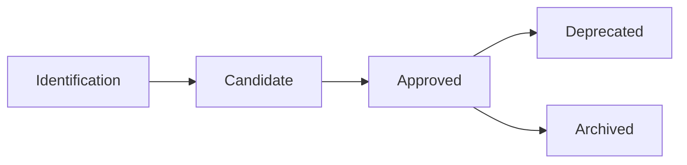

# Cycle de Vie d'un PRA

Ce document décrit les différentes étapes du cycle de vie d'un Proven Reusable Architecture (PRA), de sa conception initiale à sa dépréciation éventuelle.

##  Vue d'ensemble

Un PRA passe par plusieurs statuts au cours de son cycle de vie :



##  Statuts d'un PRA

### Candidate

**Définition** : PRA en cours de validation, avec moins de 3 implémentations prouvées.

**Critères** :
-  Au moins **1 implémentation** prouvée en production
-  Documentation complète (contexte, architecture, ADR, exemples)
-  Réutilisabilité démontrée
-  Qualité technique validée par la Table de Gouvernance

**Localisation** : `pra/candidates/[category]/`

**Utilisation** : Peut être utilisé mais avec prudence et retour d'expérience requis

### Approved

**Définition** : PRA validé et recommandé pour usage généralisé.

**Critères** :
-  Au moins **3 implémentations** prouvées en production
-  Retours positifs des équipes utilisatrices
-  Documentation enrichie avec learnings
-  Validité confirmée sur plusieurs contextes

**Localisation** : `pra/approved/[category]/`

**Utilisation** : Recommandé pour tous les projets applicables

### Deprecated

**Définition** : PRA obsolète, non recommandé pour nouvelles implémentations.

**Raisons** :
-  Technologies obsolètes
-  Meilleures alternatives disponibles
-  Retours négatifs répétés
-  Non maintenance pendant 12+ mois

**Localisation** : `pra/deprecated/[category]/`

**Utilisation** : Maintenance uniquement pour projets existants

##  Transitions de Statut

### De Candidate à Approved

**Déclencheur** : 3+ implémentations prouvées documentées

**Processus** :
1. Contributeur crée PR pour déplacement `candidates/`  `approved/`
2. Update metadata : `status: approved`
3. GitHub Actions validation automatique
4. Review par Table de Gouvernance (2 approvals requis)
5. Merge  PRA devient Approved
6. Publication automatique sur Confluence
7. Annonce à la communauté (Teams/email)

**Timeline** : 5-10 jours ouvrés

### De Approved à Deprecated

**Déclencheur** : Proposition de la Table de Gouvernance ou feedback négatif répété

**Processus** :
1. Proposition de dépréciation (avec justification)
2. Discussion avec contributeurs originaux
3. Vote de la Table de Gouvernance (majorité simple)
4. PR pour déplacement `approved/`  `deprecated/`
5. Update metadata : `status: deprecated`, `deprecated_date`, `replaces` (si applicable)
6. Documentation mise à jour avec alternative recommandée
7. Communication aux équipes utilisant le PRA
8. Période de transition de 6 mois
9. Archivage optionnel après période de transition

**Timeline** : 2-4 semaines + 6 mois transition

##  Maintenance Continue

### PRA Approved

**Responsabilités** :
- **Mainteneur désigné** : Mise à jour documentation, réponse aux questions
- **Table de Gouvernance** : Monitoring qualité, validation updates

**Rythme** :
- **Review annuelle** : Pertinence, utilisation, feedback
- **Updates as-needed** : Nouvelles versions technologiques, learnings

### PRA Candidate

**Responsabilités** :
- **Contributeur original** : Documentation initiale, premiers retours
- **Early adopters** : Feedback actif, documentation learnings

**Objectif** : Atteindre 3 implémentations pour promotion Approved

##  Retour d'Expérience (Proven-in-use)

Chaque implémentation d'un PRA doit être documentée avec :

```yaml
proven_in_use:
  - project: "Nom du projet"
    team: "Nom de l'équipe"
    date: "YYYY-MM-DD"
    feedback: "Résultats et learnings concrets"
    metrics:
      - "Réduction 40% temps déploiement"
      - "100% traçabilité changements"
```

**Critères de qualité** :
- Projet en **production** (pas dev/staging)
- Feedback **concret** et **mesurable**
- Date d'implémentation récente (< 2 ans)

##  Critères de Succès

### Pour un PRA Candidate

- [ ] 1+ proven-in-use documenté
- [ ] Documentation complète et claire
- [ ] Feedback positif de l'équipe pilote
- [ ] Aucun blocage technique majeur

### Pour promotion Approved

- [ ] 3+ proven-in-use documentés
- [ ] Feedback positif de multiples équipes
- [ ] Documentation enrichie avec learnings
- [ ] Cas d'usage variés (différents contextes)

### Pour un PRA Approved

- [ ] Utilisation active dans 3+ projets
- [ ] Satisfaction > 8/10 des utilisateurs
- [ ] Maintenance régulière (< 6 mois depuis dernière update)
- [ ] Documentation à jour

##  Support et Questions

Pour toute question sur le cycle de vie d'un PRA :

- **Canal Teams** : `#pra-registry`
- **Email** : pra-governance@company.com
- **Issues GitHub** : [Ouvrir une issue](https://github.com/org/pra-registry/issues)

---

**Parcours recommandé** :
1. [Démarrer avec les PRA](/registre/01-getting-started)
2. [Comprendre les PRA](/registre/02-understanding-pra)
3. [Rôles et Responsabilités](/registre/03-roles-responsibilities)
4.  **Cycle de Vie** (vous êtes ici)
5. [Standards de Qualité](/registre/05-standards)
6. [Contribuer un PRA](/registre/06-contributing)
7. [Processus de Promotion](/registre/07-promotion-process)
8. [Gouvernance](/registre/08-governance)

---

**Navigation** :
-  **Précédent** : [Rôles et Responsabilités](/registre/03-roles-responsibilities)
-  **Suivant** : [Standards de Qualité](/registre/05-standards)

---

**Dernière mise à jour** : 2025-11-28
**Prochaine review** : 2026-05-28
