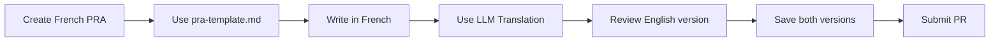

# 📋 PRA Templates

This directory contains templates and guides for creating and translating PRAs.

---

## 📁 Files

### 1. `pra-template.md`
Complete template for creating a new PRA with all required sections.

**Use when**: Creating a new PRA from scratch

**How to use**:
```bash
# Copy template to your PRA location
cp templates/pra-template.md content/fr/registre/transversal/tech/my-pra.md

# Edit the file and fill in all sections
# Follow the instructions in the template comments
```

### 2. `adr-template.md`
Template for Architecture Decision Records (ADRs).

**Use when**: Documenting a key architectural decision within a PRA

### 3. `metadata-template.yml`
YAML frontmatter structure reference.

**Use when**: Checking metadata field names and format

### 4. `TRANSLATION_PROMPT.md` 🌐
**Detailed prompt for translating PRAs from French to English using LLMs.**

**Use when**: You've created a French PRA and need to translate it

**Quick usage**:
1. Open your LLM (VS Code Copilot, Claude, ChatGPT)
2. Copy the prompt from `TRANSLATION_PROMPT.md`
3. Paste your French PRA content
4. Get English translation
5. Save to `content/en/registre/[same-path]/[same-filename].md`

---

## 🌐 Multilingual Workflow

### For New PRAs:



### Directory Structure:

```
content/
├── fr/registre/
│   └── transversal/tech/
│       └── my-pra.md          ← French version
└── en/registre/
    └── transversal/tech/
        └── my-pra.md          ← English version (translated)
```

---

## 🚀 Quick Start

### Step 1: Create French PRA
```bash
# Copy template
cp templates/pra-template.md content/fr/registre/transversal/tech/kubernetes-deployment.md

# Edit and fill in French
```

### Step 2: Translate to English
Open your LLM and use this quick prompt:

```
Translate this PRA from French to English. Keep Markdown formatting,
preserve technical terms, update /registre/ links to /en/registre/.

[PASTE FRENCH CONTENT HERE]
```

### Step 3: Save English Version
```bash
# Save translation
# Paste translated content into:
content/en/registre/transversal/tech/kubernetes-deployment.md
```

### Step 4: Commit Both
```bash
git add content/fr/registre/transversal/tech/kubernetes-deployment.md
git add content/en/registre/transversal/tech/kubernetes-deployment.md
git commit -m "feat(pra): add Kubernetes Deployment pattern (fr/en)"
git push origin feat/kubernetes-deployment-pra
```

---

## 📚 Additional Resources

- **Full Translation Guide**: [`../docs/TRANSLATION_GUIDE.md`](../docs/TRANSLATION_GUIDE.md)
- **Contributing Guide**: [`../docs/CONTRIBUTING.md`](../docs/CONTRIBUTING.md)
- **Quality Standards**: [`../docs/STANDARDS.md`](../docs/STANDARDS.md)
- **Governance**: [`../docs/GOVERNANCE.md`](../docs/GOVERNANCE.md)

---

## ❓ FAQ

**Q: Do I have to translate my PRA to English?**
A: Yes, to ensure broad accessibility. Use the translation prompt to make it easy!

**Q: Can I use an automated translation?**
A: Yes! Use LLMs (Copilot, Claude, ChatGPT) with our provided prompt.

**Q: What if I don't speak English well?**
A: That's okay! The LLM will handle the translation. Just review it for technical accuracy.

**Q: Should I translate code examples?**
A: No. Keep code unchanged. Only translate comments and documentation text.

**Q: Which file do I create first?**
A: Always create the French version first, then translate to English.

---

**Need help?** Ask in Teams: `#pra-registry`
